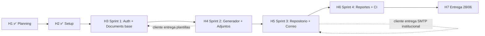

# Plan de Implementación — Plataforma Somos Barrio

**Proyecto:** Plataforma Web de **Gestión Documental** — Programa Somos Barrio
**Cliente:** Subsecretaría de Prevención del Delito, Viña del Mar
**Documento:** Plan de Implementación (versión ligera para equipo estudiante)
**Versión:** 2.0 (refocalizada y simplificada)
**Fecha:** 25/04/2026

---

## Tabla de Contenidos

1. [Portada y control de versiones](#1-portada-y-control-de-versiones)
2. [Introducción](#2-introducción)
3. [Equipo, roles y responsabilidades](#3-equipo-roles-y-responsabilidades)
4. [Metodología "ligera" del equipo](#4-metodología-ligera-del-equipo)
5. [Plan por sprint](#5-plan-por-sprint)
6. [Definition of Done (DoD) simplificado](#6-definition-of-done-dod-simplificado)
7. [Setup del entorno local (runbook)](#7-setup-del-entorno-local-runbook)
8. [Flujo de trabajo Git y PRs](#8-flujo-de-trabajo-git-y-prs)
9. [Estrategia CI/CD](#9-estrategia-cicd)
10. [Estrategia de QA y pruebas](#10-estrategia-de-qa-y-pruebas)
11. [Gestión de riesgos](#11-gestión-de-riesgos)
12. [Plan de comunicación con el cliente](#12-plan-de-comunicación-con-el-cliente)
13. [Hitos y dependencias](#13-hitos-y-dependencias)
14. [Plan de cierre y entrega final](#14-plan-de-cierre-y-entrega-final)
15. [Anexos (plantillas mínimas)](#15-anexos-plantillas-mínimas)

---

## 1. Portada y control de versiones

### 1.1 Ficha del documento

| Campo | Valor |
|---|---|
| Título | Plan de Implementación — Somos Barrio |
| Código interno | SB-PI-002 |
| Autor principal | Alfonso González (Scrum Master) |
| Estado | Vigente |
| Fecha de emisión | 25/04/2026 |
| Alcance | 16 semanas, 9/03/2026 – 28/06/2026 |

### 1.2 Registro de cambios

| Versión | Fecha | Autor | Descripción |
|---|---|---|---|
| 1.0 | 20/04/2026 | A. González | Primera versión, formal y exhaustiva. |
| **2.0** | **25/04/2026** | **A. González** | **Reescritura completa: (1) refocalización del MVP en gestión documental, (2) rendición financiera movida a post-MVP, (3) metodología simplificada para equipo estudiante part-time, (4) eliminación de dailys/Trello/SP/RACI extensa.** |

---

## 2. Introducción

### 2.1 Cambio de rumbo (lo importante de esta versión)

Tras la reunión interna del 25/04 y el feedback inicial del cliente, el proyecto se reorienta de **"plataforma administrativa integral"** a **"plataforma de gestión documental"**. El núcleo del producto ahora es:

> **Permitir que los usuarios del programa Somos Barrio rellenen, generen, organicen, busquen y envíen por correo institucional las actas y documentos oficiales del programa, todo desde un único repositorio digital ordenado.**

Esto implica:

| Antes (v1.0) | Ahora (v2.0) |
|---|---|
| 8 RF en MVP, todos al mismo nivel | **6 RF en MVP** centrados en documentos; 2 RF a post-MVP |
| Rendición financiera completa con IVA, estados, RUT, aprobaciones | **Movida a post-MVP** |
| Inventario | **Movido a post-MVP** |
| Énfasis en autenticación + 5 roles | Énfasis en flujo documental + 3 roles |
| Sprint Reviews formales con cliente cada 2 semanas | **2 check-ins** con cliente: mitad y fin |
| Dailies + retros + Trello + SP Fibonacci + RACI extensa | **1 reunión semanal de 1 h + GitHub Projects + tallas S/M/L** |

### 2.2 Por qué esta simplificación

El equipo está formado por **4 estudiantes** que combinan este proyecto con clases, trabajos parciales y vida personal. La metodología v1.0 era apropiada para un equipo full-time profesional, no para esta realidad. Se prioriza:

1. **Entregar valor al cliente** con un producto enfocado y completo en su núcleo.
2. **Sostenibilidad del equipo**: ritmo de trabajo realista, sin sobre-ceremonia.
3. **Aprendizaje real**: cada integrante toca menos tecnologías pero las comprende mejor.

### 2.3 Documentos relacionados

| Documento | Rol |
|---|---|
| `Registro_de_Proyecto.md` | Definición original (sin cambios). |
| `PLAN_CARTA_GANTT.md` | Calendario semana a semana. Sus tareas se reordenan según este plan v2.0. |
| `especificaciones_tecnicas.md` | El **"qué"** se construye. Refocalizado en gestión documental (v2.0). |
| `glosario_tecnologias.md` | Guía de estudio del equipo (qué es cada tecnología, dónde aprenderla). |
| `SUPER_PROMPT.md` | Prompt original; sigue siendo referencia histórica. |

---

## 3. Equipo, roles y responsabilidades

### 3.1 Integrantes y áreas

| Integrante | Área principal | Apoyo en | Disponibilidad estimada |
|---|---|---|---|
| **Alfonso González** | Backend + Coordinación general | Frontend si hace falta, CI/CD, integración con cliente | ~10–12 h/semana |
| **Benjamín Castro** | Backend + Base de datos | QA, despliegue Docker | ~10–12 h/semana |
| **Stephania Muñoz** | Frontend (vistas, listados, repositorio documental) | UI/UX, mockups | ~10–12 h/semana |
| **Aran Opazo** | Frontend (formularios, generador de actas, descargas) | UI/UX, mockups | ~10–12 h/semana |

> **Nota:** la disponibilidad real es la realidad. Si una semana alguien tiene menos tiempo (ej. periodo de pruebas), lo avisa en la reunión semanal y se redistribuye.

### 3.2 Responsabilidades por área (sin RACI complejo)

**Backend (Alfonso + Benjamín)**
- Diseñar y construir endpoints REST.
- Modelar la BD y mantener migraciones Flyway.
- Configurar JWT, roles, validaciones, envío de correos.
- Generación de PDFs/Excel.

**Frontend (Stephania + Aran)**
- Construir las pantallas y formularios.
- Conectar con la API.
- Asegurar responsive y accesibilidad básica.
- Mockups por módulo antes de implementar.

**Coordinación (Alfonso, como Scrum Master ligero)**
- Mantener el GitHub Project ordenado.
- Convocar la reunión semanal y enviar resumen.
- Comunicarse con el cliente.
- Velar por que los hitos se cumplan.

**QA (Benjamín, además de backend)**
- Probar funcionalidades nuevas en cada sprint.
- Reportar bugs como Issues en GitHub.
- Mantener cobertura de tests backend ≥ 50% (objetivo realista, antes era 60%).

> **Importante**: no hay matriz RACI extensa. Las responsabilidades son las anteriores; las decisiones técnicas se conversan en la reunión semanal. Si algo no está cubierto, **el primero que lo detecta lo hace o lo levanta**.

---

## 4. Metodología "ligera" del equipo

### 4.1 Filosofía

> "Lo justo y necesario para que avancemos juntos sin que la gestión nos quite tiempo de programar."

Adaptamos Scrum, no lo aplicamos al pie de la letra.

### 4.2 Ceremonias (las únicas obligatorias)

| Ceremonia | Cuándo | Duración | Modalidad |
|---|---|---|---|
| **Reunión semanal** | Domingos 19:00 (o el día que el equipo acuerde y pueda sostener) | 60 min | Discord videollamada |
| **Check-in con cliente** | 17/05 (mitad) y 14/06 (final de sprints) | 30–45 min | Coordinar con Luciano |
| **Demo final** | 28/06 | Lo que dure | Presencial |

**Eso es todo.** No hay dailies, no hay sprint planning de 2 horas, no hay retrospectivas formales.

### 4.3 Estructura de la reunión semanal (60 min)

| Bloque | Tiempo | Quién facilita |
|---|---|---|
| 1. **Estado de cada uno** (qué hice, qué haré, dónde estoy bloqueado) | 15 min (≈4 min c/u) | Alfonso |
| 2. **Revisión del tablero** (mover issues, descartar lo que no se hará) | 10 min | Alfonso |
| 3. **Decisiones técnicas pendientes** | 15 min | Quien proponga |
| 4. **Definir las tareas de la próxima semana** (3-5 issues por persona) | 15 min | Alfonso + equipo |
| 5. **¿Algo que mejorar como equipo?** (mini-retro de 5 min) | 5 min | Alfonso |

Si el equipo termina antes, mejor. Si necesita más, se extiende solo si todos están de acuerdo.

### 4.4 Comunicación entre reuniones (asíncrona)

| Canal | Para qué | Frecuencia esperada |
|---|---|---|
| **Discord** (canal `#general`) | Avisos, dudas técnicas, compartir links | Diario suelto |
| **Discord** (canal `#bloqueos`) | Avisar cuando estás bloqueado | Cuando ocurra |
| **WhatsApp** | Solo urgencias / coordinaciones rápidas | Mínimo |
| **GitHub Issues** | Discusiones técnicas que deben quedar registradas | Cuando aplique |
| **GitHub PR comments** | Code reviews | Por cada PR |
| **Correo** | Solo con el cliente | Después de cada check-in |

**Regla simple**: si la respuesta puede esperar 24 h, va por Discord/Issues; si no, WhatsApp.

### 4.5 Herramientas (mínimas)

| Para qué | Herramienta | Por qué |
|---|---|---|
| Tablero de tareas | **GitHub Projects** (kanban: Backlog / Esta semana / En progreso / En revisión / Listo) | Está en el mismo repo, sin tener que cambiar de tab. |
| Issues y PRs | **GitHub** | Donde vive el código. |
| Comunicación sincrónica | **Discord** | Llamadas y chat en un mismo lugar. |
| Comunicación urgente | **WhatsApp** | Lo que ya usan. |
| Documentos compartidos | **Google Drive** + Markdown en repo | Drive para entregables al cliente; markdown para documentación viva. |
| Mockups | **Figma** (gratuito) o lápiz/papel fotografiado | Lo más rápido para iterar. |

### 4.6 Estimación: tallas de polera (S/M/L), no Story Points

| Talla | Significado | Tiempo aproximado |
|---|---|---|
| **S** (small) | Tarea pequeña, una sola sesión | ½ día (≈3 h) |
| **M** (medium) | Tarea normal, requiere foco | 1–2 días |
| **L** (large) | Tarea grande; **considerar dividirla** | 3+ días |

Cada issue del GitHub Project lleva una etiqueta `size/S`, `size/M` o `size/L`. **Regla**: si una persona se compromete a más de 1 L + 2 M en una semana, alarma.

### 4.7 Resumen visual de la metodología

```
┌─────────────────────────────────────────────────────────┐
│  REUNIÓN SEMANAL (1h)  →  TABLERO ACTUALIZADO           │
│         ↓                                                │
│  4 PERSONAS TRABAJANDO ASÍNCRONAMENTE                    │
│    · Cada uno con 3-5 issues asignados                  │
│    · Commits y PRs cuando avanzan                       │
│    · Code reviews cuando hay PRs abiertos               │
│    · Discord para dudas y bloqueos                      │
│         ↓                                                │
│  PRÓXIMA REUNIÓN SEMANAL                                 │
└─────────────────────────────────────────────────────────┘
```

---

## 5. Plan por sprint

### 5.1 Cronograma global (refocalizado)

| Fase | Semanas | Fechas | Foco |
|---|---|---|---|
| ✅ Fase 1 — Planificación | S1–S4 | 09/03 – 05/04 | Requerimientos, backlog (ya ejecutada) |
| ✅ Fase 2.1 — Diseño y Setup | S5–S6 | 06/04 – 19/04 | MER, arquitectura, Docker (ya ejecutada) |
| 🔄 **Fase 2.2 — Sprint 1** | S7–S8 | **20/04 – 03/05** | **Auth + Actividades + base del módulo Documentos** |
| ⏭ Fase 2.3 — Sprint 2 | S9–S10 | 04/05 – 17/05 | **Generador de Actas + Adjuntos + estado del documento** |
| ⏭ Fase 2.4 — Sprint 3 | S11–S12 | 18/05 – 31/05 | **Repositorio documental + Búsqueda + Envío por correo** |
| ⏭ Fase 3.1 — Sprint 4 | S13–S14 | 01/06 – 14/06 | **Reportes + Auditoría + Pulido + CI** |
| ⏭ Fase 3.2 — Cierre | S15–S16 | 15/06 – 28/06 | Pruebas, ajustes, docs, demo |

### 5.2 Sprint 1 — Auth + Actividades + Base de Documentos (S7–S8 | 20/04 – 03/05)

**Objetivo del sprint:** que un usuario pueda iniciar sesión, navegar la app, crear actividades comunitarias y crear un documento (acta) en estado borrador asociado a una actividad.

**Reuniones del sprint**:
- Inicio: domingo 19/04 (planning corto, ya pasó si la fecha actual es 25/04 → asumir backlog ya cargado).
- Reunión semanal 1: domingo 26/04.
- Reunión semanal 2: domingo 03/05 (cierre del sprint + planning del sprint 2).

#### Issues a crear en GitHub Project

| # | Issue | Responsable | Talla | Notas |
|---|---|---|---|---|
| 1 | [BE] Entidades User, Role + migración Flyway V2 | Benjamín | S | — |
| 2 | [BE] Login con JWT (access + refresh) | Benjamín + Alfonso (pair) | M | Endpoint `POST /api/v1/auth/login` y `/refresh` |
| 3 | [BE] Spring Security con autorización por rol | Alfonso | M | `@PreAuthorize` |
| 4 | [BE] Seeders: 3 usuarios (admin, coordinador, analista) | Benjamín | S | En migración V9 (perfil dev) |
| 5 | [FE] Pantalla de login | Stephania | M | Diseño shadcn + RHF + Zod |
| 6 | [FE] Auth store (Zustand) + interceptor Axios + rutas protegidas | Aran | M | — |
| 7 | [FE] Layout principal con sidebar de navegación | Stephania | M | Solo módulos del MVP |
| 8 | [BE] Entidad Activity + migración V3 + CRUD | Alfonso | M | Estados: PLANIFICADA/EN_CURSO/FINALIZADA/CANCELADA |
| 9 | [FE] Listado de actividades con filtros básicos | Stephania | M | Filtros por estado, territorio |
| 10 | [FE] Formulario crear/editar actividad | Aran | M | Con validación Zod |
| 11 | [BE] Entidades Document + DocumentTemplate + migración V4 | Benjamín | M | Núcleo del nuevo MVP |
| 12 | [BE] Endpoints: crear documento en BORRADOR a partir de plantilla | Alfonso | M | `POST /api/v1/documents` |
| 13 | [FE] Diseño visual del módulo "Documentos" (mockup en Figma) | Stephania + Aran | S | Antes de implementar |
| 14 | [DOC] Documentar 3 tipos de documento iniciales (acta general, informe mensual, oficio) | Equipo | S | Pedir al cliente plantillas reales |

**Total estimado:** 4 S + 9 M + 0 L = manejable en 2 semanas con la disponibilidad descrita.

**Cierre del Sprint 1 (03/05):**
- `v0.1.0` taggeada en `main`.
- Demo interna (no formal con cliente todavía).
- Issues no terminados: pasan a Sprint 2 con prioridad.

---

### 5.3 Sprint 2 — Generador de Actas + Adjuntos + Estados (S9–S10 | 04/05 – 17/05)

**Objetivo del sprint:** que el usuario pueda completar un documento desde una plantilla, adjuntar archivos, y avanzar el estado (BORRADOR → EN_REVISION → APROBADA).

**Reuniones**:
- Reunión semanal 3: domingo 10/05.
- Reunión semanal 4: domingo 17/05 (cierre del sprint).
- 🔵 **Check-in con cliente: 17/05** (presentar Sprint 1 + Sprint 2 juntos).

#### Issues

| # | Issue | Responsable | Talla |
|---|---|---|---|
| 15 | [BE] Endpoint para listar plantillas disponibles | Alfonso | S |
| 16 | [BE] Generador de PDF a partir de un documento + plantilla (OpenPDF) | Alfonso | L |
| 17 | [BE] Endpoint `GET /api/v1/documents/{id}/pdf` para descargar | Alfonso | S |
| 18 | [BE] Máquina de estados del documento + transiciones | Benjamín | M |
| 19 | [BE] Endpoints PATCH `/status` con validación de roles | Benjamín | M |
| 20 | [BE] Entidad DocumentAttachment + endpoint upload (multipart) | Benjamín | M |
| 21 | [BE] Validación MIME real con Apache Tika (PDF/JPG/PNG/DOCX/XLSX, máx 20 MB) | Benjamín | M |
| 22 | [FE] Pantalla "Crear documento": elegir plantilla + actividad | Aran | M |
| 23 | [FE] Formulario dinámico para rellenar campos de la plantilla | Aran | L |
| 24 | [FE] Componente upload de adjuntos | Aran | M |
| 25 | [FE] Vista detalle de documento (datos + adjuntos + acciones de estado) | Stephania | M |
| 26 | [FE] Botón "Descargar PDF" del documento | Stephania | S |
| 27 | [FE] Badges visuales para estados (BORRADOR/EN_REVISION/APROBADA) | Stephania | S |
| 28 | [DOC] Solicitar al cliente las 3 plantillas reales en Word | Alfonso | S |

**Cierre del Sprint 2 (17/05):**
- `v0.2.0` taggeada.
- **Demo al cliente** mostrando: login → crear actividad → crear acta desde plantilla → adjuntar → aprobar → descargar PDF.
- Recoger feedback del cliente para incorporar en Sprint 3.

---

### 5.4 Sprint 3 — Repositorio + Búsqueda + Envío por Correo (S11–S12 | 18/05 – 31/05)

**Objetivo del sprint:** completar la propuesta de valor diferencial de la plataforma: el repositorio centralizado con búsqueda potente y el envío por correo institucional.

**Reuniones**:
- Reunión semanal 5: domingo 24/05.
- Reunión semanal 6: domingo 31/05.

#### Issues

| # | Issue | Responsable | Talla |
|---|---|---|---|
| 29 | [BE] Endpoint de búsqueda de documentos con múltiples filtros | Alfonso | M |
| 30 | [BE] Filtros: rango de fechas, código, tipo, autor, actividad, estado, palabra clave | Alfonso | M |
| 31 | [BE] Generador automático de **código de documento** (ej: `ACT-2026-0001`) | Benjamín | S |
| 32 | [BE] Configuración Spring Mail con SMTP Gmail + App Password | Benjamín | M |
| 33 | [BE] Endpoint `POST /api/v1/documents/{id}/send` (envía PDF por correo) | Benjamín | M |
| 34 | [BE] Lista de destinatarios habituales + envío ad-hoc | Alfonso | M |
| 35 | [BE] EmailLog: trazabilidad de cada envío (a quién, cuándo, éxito/fallo) | Benjamín | S |
| 36 | [BE] Plantilla de correo con datos del documento embebidos | Alfonso | S |
| 37 | [FE] Pantalla "Repositorio Documental" con tabla y filtros avanzados | Stephania | L |
| 38 | [FE] Búsqueda en tiempo real con debounce | Stephania | M |
| 39 | [FE] Modal "Enviar por correo" desde la vista detalle del documento | Aran | M |
| 40 | [FE] Vista de historial de envíos del documento | Aran | S |
| 41 | [FE] Ordenamiento de la tabla por columnas | Stephania | S |
| 42 | [FE] Indicador visual cuando un documento ya fue enviado | Aran | S |

**Cierre del Sprint 3 (31/05):**
- `v0.3.0` taggeada.
- Demo interna del repositorio + envío.

---

### 5.5 Sprint 4 — Reportes + Auditoría + Pulido + CI (S13–S14 | 01/06 – 14/06)

**Objetivo del sprint:** terminar lo restante del MVP, dejar el sistema robusto y desplegable, y entregar reportes que permitan al cliente medir el uso.

**Reuniones**:
- Reunión semanal 7: domingo 07/06.
- Reunión semanal 8: domingo 14/06 (cierre del sprint).
- 🔵 **Check-in con cliente: 14/06** (Sprint 3 + Sprint 4: producto MVP completo).

#### Issues

| # | Issue | Responsable | Talla |
|---|---|---|---|
| 43 | [BE] Auditoría automática (audit_logs) en CREATE/UPDATE/APPROVE/SEND | Benjamín | M |
| 44 | [BE] Endpoint consulta de logs (solo ADMIN) | Alfonso | S |
| 45 | [BE] Reporte: listado de documentos generados en un rango (Excel + PDF) | Benjamín | M |
| 46 | [BE] Reporte: actividades del mes (Excel) | Benjamín | S |
| 47 | [FE] Panel de reportes con filtros y descarga | Stephania | M |
| 48 | [FE] Vista de logs de auditoría (solo ADMIN) | Stephania + Aran | M |
| 49 | [DEVOPS] GitHub Actions: lint + test + build (frontend y backend) | Alfonso | M |
| 50 | [DEVOPS] Build de imagen Docker en CI (sin push) | Alfonso | S |
| 51 | [QA] Pruebas manuales completas + reporte de bugs | Benjamín | M |
| 52 | [BUGFIX] Corrección de bugs encontrados | Equipo | M |
| 53 | [UX] Pulido visual general (espaciados, alineaciones, microcopy) | Stephania + Aran | M |
| 54 | [FE] Estados loading/empty/error en todas las pantallas | Stephania + Aran | M |
| 55 | [DOC] README de cada repo completo | Alfonso | S |

**Cierre del Sprint 4 (14/06):**
- `v0.4.0` taggeada.
- **Demo al cliente** con producto completo del MVP.
- Solicitar al cliente el feedback final que se incorporará en S15.

---

### 5.6 Cierre — S15–S16 (15/06 – 28/06)

**Objetivo:** dejar el producto estable, documentado y presentado.

| # | Tarea | Responsable | Talla | Fecha objetivo |
|---|---|---|---|---|
| 56 | Tests automatizados backend ≥ 50% | Benjamín + Alfonso | L | Antes 19/06 |
| 57 | Pruebas funcionales completas | Benjamín | M | Antes 18/06 |
| 58 | Pruebas básicas de seguridad (JWT, roles, CORS, upload) | Alfonso + Benjamín | M | Antes 17/06 |
| 59 | Corrección de bugs finales | Equipo | M | Antes 21/06 |
| 60 | Documentación técnica (READMEs, OpenAPI/Swagger) | Alfonso | M | Antes 23/06 |
| 61 | Manual breve de usuario final (≤ 8 páginas con capturas) | Stephania | M | Antes 24/06 |
| 62 | Informe final del proyecto (académico) | Equipo (por secciones) | L | Antes 25/06 |
| 63 | Preparación de presentación (PPT) | Equipo | M | Antes 26/06 |
| 64 | Ensayo de la presentación | Equipo | S | 26/06 + 27/06 |
| 65 | **Presentación final + entrega formal** | Equipo | — | **28/06** |

`v1.0.0` se tagea el 27/06 tras último merge.

---

## 6. Definition of Done (DoD) simplificado

Para considerar una **historia/issue terminado**:

- [ ] Código en una rama `feature/XX-...` y PR abierto contra `develop`.
- [ ] **Al menos 1 compañero** revisó el PR y dejó comentarios o aprobación.
- [ ] CI en verde (lint + build + tests).
- [ ] El sistema completo levanta con `docker compose up --build` sin errores.
- [ ] La funcionalidad nueva fue probada manualmente por el autor.
- [ ] Si es una pantalla: se ve bien en desktop (1280px) y en tablet (768px).
- [ ] El issue se mueve a la columna **"Listo"** en GitHub Project.

Para considerar un **sprint cerrado**:

- [ ] Tag `v0.X.0` creada en `main` (merge de `release/v0.X.0` o de `develop`).
- [ ] Issues no terminados movidos al sprint siguiente con razón breve.
- [ ] Resumen del sprint enviado al equipo (Discord o documento).

> **No usamos** DoR formal; basta con que la persona que toma una issue entienda lo que hay que hacer y, si tiene dudas, pregunte en Discord o en la reunión semanal.

---

## 7. Setup del entorno local (runbook)

Esta sección es **idéntica** a la versión anterior porque el setup técnico no cambia.

### 7.1 Prerrequisitos

| Herramienta | Versión |
|---|---|
| Docker Desktop | 4.25+ con WSL2 en Windows |
| Git | 2.40+ |
| Node.js | 20 LTS (solo si se corre frontend fuera de Docker) |
| JDK Temurin | 21 (solo si se corre backend fuera de Docker) |
| Editor | VS Code recomendado |

Puertos a tener libres: **5173, 8081, 5432, 5050** (`8081` = backend expuesto por `docker-compose` del repo backend; dentro del contenedor la app usa `8380`. Si ejecutas `./mvnw spring-boot:run` sin Compose, típicamente usas **`8380`**, no es necesario dejar libre `8081`).

### 7.2 Clonado

```bash
mkdir somosbarrio && cd somosbarrio
git clone https://github.com/<org>/somosbarrio-backend.git
git clone https://github.com/<org>/somosbarrio-frontend.git
```

### 7.3 Configuración `.env`

#### Backend

```bash
cd somosbarrio-backend
cp .env.example .env
```

Editar `.env` y completar al menos:
- `DB_PASSWORD` (cualquiera para local).
- `JWT_SECRET` con `openssl rand -base64 64`.
- `MAIL_USERNAME` y `MAIL_PASSWORD` con cuenta institucional Gmail + App Password.

#### Frontend

```bash
cd ../somosbarrio-frontend
cp .env.example .env
```

Con el backend levantado vía Compose en este repo, el SPA debe apuntar a `VITE_API_URL=http://localhost:8081/api/v1`.

### 7.4 Levantar el sistema

Desde la carpeta raíz:

```bash
docker compose up --build -d
docker compose logs -f backend
```

**Smoke test**:
1. `http://localhost:5173` → ver login (SPA con `VITE_API_URL=http://localhost:8081/api/v1` cuando el backend va por Compose).
2. Comprobar `http://localhost:8081/actuator/health` (o `:8380` si corres solo `./mvnw spring-boot:run`).
3. Login en el SPA con `admin@somosbarrio.cl` / `Admin123!`.
4. Confirmar dashboard con sidebar de los módulos del MVP.

### 7.5 Usuarios seed (perfil `dev`)

| Email | Contraseña | Rol |
|---|---|---|
| `admin@somosbarrio.cl` | `Admin123!` | ADMIN |
| `coordinador@somosbarrio.cl` | `Coord123!` | COORDINADOR |
| `analista@somosbarrio.cl` | `Analista123!` | ANALISTA_TERRITORIAL |

> **Nota v2.0**: los roles `FINANZAS` y `AUDITOR` salen del MVP. ADMIN absorbe la consulta de auditoría.

### 7.6 Troubleshooting (5 más comunes)

#### Puerto 5432 ocupado
- Windows: `Get-Service postgresql*` → `Stop-Service`. O cambiar a `15432:5432` en `docker-compose.yml`.

#### Permisos de volumen `uploads`
```bash
sudo chown -R $(id -u):$(id -g) ./uploads
```

#### SMTP Gmail rechaza
- Asegurar que es **App Password**, no la contraseña normal.
- Probar con `telnet smtp.gmail.com 587`.

#### Migraciones Flyway fallan (checksum mismatch)
- Solo en dev: `docker compose down -v && docker compose up --build -d`.
- Nunca editar una migración ya aplicada; crear una nueva `V<n+1>__fix.sql`.

#### Error 401 inmediato tras login
- Sincronizar reloj del PC (NTP).
- Verificar que el frontend usa el mismo `VITE_API_URL` que el backend está escuchando.

---

## 8. Flujo de trabajo Git y PRs

### 8.1 Ramas (GitFlow simplificado)

| Rama | Para qué |
|---|---|
| `main` | Estable. Solo recibe merges de `release/*` con tag `v0.X.0`. |
| `develop` | Integración. Todo PR de feature apunta acá. |
| `feature/<num>-<desc>` | Trabajo en una issue. Ej: `feature/22-pantalla-crear-documento`. |
| `bugfix/<num>-<desc>` | Corrección de un bug. |
| `release/v0.X.0` | Preparación de release (opcional, se puede hacer merge directo). |

### 8.2 Conventional Commits

Mensajes en español:
- `feat: agregar generador de PDF para actas`
- `fix: corregir validación de RUT en proveedores`
- `docs: actualizar README backend`
- `chore: actualizar dependencias`
- `refactor: extraer servicio de mail`
- `test: agregar tests al servicio de documentos`

Primera línea ≤ 72 caracteres.

### 8.3 Plantilla mínima de PR

`.github/PULL_REQUEST_TEMPLATE.md`:

```markdown
## Qué hace este PR
<1-3 líneas>

## Issue
Closes #<número>

## Checklist DoD
- [ ] CI en verde
- [ ] Probado manualmente
- [ ] Sin warnings nuevos
- [ ] (Si frontend) responsive desktop + tablet OK

## Capturas
<si aplica>
```

### 8.4 Política de revisión

- Mínimo **1 aprobador**.
- Tiempo máximo de revisión esperado: **48 h en días hábiles** (más laxo que la v1.0).
- Estrategia de merge: **squash and merge** con mensaje siguiendo Conventional Commits.

### 8.5 Versionado semántico

| Versión | Cuándo |
|---|---|
| `v0.1.0` | Cierre Sprint 1 (03/05) |
| `v0.2.0` | Cierre Sprint 2 (17/05) |
| `v0.3.0` | Cierre Sprint 3 (31/05) |
| `v0.4.0` | Cierre Sprint 4 (14/06) |
| `v1.0.0` | Entrega final (27–28/06) |

---

## 9. Estrategia CI/CD

> **Versión simplificada**: tenemos CI funcional pero no nos exigimos pipelines complejos. Lo más importante es que cada PR tenga lint + test + build verdes.

### 9.1 Workflow backend (`somosbarrio-backend/.github/workflows/ci.yml`)

```yaml
name: Backend CI
on:
  pull_request: { branches: [develop, main] }
  push: { branches: [develop, main] }
jobs:
  build:
    runs-on: ubuntu-latest
    services:
      postgres:
        image: postgres:16-alpine
        env: { POSTGRES_DB: test, POSTGRES_USER: test, POSTGRES_PASSWORD: test }
        ports: ['5432:5432']
        options: --health-cmd pg_isready --health-interval 10s
    steps:
      - uses: actions/checkout@v4
      - uses: actions/setup-java@v4
        with: { distribution: 'temurin', java-version: '21', cache: 'maven' }
      - run: ./mvnw spotless:check
      - run: ./mvnw verify
```

### 9.2 Workflow frontend (`somosbarrio-frontend/.github/workflows/ci.yml`)

```yaml
name: Frontend CI
on:
  pull_request: { branches: [develop, main] }
  push: { branches: [develop, main] }
jobs:
  build:
    runs-on: ubuntu-latest
    steps:
      - uses: actions/checkout@v4
      - uses: actions/setup-node@v4
        with: { node-version: '20', cache: 'npm' }
      - run: npm ci
      - run: npm run lint
      - run: npm run test
      - run: npm run build
```

### 9.3 Umbrales que bloquean merge

- Tests rotos.
- Lint con errores.
- Build falla.

> **Cobertura JaCoCo**: la medimos pero **no bloquea merge** (objetivo es 50% al cierre, sin convertirlo en obstáculo durante el desarrollo).

### 9.4 Despliegue

Manual el día 28/06. Sin CD a staging.

---

## 10. Estrategia de QA y pruebas

### 10.1 Responsable QA

**Benjamín**, en paralelo a backend.

### 10.2 Tipos de pruebas

| Tipo | Cuándo | Quién | Herramienta |
|---|---|---|---|
| **Manual exploratoria** | Cada vez que se cierra un sprint | Benjamín + el equipo | Navegador |
| **Tests unitarios backend** | Durante el desarrollo de cada feature | Quien desarrolla | JUnit 5 + Mockito |
| **Tests de servicio críticos** | Antes del cierre del Sprint 4 | Benjamín | JUnit + AssertJ |
| **Tests de componentes frontend (críticos)** | S15 | Stephania + Aran | Vitest + Testing Library |
| **Smoke test al levantar el sistema** | Cada vez | Cualquiera | Lista de 5 pasos manuales |

### 10.3 Casos críticos a probar antes de cada demo

1. Login con cada uno de los 3 roles.
2. Crear actividad → crear documento → rellenar plantilla → guardar borrador.
3. Cambiar estado del documento (BORRADOR → EN_REVISION → APROBADA).
4. Adjuntar un PDF, descargarlo, eliminarlo (si aplica).
5. Generar PDF del documento aprobado.
6. Buscar en el repositorio por fecha, código y autor.
7. Enviar el PDF por correo a un destinatario de prueba (verificar bandeja).
8. Acceder a la auditoría como ADMIN.

### 10.4 Bug tracking

- **Como Issues en GitHub**, etiqueta `bug`.
- Incluir: pasos para reproducir, comportamiento esperado vs actual, captura.
- Severidades: `bug/critical` (bloqueante), `bug/major`, `bug/minor`, `bug/cosmetic`.

### 10.5 Cobertura realista

- Objetivo backend: **≥ 50%** (antes era 60%, lo bajamos para no asfixiar al equipo).
- Frontend: tests sí, pero solo en componentes críticos. Sin métrica obligatoria.

---

## 11. Gestión de riesgos

| # | Riesgo | Prob. | Impacto | Mitigación / Plan B |
|---|---|---|---|---|
| R1 | Disponibilidad reducida del equipo en alguna semana (pruebas u otras obligaciones) | A | M | Reunión semanal lo conversa explícitamente; redistribuir issues. Plan B: mover el alcance no crítico a sprint siguiente. |
| R2 | El cliente entrega tarde las plantillas reales de documentos | A | A | Pedirlas formalmente antes del 03/05. Plan B: usar plantillas genéricas (acta, oficio, informe) propuestas por el equipo y validarlas en el check-in. |
| R3 | Cambio de alcance del cliente | M | A | Solo aceptar cambios pequeños durante sprints; cambios grandes se evalúan como post-MVP. |
| R4 | Configuración SMTP Gmail bloqueada en alguna red | M | M | Probar el envío en S9; tener cuenta de backup (otra cuenta personal con App Password) por si falla. |
| R5 | Generación de PDFs complejos toma más tiempo del esperado | M | M | Empezar con plantilla simple y agregar complejidad. Plan B: usar la versión más sencilla posible (PDF básico sin estilos avanzados). |
| R6 | Conflictos de merge frecuentes | M | M | PRs pequeños; comunicar en Discord cuando se va a tocar un módulo. |
| R7 | Pérdida de datos en volumen Docker | B | A | Comando `docker compose down -v` prohibido salvo en setup nuevo. Backup manual antes de demos. |
| R8 | Incompatibilidad Docker en algún equipo del integrante | B | M | Verificar al inicio del Sprint 1; soportar fallback nativo (sin Docker) si pasa. |
| R9 | Dependencia técnica desconocida (curva de aprendizaje en TanStack Query, JWT, etc.) | M | M | Glosario `glosario_tecnologias.md` con recursos curados. Pair programming en bloque difícil. |
| R10 | Demo final falla el 28/06 | B | A | Ensayo el 26/06 y 27/06. Tener video grabado de respaldo. |
| R11 | Cliente no disponible para check-in | M | M | Agendar con 1 semana de anticipación; ofrecer 2 horarios. Plan B: enviar video corto + acta. |

> En cada reunión semanal se revisan los riesgos abiertos brevemente (~3 min).

---

## 12. Plan de comunicación con el cliente

### 12.1 Interlocutor

**Luciano Renault**, Subdirector del programa Somos Barrio.

### 12.2 Cadencia simplificada

| Tipo | Cuándo | Modalidad | Duración |
|---|---|---|---|
| Kickoff | Ya realizado (S1) | Presencial | — |
| Validación de requerimientos | Ya realizado (S2) | Videollamada | — |
| **Check-in 1: Sprint 1+2** | 17/05/2026 | Videollamada o presencial | 30–45 min |
| **Check-in 2: Sprint 3+4** | 14/06/2026 | Videollamada o presencial | 30–45 min |
| Solicitud de plantillas y dudas puntuales | Cuando aplique | Correo | — |
| **Presentación y entrega final** | 28/06/2026 | Presencial | 60–90 min |

### 12.3 Plantilla de correo post check-in

```
Asunto: [Somos Barrio] Resumen check-in <fecha>

Estimado Luciano,

Adjunto resumen del check-in realizado el <fecha>.

Lo que se mostró:
- <bullet 1>
- <bullet 2>

Tu feedback:
- <bullet 1>
- <bullet 2>

Próximos pasos:
- <bullet 1>

Si tienes comentarios adicionales, te agradecemos responder dentro de
72 h para incorporarlos en el próximo ciclo.

Saludos,
Alfonso González
Coordinador — Proyecto Plataforma Somos Barrio
```

### 12.4 Cosas que pediremos formalmente al cliente

| Cuándo | Qué |
|---|---|
| Antes del 03/05 | Las **3 plantillas reales** de documentos en Word (acta general, informe mensual, oficio) |
| Antes del 03/05 | Cuenta de Gmail institucional + App Password (o credenciales SMTP equivalentes) |
| Antes del 17/05 | Lista de destinatarios habituales de correos institucionales |
| Antes del 14/06 | Confirmación de la matriz de roles (3 roles MVP) |
| Antes del 28/06 | Logo institucional en alta resolución para la cabecera de PDFs |

---

## 13. Hitos y dependencias

### 13.1 Hitos (alineados con la Carta Gantt original)

| Hito | Fecha | Criterio |
|---|---|---|
| ✅ **H1** — Fin Planificación | 05/04 | Backlog inicial validado |
| ✅ **H2** — Fin Diseño y Setup | 19/04 | Docker + repos + base BD |
| 🔄 **H3** — Sprint 1 completo | 03/05 | Auth + Actividades + base de Documentos funcional |
| ⏭ **H4** — Sprint 2 completo + Check-in 1 | 17/05 | Generador de actas + adjuntos + estados (demo cliente) |
| ⏭ **H5** — Sprint 3 completo | 31/05 | Repositorio + búsqueda + envío correo funcional |
| ⏭ **H6** — Sprint 4 completo + Check-in 2 | 14/06 | MVP completo (demo cliente) |
| ⏭ **H7** — Entrega final | 28/06 | Producto entregado, presentación realizada |

### 13.2 Diagrama de dependencias



---

## 14. Plan de cierre y entrega final

### 14.1 Checklist de entrega (28/06/2026)

#### Producto
- [ ] Tag `v1.0.0` en `main` de ambos repos.
- [ ] `docker compose up --build` levanta el sistema en una máquina limpia.
- [ ] Usuarios seed funcionan.
- [ ] CI en verde para `main`.

#### Documentación
- [ ] README de cada repo completo (qué es, cómo levantar, estructura).
- [ ] `especificaciones_tecnicas.md` actualizado.
- [ ] `plan_de_implementacion.md` actualizado.
- [ ] `glosario_tecnologias.md` actualizado.
- [ ] Manual breve de usuario final con capturas (Stephania).

#### Académico / cliente
- [ ] **Informe final** del proyecto (PDF) con: contexto, metodología, arquitectura, resultados, lecciones aprendidas, capturas, anexos.
- [ ] **Presentación** preparada (~20 min).
- [ ] **Demo en vivo** lista (con video de respaldo grabado).
- [ ] Acta final firmada por el cliente.

### 14.2 Estructura del informe final (división del trabajo)

| Sección | Responsable principal | Páginas estimadas |
|---|---|---|
| 1. Portada e índice | Alfonso | 1 |
| 2. Resumen ejecutivo | Alfonso | 1 |
| 3. Contexto y problemática | Alfonso | 2 |
| 4. Objetivos y alcance | Alfonso | 1 |
| 5. Metodología (versión ligera) | Alfonso | 2 |
| 6. Arquitectura de la solución | Benjamín | 3 + diagramas |
| 7. Modelo de datos | Benjamín | 2 |
| 8. Módulos implementados | Equipo (cada uno 1) | 6 |
| 9. Diseño UI y experiencia de usuario | Stephania + Aran | 3 + capturas |
| 10. Pruebas y QA | Benjamín | 2 |
| 11. Gestión del proyecto y lecciones aprendidas | Alfonso | 2 |
| 12. Conclusiones y trabajo futuro (post-MVP) | Equipo | 2 |
| 13. Anexos | Alfonso | variable |

### 14.3 Cronograma S15–S16

| Fecha | Actividad | Responsable |
|---|---|---|
| L 15/06 | Inicio de pruebas finales | Benjamín |
| V 19/06 | Cierre tests automatizados (≥50% backend) | Benjamín + Alfonso |
| L 22/06 | Documentación técnica (READMEs + Swagger) | Alfonso |
| M 23/06 | Inicio del informe final (cada uno su sección) | Equipo |
| J 25/06 | Entregar primer borrador del informe + manual de usuario | Equipo |
| V 26/06 | Ensayo 1 de presentación + grabación demo | Equipo |
| S 27/06 | Tag `v1.0.0` + ensayo 2 + ajustes finales | Equipo |
| **D 28/06** | **Presentación y entrega formal** | Equipo + cliente |

---

## 15. Anexos (plantillas mínimas)

### 15.1 Plantilla de minuta de reunión semanal

```
# Reunión semanal — <dd/MM/yyyy>
Asistentes: <quiénes vinieron>

## Estado por persona
- Alfonso: hizo X, hará Y, sin bloqueos
- Benjamín: ...
- Stephania: ...
- Aran: ...

## Decisiones tomadas
- <bullet>

## Tareas para la próxima semana
| Persona | Issue # | Talla |
|---------|---------|-------|
| Alfonso | #12, #15 | M, S |
| ...     | ...      | ...   |

## Mejoras (mini-retro)
- Continuar: ...
- Empezar: ...
- Dejar: ...

## Próxima reunión
<dd/MM/yyyy hh:mm>
```

### 15.2 Plantilla de Issue en GitHub

```markdown
## Descripción
<qué hay que hacer en 2-3 líneas>

## Criterios de aceptación
- [ ] <criterio 1>
- [ ] <criterio 2>

## Notas técnicas (opcional)
<endpoints, archivos a tocar, etc.>

## Tarea relacionada en el plan
RF-XX / Issue #YY del plan de implementación

**Talla**: S / M / L
**Asignado a**: @<usuario>
```

### 15.3 Plantilla de PR (ya en §8.3)

### 15.4 Plantilla de reporte de bug (Issue tipo `bug`)

```markdown
## Descripción del bug
<síntoma en 1 línea>

## Pasos para reproducir
1. ...
2. ...
3. ...

## Comportamiento esperado
<qué debería pasar>

## Comportamiento actual
<qué pasa>

## Entorno
- Navegador / sistema operativo:
- Usuario / rol:
- Versión / commit:

## Capturas
<si aplica>

**Severidad**: critical / major / minor / cosmetic
```

### 15.5 Plantilla de acta de aprobación de entregable

```
# Acta de aprobación — <entregable>

Proyecto: Plataforma de Gestión Documental — Somos Barrio
Entregable: <nombre>
Fecha: <dd/MM/yyyy>
Versión: <vX.Y.Z>

Entregado por: Equipo de desarrollo
Recibido por: Luciano Renault

## Contenido entregado
- <bullet>

## Conformidad
[ ] Aprobado sin observaciones
[ ] Aprobado con observaciones menores
[ ] Rechazado (motivos abajo)

## Observaciones
<...>

## Firmas
Cliente: ______________________
SM: ______________________
```

---

**Estado del documento:** v2.0 vigente — 25/04/2026.
**Mantenedor:** Alfonso González (SM).
