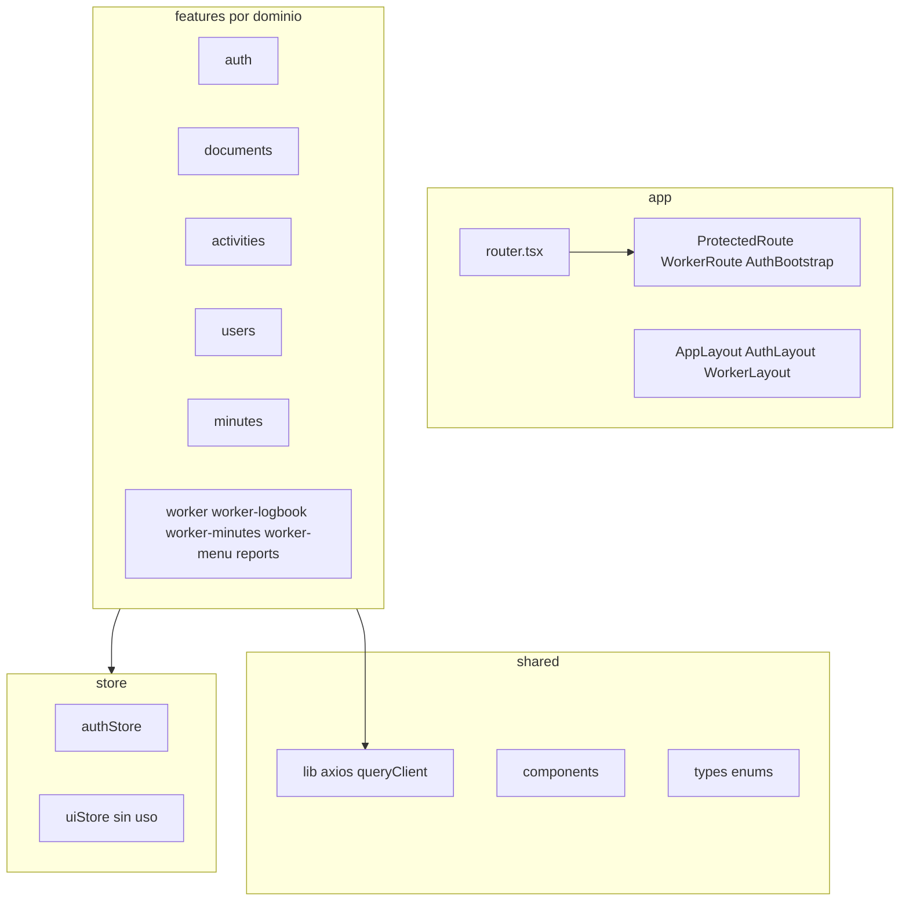

# Análisis técnico del frontend Somos Barrio

Documentación del estado actual de [`somosbarrio-frontend`](somosbarrio-frontend) (mayo 2026), alineada con el backend en [`somosbarrio-backend`](../BACKEND/somosbarrio-backend). Complementa el contraste de integración en [`INTEGRACION_FRONTEND_BACKEND.md`](INTEGRACION_FRONTEND_BACKEND.md).

---

## 1. Resumen ejecutivo

**Somos Barrio Frontend** es una SPA de gestión documental para la Subsecretaría de Prevención del Delito (Viña del Mar). Expone dos portales:

| Portal | Rol objetivo | Rutas base |
|--------|--------------|------------|
| **Institucional / admin** | `ADMINISTRADOR` | `/`, `/activities`, `/documents`, `/users`, `/reports` |
| **Trabajador en terreno** | `COLABORADOR` | `/trabajador/*` |

**Estado general:** el frontend está **operativo para los flujos principales** (documentos, workflow de aprobación, usuarios, exportación Excel de documentos, reportes/bitácora/actas del colaborador). El backend asociado está **completo** (~55 endpoints REST). La integración frontend↔backend cubre aproximadamente **dos tercios** del catálogo API; faltan pantallas para repositorio, mailing, auditoría, administración de plantillas, reportes de actividades y varios endpoints admin de actas y usuarios (detalle en el documento de integración).

**Puntos críticos pendientes en el cliente:**

- [`ProtectedRoute`](somosbarrio-frontend/src/app/ProtectedRoute.tsx) y [`AuthBootstrap`](somosbarrio-frontend/src/app/AuthBootstrap.tsx) **desactivados** (código comentado).
- Bug de URL duplicada en listado y alta de actividades (`/api/v1/api/v1/activities`).
- Sin tests automatizados.

---

## 2. Stack tecnológico

| Área | Tecnología |
|------|------------|
| UI | React 19, React DOM |
| Lenguaje | TypeScript ~6 (`tsc -b` en build) |
| Bundler | Vite 8, `@vitejs/plugin-react`, `@tailwindcss/vite` |
| Estilos | Tailwind CSS 4, tokens en [`src/index.css`](somosbarrio-frontend/src/index.css) |
| Routing | React Router 7 (`createBrowserRouter`) |
| HTTP | Axios 1.15 |
| Estado servidor | TanStack React Query 5 |
| Estado cliente | Zustand 5 (`persist` en auth) |
| Formularios | react-hook-form, zod, `@hookform/resolvers` |
| Iconografía | Material Symbols (CDN en `index.html`) |

### Scripts NPM

| Script | Comando | Uso |
|--------|---------|-----|
| `dev` | `vite` | Desarrollo con HMR y proxy `/api` |
| `build` | `tsc -b && vite build` | Typecheck + bundle producción |
| `preview` | `vite preview` | Servir build local |
| `lint` | `eslint .` | Análisis estático |

No hay script `test` ni dependencias Vitest/Jest/Playwright.

---

## 3. Arquitectura del código



**Convención por feature:** `pages/`, `api/`, `hooks/`, `components/`, `lib/`, `schemas/`, `types.ts`.

**Alias:** `@/` → `src/` ([`vite.config.ts`](somosbarrio-frontend/vite.config.ts)).

---

## 4. Configuración de entorno

### Variables ([`.env.example`](somosbarrio-frontend/.env.example))

| Variable | Propósito |
|----------|-----------|
| `VITE_BACKEND_PROXY_TARGET` | Target del proxy Vite (`/api` → backend) |
| `VITE_API_URL` | Base del cliente Axios (desarrollo: `/api/v1`) |
| `VITE_APP_NAME`, `VITE_ENV` | Metadatos UI |
| `VITE_TEMPLATE_REPORTE_CODE` | Código plantilla informes (default `INFORME_TIPO`) |
| `VITE_TEMPLATE_BITACORA_CODE` | Código plantilla bitácora (default `INFORME_TIPO`) |

### Proxy y puertos

- **Frontend:** `http://localhost:5173`
- **Backend Docker Compose:** expone **`8081:8380`** ([`docker-compose.yml`](../BACKEND/somosbarrio-backend/docker-compose.yml)) — ajustar `VITE_BACKEND_PROXY_TARGET=http://localhost:8081` si se usa Compose.
- **Spring local (Maven):** puerto **8380** en [`application.yml`](../BACKEND/somosbarrio-backend/backend/src/main/resources/application.yml).

> El `.env.example` aún menciona puerto `8080`; verificar el puerto real del backend en cada entorno.

---

## 5. Autenticación y sesión

### Clientes HTTP

| Cliente | Archivo | Uso |
|---------|---------|-----|
| `api` | [`shared/lib/axios.ts`](somosbarrio-frontend/src/shared/lib/axios.ts) | Bearer + `X-Correlation-Id`; refresh en 401 |
| `authClient` | [`features/auth/api/authClient.ts`](somosbarrio-frontend/src/features/auth/api/authClient.ts) | Login/refresh/logout sin Bearer |

### Store ([`store/authStore.ts`](somosbarrio-frontend/src/store/authStore.ts))

- Persistencia `localStorage` key `sb-auth`: solo `refreshToken` y `user` (no `accessToken`).
- Normaliza roles quitando prefijo `ROLE_`.
- `logout`: revoca refresh en servidor; `localStorage.clear()` (borra también notas/borradores locales).

### Guards

| Componente | Estado | Comportamiento |
|------------|--------|----------------|
| `WorkerRoute` | **Activo** | Exige token + rol `COLABORADOR` |
| `ProtectedRoute` | **Inactivo** | Renderiza hijos sin validar sesión |
| `AuthBootstrap` | **Inactivo** | No rehidrata ni renueva token al arrancar |

---

## 6. Routing completo

Fuente: [`src/app/router.tsx`](somosbarrio-frontend/src/app/router.tsx).

| Ruta | Layout | Guard | Página |
|------|--------|-------|--------|
| `/login` | `AuthLayout` | — | `LoginPage` |
| `/trabajador/login` | `AuthLayout` | — | `WorkerLoginPage` |
| `/` | `AppLayout` | `ProtectedRoute` (sin efecto) | `HomePage` |
| `/activities` | `AppLayout` | idem | `ActivitiesListPage` |
| `/activities/new` | `AppLayout` | idem | `CreateActivityPage` |
| `/activities/:id/edit` | `AppLayout` | idem | `EditActivityPage` |
| `/reports` | `AppLayout` | idem | `WorkerReportsPage` |
| `/documents` | `AppLayout` | idem | `DocumentsListPage` |
| `/documents/new` | `AppLayout` | idem | `CreateDocumentPage` |
| `/documents/:id` | `AppLayout` | idem | `DocumentDetailPage` |
| `/users` | `AppLayout` | idem | `UsersListPage` |
| `/trabajador` | `WorkerLayout` | `WorkerRoute` | `WorkerHomePage` |
| `/trabajador/mis-registros` | — | — | redirect → `/trabajador` |
| `/trabajador/configuracion` | `WorkerLayout` | `WorkerRoute` | `WorkerConfigPage` |
| `/trabajador/ayuda` | `WorkerLayout` | `WorkerRoute` | `WorkerHelpPage` |
| `/trabajador/notas` | `WorkerLayout` | `WorkerRoute` | `WorkerNotesPage` |
| `/trabajador/reportes` | `WorkerLayout` | `WorkerRoute` | `WorkerReportsPage` |
| `/trabajador/bitacora` | `WorkerLayout` | `WorkerRoute` | `WorkerLogbookPage` |
| `/trabajador/actas` | `WorkerLayout` | `WorkerRoute` | `WorkerMinutesPage` |
| `*` | — | — | redirect → `/` |

**Huérfana:** [`WorkerMyRecordsPage.tsx`](somosbarrio-frontend/src/features/worker-menu/pages/WorkerMyRecordsPage.tsx) no registrada en router.

---

## 7. Capa HTTP — inventario `*.api.ts`

Base: `VITE_API_URL` → `/api/v1`. Rutas **relativas** salvo donde se indica bug.

### Auth — [`auth.api.ts`](somosbarrio-frontend/src/features/auth/api/auth.api.ts)

| Función | Método | Ruta |
|---------|--------|------|
| `loginRequest` | POST | `/auth/login` |
| `refreshRequest` | POST | `/auth/refresh` |
| `logoutRequest` | POST | `/auth/logout` |

### Actividades — [`activities.api.ts`](somosbarrio-frontend/src/features/activities/api/activities.api.ts)

| Función | Método | Ruta |
|---------|--------|------|
| `getActivities` | GET | `/activities` |
| `getActivityById` | GET | `/activities/:id` |
| `createActivity` | POST | `/activities` |
| `updateActivity` | PUT | `/activities/:id` |
| `changeActivityStatus` | PATCH | `/activities/:id/status` |

### Documentos — [`documents.api.ts`](somosbarrio-frontend/src/features/documents/api/documents.api.ts)

CRUD, workflow (`submit-review`, `approve`, `reject`, `reopen`), adjuntos multipart, `GET .../pdf`, `POST .../preview-docx`, helper `createDocumentWithAttachments`.

### Plantillas — [`document-templates.api.ts`](somosbarrio-frontend/src/features/documents/api/document-templates.api.ts)

| Función | Método | Ruta |
|---------|--------|------|
| `listDocumentTemplates` | GET | `/document-templates` |
| `resolveTemplateId` | — | cache local del listado |

### Reportes Excel — [`documents-reports.api.ts`](somosbarrio-frontend/src/features/documents/api/documents-reports.api.ts)

| Función | Método | Ruta |
|---------|--------|------|
| `downloadDocumentsExcelReport` | GET | `/reports/documents` (blob) |

### Usuarios — [`users.api.ts`](somosbarrio-frontend/src/features/users/api/users.api.ts)

| Función | Método | Ruta |
|---------|--------|------|
| `getAll` | GET | `/users` |
| `create` | POST | `/users` |
| `delete` | DELETE | `/users/:id` |

### Actas — [`minutes.api.ts`](somosbarrio-frontend/src/features/minutes/api/minutes.api.ts)

| Función | Método | Ruta |
|---------|--------|------|
| `listMinutes` | GET | `/minutes` |
| `createMinute` | POST | `/minutes` |
| `uploadMinuteAttachment` | POST | `/minutes/:id/attachments` |
| `changeMinuteStatus` | PATCH | `/minutes/:id/status` |
| `createMinuteWithAttachments` | compuesto | create + uploads + `EN_REVISION` |

### Reportes trabajador — [`reports.api.ts`](somosbarrio-frontend/src/features/reports/api/reports.api.ts)

Orquesta `createDocumentWithAttachments` con plantilla de informe (sin endpoint REST propio).

### Llamadas fuera de `*.api.ts`

| Archivo | Método | Ruta | Nota |
|---------|--------|------|------|
| `HomePage.tsx` | GET | `/activities` | Correcto |
| `ActivitiesListPage.tsx` | GET | **`/api/v1/activities`** | **Bug: doble prefijo** |
| `CreateActivityPage.tsx` | POST | **`/api/v1/activities`** | **Bug: doble prefijo** |

---

## 8. Módulos funcionales

### 8.1 Auth (`features/auth`)

- **LoginPage:** admin → `/` tras login.
- **WorkerLoginPage:** valida rol `COLABORADOR` → `/trabajador`.

### 8.2 Home (`features/home`)

- **HomePage:** KPIs y tabla de actividades recientes (`GET /activities`); diálogo export Excel documentos.

### 8.3 Actividades (`features/activities`)

- Listado legacy con `useEffect` (bug URL).
- Creación legacy con POST directo (bug URL).
- Edición vía `useActivities` / `activities.api.ts` (correcto).
- Formulario compartido: `ActivityForm` + schema zod.

### 8.4 Documentos (`features/documents`) — módulo más maduro

- **DocumentsListPage:** bandeja paginada, filtros.
- **CreateDocumentPage:** selección plantilla + `TemplateFieldsForm` dinámico.
- **DocumentDetailPage:** workflow completo, adjuntos, PDF, preview DOCX según rol/estado.
- Componentes: `DocumentAttachmentsPanel`, `ExportDocumentsDialog`, `DocumentStatusBadge`.

Estados: `BORRADOR` → `EN_REVISION` → `APROBADA` | `RECHAZADA` (con `reopen`).

### 8.5 Usuarios (`features/users`)

- **UsersListPage:** listar, crear (contraseña demo fija), eliminar/desactivar.
- Sin edición (`PUT`).

### 8.6 Reportes (`features/reports`)

- **WorkerReportsPage:** informe con fotos → documento + adjuntos; reutilizada en `/reports` admin.

### 8.7 Trabajador — bitácora (`worker-logbook`)

- Persiste como documento con plantilla `VITE_TEMPLATE_BITACORA_CODE`.
- Defaults hardcodeados (territorio, equipo).

### 8.8 Trabajador — actas (`worker-minutes`)

- Formulario extenso + firmas/fotos → API `/minutes`.
- `WorkerMinutesHistoryList` para historial local/reciente.

### 8.9 Trabajador — menú auxiliar (`worker-menu`)

| Página | Integración |
|--------|-------------|
| `WorkerHomePage` | Hub de navegación |
| `WorkerNotesPage` | Solo `localStorage` |
| `WorkerConfigPage` | Placeholder |
| `WorkerHelpPage` | Estático |

### 8.10 Utilidades trabajador (`features/worker`)

- `useWorkerFormDraft`: borradores en `localStorage`.
- `useDefaultActivityId`: primera actividad o UUID fallback.
- `worker-templates.ts`: resolución de plantillas por código env.

---

## 9. Gestión de estado

| Capa | Implementación |
|------|----------------|
| Auth | Zustand `authStore` |
| UI global | `uiStore` — **sin consumidores** |
| Servidor | React Query en documentos, plantillas, usuarios, actividades (hooks), actas |
| Local | Borradores trabajador, notas, filtros UI |

**PagedResponse canónico:** [`shared/types/api.ts`](somosbarrio-frontend/src/shared/types/api.ts) (`number`, `size`). `users.api.ts` redefine otro tipo con `pageNumber`/`pageSize`.

---

## 10. Componentes compartidos

- [`SideNavBar`](somosbarrio-frontend/src/shared/components/layout/SideNavBar.tsx): navegación admin + logout (usa `authStore` para logout; perfil muestra **"Usuario Demo"** hardcodeado).
- `PageHeader`, `EmptyState`, `DateInput`, `Button` (CVA).
- Tokens de diseño institucional en CSS.

---

## 11. Deuda técnica conocida

| Prioridad | Issue |
|-----------|-------|
| Alta | `ProtectedRoute` / `AuthBootstrap` desactivados |
| Alta | URL duplicada actividades list/new |
| Media | Dos implementaciones paralelas de actividades (legacy vs hooks) |
| Media | `/reports` admin monta UI de trabajador |
| Media | Sin guard de rol admin en rutas (depende del backend 403) |
| Baja | `SideNavBar` perfil demo; `uiStore`, `useDashboard`, `WorkerMyRecordsPage` sin uso |
| Baja | Referencias legacy a tokens `mock*` |
| Baja | README del paquete desactualizado vs router y `.env` |

---

## 12. Guía de pruebas manuales

### 12.1 Preparación del entorno (TP-SETUP)

**Precondiciones:** Node 18+, Docker o PostgreSQL, backend con migraciones Flyway V1–V17 aplicadas.

```bash
# Backend (desde somosbarrio-backend)
docker compose up -d
# Ajustar proxy si usa Compose:
# VITE_BACKEND_PROXY_TARGET=http://localhost:8081

# Frontend
cd somosbarrio-frontend
cp .env.example .env
npm install
npm run dev
```

Abrir `http://localhost:5173`. Swagger: `http://localhost:8081/swagger-ui.html` (Compose) o puerto equivalente.

**Credenciales seed:**

| Rol | Email | Contraseña |
|-----|-------|------------|
| Admin | `admin@somosbarrio.cl` | `Admin123!` |
| Colaborador | `colaborador1@somosbarrio.cl` | `Admin123!` |

**Formato de casos:** precondiciones → pasos → resultado esperado → verificación en Network/Swagger.

---

### 12.2 Autenticación (TP-AUTH)

**TP-AUTH-01 — Login administrador**

- **Pasos:** `/login` → credenciales admin → enviar.
- **Esperado:** Redirección a `/`; `POST /api/v1/auth/login` → 200 con tokens.
- **Verificar:** Requests posteriores llevan `Authorization: Bearer`.

**TP-AUTH-02 — Login colaborador**

- **Pasos:** `/trabajador/login` → credenciales colaborador.
- **Esperado:** Entrada a `/trabajador`; rol `COLABORADOR` en store.

**TP-AUTH-03 — Logout**

- **Pasos:** Cerrar sesión desde layout admin o trabajador.
- **Esperado:** `POST /api/v1/auth/logout` 204; estado local limpio.

**TP-AUTH-04 — Refresh tras 401**

- **Precondiciones:** Sesión activa; esperar expiración access token o forzar 401.
- **Esperado:** Interceptor llama `POST /auth/refresh` y reintenta request (si hay refresh válido).

**TP-AUTH-05 — Protección trabajador**

- **Pasos:** Sin sesión, navegar a `/trabajador`.
- **Esperado:** Redirect a `/trabajador/login`.

---

### 12.3 Panel admin — actividades (TP-ACT)

**TP-ACT-01 — Home / actividades recientes**

- **Pasos:** Login admin → `/`.
- **Esperado:** `GET /api/v1/activities?page=0&size=100` 200; tabla poblada.

**TP-ACT-02 — Listado `/activities`**

- **Pasos:** Ir a Actividades.
- **Verificar Network:** si aparece `/api/v1/api/v1/activities` → **bug conocido** (404).

**TP-ACT-03 — Crear actividad**

- **Pasos:** `/activities/new` → completar formulario → guardar.
- **Verificar:** misma regla de URL duplicada en POST.

**TP-ACT-04 — Editar actividad**

- **Pasos:** Editar desde listado → guardar cambios.
- **Esperado:** `PUT /api/v1/activities/:id` 200 (vía `activities.api.ts`).

**TP-ACT-05 — Cambio de estado (admin)**

- **Pasos:** Desde edición o UI de estado, cambiar a `EN_CURSO` / `FINALIZADA`.
- **Esperado:** `PATCH /api/v1/activities/:id/status` 200 (solo admin en backend).

---

### 12.4 Documentos — flujo completo (TP-DOC)

**TP-DOC-01 — Listar bandeja**

- **Pasos:** `/documents` con filtros opcionales.
- **Esperado:** `GET /api/v1/documents` paginado.

**TP-DOC-02 — Crear documento**

- **Pasos:** `/documents/new` → plantilla → campos → guardar.
- **Esperado:** `POST /api/v1/documents` 201; estado `BORRADOR`; código correlativo en respuesta.

**TP-DOC-03 — Subir adjunto**

- **Pasos:** Detalle documento en borrador → adjuntar archivo.
- **Esperado:** `POST .../attachments` multipart 201.

**TP-DOC-04 — Enviar a revisión**

- **Esperado:** `PATCH .../submit-review`; estado `EN_REVISION`.

**TP-DOC-05 — Aprobar (admin)**

- **Esperado:** `PATCH .../approve`; estado `APROBADA`; PDF generado en servidor.

**TP-DOC-06 — Descargar PDF**

- **Esperado:** `GET .../pdf` blob descargable.

**TP-DOC-07 — Vista previa DOCX**

- **Esperado:** `POST .../preview-docx` blob `.docx`.

**TP-DOC-08 — Rechazar y reabrir**

- **Pasos:** Rechazar con motivo (10+ chars) → reabrir desde rechazada.
- **Esperado:** `PATCH .../reject` → `RECHAZADA`; `PATCH .../reopen` → `BORRADOR`.

**TP-DOC-09 — Eliminar borrador**

- **Esperado:** `DELETE /documents/:id` solo en `BORRADOR`.

---

### 12.5 Exportación Excel documentos (TP-REP)

**TP-REP-01 — Export desde home o bandeja**

- **Pasos:** Abrir diálogo export → rango fechas válido → descargar.
- **Esperado:** `GET /api/v1/reports/documents?from=&to=` → blob `.xlsx`.

---

### 12.6 Usuarios admin (TP-USR)

**TP-USR-01 — Listar**

- **Pasos:** `/users` como admin.
- **Esperado:** `GET /api/v1/users` 200.

**TP-USR-02 — Crear usuario**

- **Esperado:** `POST /api/v1/users` 201.

**TP-USR-03 — Desactivar usuario**

- **Esperado:** `DELETE /api/v1/users/:id` 204.

**TP-USR-04 — Colaborador en `/users`**

- **Esperado:** 403 desde backend (sin UI de error dedicada necesariamente).

---

### 12.7 Portal trabajador (TP-WKR)

**TP-WKR-01 — Reporte rápido con fotos**

- **Pasos:** `/trabajador/reportes` → título, texto, imágenes → enviar.
- **Esperado:** `POST /documents` + `POST .../attachments` (plantilla informe).

**TP-WKR-02 — Bitácora diaria**

- **Pasos:** `/trabajador/bitacora` → completar → enviar.
- **Esperado:** Documento creado con plantilla bitácora.

**TP-WKR-03 — Acta con adjuntos**

- **Pasos:** `/trabajador/actas` → formulario → firmas/fotos → enviar.
- **Esperado:** `POST /minutes` + adjuntos + `PATCH .../status` → `EN_REVISION`.

**TP-WKR-04 — Borrador local**

- **Pasos:** Escribir reporte sin enviar → salir → volver.
- **Esperado:** Datos en `localStorage`; sin llamada API hasta envío.

**TP-WKR-05 — Notas locales**

- **Pasos:** `/trabajador/notas` → crear nota → refrescar página.
- **Esperado:** Persiste en navegador; **cero** requests REST.

---

### 12.8 Casos negativos (TP-NEG)

| ID | Escenario | Esperado |
|----|-----------|----------|
| TP-NEG-01 | Colaborador intenta `PATCH .../approve` | 403 |
| TP-NEG-02 | Editar documento `APROBADA` | 403 / error negocio |
| TP-NEG-03 | Request sin Bearer a endpoint protegido | 401 |
| TP-NEG-04 | Admin accede a `/trabajador` autenticado como admin | Redirect (sin rol COLABORADOR) |

---

## 13. Build y despliegue

```bash
npm run lint
npm run build
npm run preview   # opcional
```

**Producción:** `VITE_API_URL` absoluta si no hay proxy reverso `/api`. Configurar `APP_CORS_ORIGINS` en backend.

---

## 14. Referencias

| Documento | Ruta |
|-----------|------|
| Integración frontend–backend | [`INTEGRACION_FRONTEND_BACKEND.md`](INTEGRACION_FRONTEND_BACKEND.md) |
| Backend — esquema BD | [`../BACKEND/somosbarrio-backend/docs/database_schema.md`](../BACKEND/somosbarrio-backend/docs/database_schema.md) |
| OpenAPI runtime | `{backend-host}/swagger-ui.html` |
