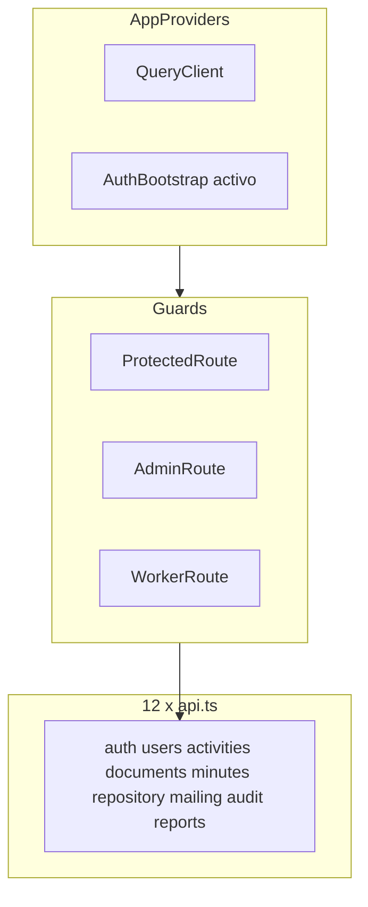

# Análisis técnico del frontend Somos Barrio

Documentación del estado actual de [`somosbarrio-frontend`](somosbarrio-frontend) (mayo 2026), alineada con [`somosbarrio-backend`](../BACKEND/somosbarrio-backend). Contraste API en [`INTEGRACION_FRONTEND_BACKEND.md`](INTEGRACION_FRONTEND_BACKEND.md).

---

## 1. Resumen ejecutivo

SPA de gestión documental (Subsecretaría de Prevención del Delito, Viña del Mar) con **dos experiencias de navegación** sobre la misma API:

| Experiencia | Login | Shell |
|-------------|-------|-------|
| Portal institucional (moderno) | `/login` | `ProtectedRoute` + `AppLayout` en `/` |
| Portal trabajador (clásico) | `/trabajador/login` | `WorkerRoute` + `WorkerLayout` en `/trabajador` |

Un **colaborador** puede operar desde el shell moderno (`/`, `/mis-reportes`, `/mis-actas`) o desde `/trabajador/*`. Un **administrador** usa el shell moderno con rutas extra vía `AdminRoute`.

**Estado:** integración API **~90–92 %**; módulos transversales (plantillas, mailing, auditoría, reportes Excel, usuarios con `PUT`, cuenta) implementados. Backend: ~55 endpoints, Flyway V1–V17.

**Correcciones recientes:**

- Alta actividad: `POST /activities` correcto.
- Interceptor: `TOKEN_EXPIRED` + refresh.
- `AuthBootstrap`: rehidratación y refresh proactivo al recargar.
- Portal unificado: colaborador en `AppLayout` con rutas `mis-*`.

**Pendiente relevante:**

- Ruta **`/repository`** no registrada en router (menú admin sí enlaza).
- `PATCH /activities/.../status` sin UI.
- `.env.example` con proxy **8080** (Compose usa **8081**).
- Sin tests automatizados.

---

## 2. Stack tecnológico

| Área | Tecnología |
|------|------------|
| UI | React 19 |
| Lenguaje | TypeScript ~6 |
| Bundler | Vite 8, Tailwind 4 |
| Routing | React Router 7 |
| HTTP | Axios 1.15 |
| Estado servidor | TanStack React Query 5 |
| Estado cliente | Zustand 5 (`persist` auth) |
| Formularios | react-hook-form + zod |

Scripts: `dev`, `build` (`tsc -b && vite build`), `preview`, `lint`. Sin `test`.

---

## 3. Arquitectura



**Alias:** `@/` → `src/`.

---

## 4. Configuración de entorno

| Variable | Uso |
|----------|-----|
| `VITE_BACKEND_PROXY_TARGET` | Proxy Vite `/api` → backend |
| `VITE_API_URL` | Base Axios (`/api/v1`) |
| `VITE_TEMPLATE_REPORTE_CODE` / `VITE_TEMPLATE_BITACORA_CODE` | Códigos plantilla (default `INFORME_TIPO`) |

| Contexto | Puerto |
|----------|--------|
| Frontend dev | 5173 |
| Backend Compose | **8081** → contenedor 8380 |
| Spring local | **8380** |
| `vite.config.ts` fallback | `http://localhost:8081` |
| `.env.example` | `http://localhost:8080` (**desalineado**) |

Recomendado con Docker:

```env
VITE_BACKEND_PROXY_TARGET=http://localhost:8081
VITE_API_URL=/api/v1
```

---

## 5. Autenticación y sesión

### Clientes

- `api` — Bearer, `X-Correlation-Id`, refresh en 401.
- `authClient` — login/refresh/logout sin Bearer.

### `authStore`

- Persiste `refreshToken` + `user` (no `accessToken`).
- `syncUser()` → `GET /auth/me`.
- `logout`: revoca refresh; **`localStorage.clear()`** (afecta datos locales worker).

### Guards y bootstrap

| Componente | Comportamiento |
|------------|----------------|
| `AuthBootstrap` | Rehidrata; si hay refresh sin access → `refresh()`; spinner de carga |
| `ProtectedRoute` | Sin token/user → `/login` |
| `AdminRoute` | Sin `ADMINISTRADOR` → `/` |
| `WorkerRoute` | Sin `COLABORADOR` → redirección login trabajador |

### Interceptor 401

Renueva si `code` es `TOKEN_EXPIRED`, `TOKEN_INVALID` o `AUTH_TOKEN_EXPIRED` (alineado con backend).

---

## 6. Routing completo

Fuente: [`src/app/router.tsx`](somosbarrio-frontend/src/app/router.tsx).

### Públicas

| Ruta | Página |
|------|--------|
| `/login` | `LoginPage` |
| `/trabajador/login` | `WorkerLoginPage` |

### Portal institucional (`ProtectedRoute` + `AppLayout`)

| Ruta | Página | Notas |
|------|--------|-------|
| `/` | `HomePage` | KPIs; UX distinta admin/colaborador |
| `/activities`, `/new`, `/:id/edit` | Actividades | |
| `/account` | `AccountPage` | |
| `/documents`, `/new`, `/:id` | Documentos | |
| `/minutes`, `/:id` | Actas admin | |
| `/mis-reportes` | `WorkerReportsPage` | Colaborador en shell moderno |
| `/mis-actas` | `WorkerMinutesPage` | Colaborador en shell moderno |
| `/reports` | `AdminReportsPage` | `AdminRoute` |
| `/document-templates` | `DocumentTemplatesPage` | `AdminRoute` |
| `/recipient-groups` | `RecipientGroupsPage` | `AdminRoute` |
| `/audit-logs` | `AuditLogsPage` | `AdminRoute` |
| `/users` | `UsersListPage` | `AdminRoute` |

> **`/repository`:** no está en el router; `RepositoryPage` existe pero el enlace del menú lleva a ruta no definida.

### Portal trabajador (`WorkerRoute`)

| Ruta | Página |
|------|--------|
| `/trabajador` | `WorkerHomePage` |
| `/trabajador/reportes` | `WorkerReportsPage` |
| `/trabajador/bitacora` | `WorkerLogbookPage` |
| `/trabajador/actas` | `WorkerMinutesPage` |
| `/trabajador/notas` | `WorkerNotesPage` (localStorage) |
| `/trabajador/configuracion`, `/ayuda` | Sin API |

### Comodín

`*` → **`/login`**

---

## 7. Capa HTTP — `*.api.ts` (12 archivos)

Base: `/api/v1`.

| Archivo | Rutas principales |
|---------|-------------------|
| `auth.api.ts` | login, refresh, logout, me, change-password |
| `users.api.ts` | GET, POST, PUT, DELETE `/users` |
| `activities.api.ts` | CRUD + PATCH status + DELETE |
| `documents.api.ts` | CRUD, workflow, adjuntos, pdf, preview |
| `document-templates.api.ts` | CRUD + resolve por código |
| `documents-reports.api.ts` | Excel documentos y actividades |
| `repository.api.ts` | `GET /repository/documents` |
| `document-mail.api.ts` | send, email-logs |
| `recipient-groups.api.ts` | CRUD grupos |
| `minutes.api.ts` | CRUD actas + adjuntos |
| `audit.api.ts` | `GET /audit-logs` |
| `reports.api.ts` | Orquesta creación documento informe (worker) |

### Llamadas legacy

| Página | Patrón |
|--------|--------|
| `ActivitiesListPage`, `HomePage` | `useEffect` + `api.get('/activities')` (correcto, no React Query) |
| `CreateActivityPage` | `api.post('/activities', …)` **correcto** |

---

## 8. Módulos funcionales

### Documentos — núcleo maduro

Bandeja, alta, detalle, workflow, adjuntos, PDF, preview, panel mail en aprobados.

### Admin transversal

Plantillas, destinatarios, auditoría, reportes Excel (docs + actividades), usuarios con edición `PUT`.

### Actividades

Listado con filtro y delete (admin); alta y edición OK; **sin UI** para `PATCH /status`.

### Actas

Admin (`/minutes`); worker (`/trabajador/actas` o `/mis-actas`).

### Repositorio

Implementado en código; **pendiente registrar ruta**.

### Trabajador auxiliar

Notas/config/ayuda sin API; borradores en `localStorage`.

---

## 9. Navegación (`SideNavBar`)

- Enlaces según rol: admin ve plantillas, destinatarios, repositorio, auditoría, reportes admin, usuarios.
- Colaborador en shell moderno: actas → `/mis-actas`, reportes → `/mis-reportes`.
- Perfil y logout; logout redirige a `/login` o `/trabajador/login` según rol.

---

## 10. Gestión de estado

| Capa | Uso |
|------|-----|
| Zustand `authStore` | Sesión |
| React Query | Documentos, plantillas, usuarios, actas, partes admin |
| `useEffect` + axios | Home y listado actividades |
| Local | Notas, borradores worker |

`PagedResponse`: `number`, `size` en [`shared/types/api.ts`](somosbarrio-frontend/src/shared/types/api.ts).

---

## 11. Deuda técnica

| Prioridad | Issue |
|-----------|-------|
| Alta | Registrar ruta `/repository` en router |
| Media | UI `PATCH /activities/{id}/status` |
| Media | `.env.example` puerto 8081 |
| Media | Listados actividades/home sin React Query unificado |
| Baja | `localStorage.clear()` en logout |
| Baja | Hooks `useChangeActivityStatus` / `useCreateActivity` duplicados vs páginas legacy |

---

## 12. Guía de pruebas manuales

### Setup

```bash
# Backend
cd somosbarrio-backend && docker compose up -d

# Frontend
cd somosbarrio-frontend
cp .env.example .env
# VITE_BACKEND_PROXY_TARGET=http://localhost:8081
npm install && npm run dev
```

| Rol | Email | Contraseña |
|-----|-------|------------|
| Admin | `admin@somosbarrio.cl` | `Admin123!` |
| Colaborador | `colaborador1@somosbarrio.cl` | `Admin123!` |

Swagger: `http://localhost:8081/swagger-ui.html`. Postman: [`../BACKEND/somosbarrio-backend/pruebas-backend.md`](../BACKEND/somosbarrio-backend/pruebas-backend.md).

### Casos clave

| ID | Escenario | Esperado |
|----|-----------|----------|
| TP-AUTH-01 | Login `/login` | Redirect `/`; F5 mantiene sesión (AuthBootstrap) |
| TP-AUTH-02 | Access expirado | Refresh automático (`TOKEN_EXPIRED`) |
| TP-ACT-01 | Crear `/activities/new` | `POST /activities` 201 |
| TP-ACT-02 | Eliminar actividad admin | `DELETE /activities/{id}` |
| TP-REP-01 | Menú Repositorio admin | **404** hasta añadir ruta en router |
| TP-DOC-01 | Workflow documento + mail | Flujo completo + `POST .../send` |
| TP-ADM-01 | `/audit-logs`, `/users` PUT | 200 como admin |
| TP-WKR-01 | `/mis-reportes` como colaborador en `/login` | Crea documento informe |
| TP-WKR-02 | `/trabajador/notas` | Sin requests REST |

---

## 13. Build y despliegue

```bash
npm run lint && npm run build
```

Producción: `VITE_API_URL` absoluta si no hay proxy `/api`. Backend: `APP_CORS_ORIGINS` con origen del SPA.

---

## 14. Referencias

| Documento | Ruta |
|-----------|------|
| Integración | [`INTEGRACION_FRONTEND_BACKEND.md`](INTEGRACION_FRONTEND_BACKEND.md) |
| Pruebas backend | [`../BACKEND/somosbarrio-backend/pruebas-backend.md`](../BACKEND/somosbarrio-backend/pruebas-backend.md) |
| README backend | [`../BACKEND/somosbarrio-backend/README.md`](../BACKEND/somosbarrio-backend/README.md) |
