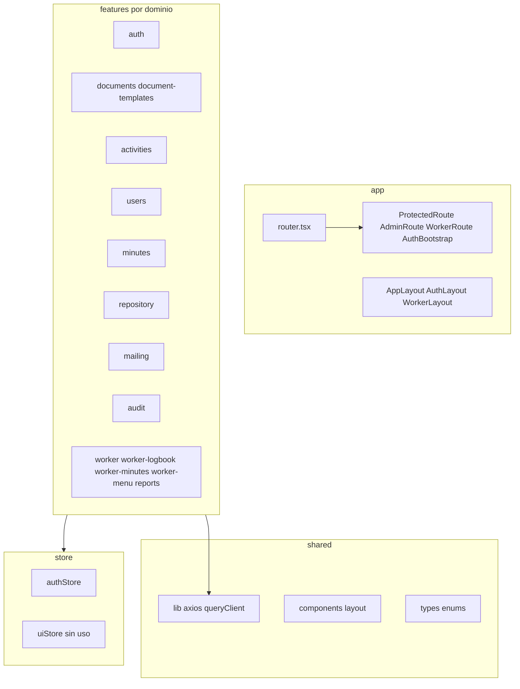

# Análisis técnico del frontend Somos Barrio

Documentación del estado actual de [`somosbarrio-frontend`](somosbarrio-frontend) (mayo 2026, post **PR #12**), alineada con el backend en [`somosbarrio-backend`](../BACKEND/somosbarrio-backend). Contraste de integración en [`INTEGRACION_FRONTEND_BACKEND.md`](INTEGRACION_FRONTEND_BACKEND.md).

---

## 1. Resumen ejecutivo

**Somos Barrio Frontend** es una SPA de gestión documental para la Subsecretaría de Prevención del Delito (Viña del Mar). Expone dos portales:

| Portal | Rol objetivo | Rutas base |
|--------|--------------|------------|
| **Institucional / admin** | Principalmente `ADMINISTRADOR` (algunas rutas para cualquier autenticado) | `/`, `/activities`, `/documents`, `/minutes`, `/repository`, `/account`, … |
| **Trabajador en terreno** | `COLABORADOR` | `/trabajador/*` |

**Estado general:** el frontend está **maduro en integración API** tras cerrar las brechas del análisis: repositorio, mailing, auditoría, plantillas admin, actas admin, reportes Excel (documentos y actividades), cuenta de usuario y CRUD usuarios con `PUT`. El backend asociado expone ~55 endpoints REST (Flyway V1–V17). Cobertura estimada **~85–90 %** del catálogo API.

**Puntos críticos pendientes en el cliente:**

- Bug **`POST /api/v1/api/v1/activities`** solo en [`CreateActivityPage`](somosbarrio-frontend/src/features/activities/pages/CreateActivityPage.tsx) (el listado ya usa `GET /activities` correcto).
- Interceptor no trata **`TOKEN_EXPIRED`** del backend.
- [`AuthBootstrap`](somosbarrio-frontend/src/app/AuthBootstrap.tsx): montado pero **lógica comentada**.
- Sin tests automatizados.

**Mejoras recientes (PR #12):**

- [`ProtectedRoute`](somosbarrio-frontend/src/app/ProtectedRoute.tsx) **activo**; [`AdminRoute`](somosbarrio-frontend/src/app/AdminRoute.tsx) para módulos solo admin.
- Nuevas pantallas: repositorio, plantillas, destinatarios, auditoría, actas admin, reportes admin, cuenta.
- `GET /auth/me` + change-password; `PUT /users/{id}`; panel mailing en detalle documento.
- [`SideNavBar`](somosbarrio-frontend/src/shared/components/layout/SideNavBar.tsx) con perfil real desde `authStore`.

---

## 2. Stack tecnológico

| Área | Tecnología |
|------|------------|
| UI | React 19, React DOM |
| Lenguaje | TypeScript ~6 (`tsc -b` en build) |
| Bundler | Vite 8, `@vitejs/plugin-react`, `@tailwindcss/vite` |
| Estilos | Tailwind CSS 4, tokens en [`src/index.css`](somosbarrio-frontend/src/index.css) |
| Routing | React Router 7 (`createBrowserRouter`) |
| HTTP | Axios 1.15 |
| Estado servidor | TanStack React Query 5 |
| Estado cliente | Zustand 5 (`persist` en auth) |
| Formularios | react-hook-form, zod, `@hookform/resolvers` |
| Iconografía | Material Symbols (CDN en `index.html`) |

### Scripts NPM

| Script | Comando | Uso |
|--------|---------|-----|
| `dev` | `vite` | Desarrollo con HMR y proxy `/api` |
| `build` | `tsc -b && vite build` | Typecheck + bundle producción |
| `preview` | `vite preview` | Servir build local |
| `lint` | `eslint .` | Análisis estático |

No hay script `test` ni dependencias Vitest/Jest/Playwright.

---

## 3. Arquitectura del código



**Convención por feature:** `pages/`, `api/`, `hooks/`, `components/`, `lib/`, `schemas/`, `types.ts`.

**Alias:** `@/` → `src/` ([`vite.config.ts`](somosbarrio-frontend/vite.config.ts)).

---

## 4. Configuración de entorno

### Variables ([`.env.example`](somosbarrio-frontend/.env.example))

| Variable | Propósito |
|----------|-----------|
| `VITE_BACKEND_PROXY_TARGET` | Target del proxy Vite (`/api` → backend) |
| `VITE_API_URL` | Base del cliente Axios (desarrollo: `/api/v1`) |
| `VITE_APP_NAME`, `VITE_ENV` | Metadatos UI |
| `VITE_TEMPLATE_REPORTE_CODE` | Código plantilla informes (default `INFORME_TIPO`) |
| `VITE_TEMPLATE_BITACORA_CODE` | Código plantilla bitácora (default `INFORME_TIPO`) |

### Proxy y puertos

| Contexto | Puerto / URL |
|----------|----------------|
| Frontend dev | `http://localhost:5173` |
| Backend Docker Compose | **`http://localhost:8081`** (mapa `8081:8380`) |
| Spring local (`mvn spring-boot:run`) | **`http://localhost:8380`** |
| Fallback en `vite.config.ts` si falta env | `http://localhost:8081` |
| `.env.example` actual | `VITE_BACKEND_PROXY_TARGET=http://localhost:8080` (**desalineado** con Compose) |

**Recomendación local con Compose:**

```env
VITE_BACKEND_PROXY_TARGET=http://localhost:8081
VITE_API_URL=/api/v1
```

---

## 5. Autenticación y sesión

### Clientes HTTP

| Cliente | Archivo | Uso |
|---------|---------|-----|
| `api` | [`shared/lib/axios.ts`](somosbarrio-frontend/src/shared/lib/axios.ts) | Bearer + `X-Correlation-Id`; refresh en 401 |
| `authClient` | [`features/auth/api/authClient.ts`](somosbarrio-frontend/src/features/auth/api/authClient.ts) | Login/refresh/logout sin Bearer |

### Store ([`store/authStore.ts`](somosbarrio-frontend/src/store/authStore.ts))

- Persistencia `localStorage` key `sb-auth`: `refreshToken` y `user` (no `accessToken`).
- `syncUser()` → `GET /auth/me` para refrescar perfil.
- Normaliza roles quitando prefijo `ROLE_`.
- `logout`: revoca refresh; `localStorage.clear()` (afecta notas/borradores).

### Guards y bootstrap

| Componente | Estado | Comportamiento |
|------------|--------|----------------|
| `ProtectedRoute` | **Activo** | Sin `accessToken` + `user` → `/login` |
| `AdminRoute` | **Activo** | Sin rol `ADMINISTRADOR` → `/` |
| `WorkerRoute` | **Activo** | Exige token + rol `COLABORADOR` |
| `AuthBootstrap` | **Passthrough** | Código de rehidratación/refresh comentado |

### Sync de perfil

- [`useSyncCurrentUser`](somosbarrio-frontend/src/features/auth/hooks/useSyncCurrentUser.ts) en [`AppLayout`](somosbarrio-frontend/src/app/layouts/AppLayout.tsx) y [`WorkerLayout`](somosbarrio-frontend/src/app/layouts/WorkerLayout.tsx).
- [`AccountPage`](somosbarrio-frontend/src/features/auth/pages/AccountPage.tsx): perfil + `POST /auth/change-password`.

### Interceptor 401

Renueva token si `code === 'AUTH_TOKEN_EXPIRED'` **o** `'TOKEN_INVALID'`. **No incluye `TOKEN_EXPIRED`** (código real del backend para access JWT caducado).

---

## 6. Routing completo

Fuente: [`src/app/router.tsx`](somosbarrio-frontend/src/app/router.tsx).

### Públicas

| Ruta | Página |
|------|--------|
| `/login` | `LoginPage` |
| `/trabajador/login` | `WorkerLoginPage` |

### Portal admin (`ProtectedRoute` + `AppLayout`)

| Ruta | Página | Restricción |
|------|--------|-------------|
| `/` | `HomePage` | Autenticado |
| `/activities`, `/activities/new`, `/activities/:id/edit` | Actividades | Autenticado |
| `/repository` | `RepositoryPage` | Autenticado |
| `/account` | `AccountPage` | Autenticado |
| `/documents`, `/documents/new`, `/documents/:id` | Documentos | Autenticado |
| `/minutes`, `/minutes/:id` | Actas admin | Autenticado |
| `/reports` | `AdminReportsPage` | **`AdminRoute`** |
| `/document-templates` | `DocumentTemplatesPage` | **`AdminRoute`** |
| `/recipient-groups` | `RecipientGroupsPage` | **`AdminRoute`** |
| `/audit-logs` | `AuditLogsPage` | **`AdminRoute`** |
| `/users` | `UsersListPage` | **`AdminRoute`** |

### Portal trabajador (`WorkerRoute` + `WorkerLayout`)

| Ruta | Página |
|------|--------|
| `/trabajador` | `WorkerHomePage` |
| `/trabajador/reportes` | `WorkerReportsPage` |
| `/trabajador/bitacora` | `WorkerLogbookPage` |
| `/trabajador/actas` | `WorkerMinutesPage` |
| `/trabajador/configuracion` | `WorkerConfigPage` (sin API) |
| `/trabajador/ayuda` | `WorkerHelpPage` (estático) |
| `/trabajador/notas` | `WorkerNotesPage` (`localStorage`) |

**Huérfana:** [`WorkerMyRecordsPage.tsx`](somosbarrio-frontend/src/features/worker-menu/pages/WorkerMyRecordsPage.tsx) no registrada en router.

---

## 7. Capa HTTP — inventario `*.api.ts`

Base: `VITE_API_URL` → `/api/v1`. **12 archivos** en `src/features/**/api/`.

### Auth — [`auth.api.ts`](somosbarrio-frontend/src/features/auth/api/auth.api.ts)

| Función | Método | Ruta |
|---------|--------|------|
| `loginRequest` | POST | `/auth/login` |
| `refreshRequest` | POST | `/auth/refresh` |
| `logoutRequest` | POST | `/auth/logout` |
| `getMeRequest` | GET | `/auth/me` |
| `changePasswordRequest` | POST | `/auth/change-password` |

### Actividades — [`activities.api.ts`](somosbarrio-frontend/src/features/activities/api/activities.api.ts)

| Función | Método | Ruta |
|---------|--------|------|
| `getActivities` | GET | `/activities` |
| `getActivityById` | GET | `/activities/:id` |
| `createActivity` | POST | `/activities` |
| `updateActivity` | PUT | `/activities/:id` |
| `changeActivityStatus` | PATCH | `/activities/:id/status` |
| `deleteActivity` | DELETE | `/activities/:id` |

### Documentos — [`documents.api.ts`](somosbarrio-frontend/src/features/documents/api/documents.api.ts)

CRUD, workflow, adjuntos multipart, PDF, preview-docx, `createDocumentWithAttachments`.

### Plantillas — [`document-templates.api.ts`](somosbarrio-frontend/src/features/documents/api/document-templates.api.ts)

| Función | Método | Ruta |
|---------|--------|------|
| `listDocumentTemplates` | GET | `/document-templates` |
| `getDocumentTemplateById` | GET | `/document-templates/:id` |
| `createDocumentTemplate` | POST | `/document-templates` |
| `updateDocumentTemplate` | PUT | `/document-templates/:id` |
| `deleteDocumentTemplate` | DELETE | `/document-templates/:id` |
| `resolveTemplateId` | — | cache por código |

### Reportes Excel — [`documents-reports.api.ts`](somosbarrio-frontend/src/features/documents/api/documents-reports.api.ts)

| Función | Método | Ruta |
|---------|--------|------|
| `downloadDocumentsExcelReport` | GET | `/reports/documents` |
| `downloadActivitiesExcelReport` | GET | `/reports/activities` |

### Usuarios — [`users.api.ts`](somosbarrio-frontend/src/features/users/api/users.api.ts)

| Función | Método | Ruta |
|---------|--------|------|
| `getAll` | GET | `/users` |
| `create` | POST | `/users` |
| `update` | PUT | `/users/:id` |
| `delete` | DELETE | `/users/:id` |

### Repositorio — [`repository.api.ts`](somosbarrio-frontend/src/features/repository/api/repository.api.ts)

| Función | Método | Ruta |
|---------|--------|------|
| `searchRepositoryDocuments` | GET | `/repository/documents` |

### Mailing — [`document-mail.api.ts`](somosbarrio-frontend/src/features/mailing/api/document-mail.api.ts), [`recipient-groups.api.ts`](somosbarrio-frontend/src/features/mailing/api/recipient-groups.api.ts)

| Función | Método | Ruta |
|---------|--------|------|
| `sendDocumentByEmail` | POST | `/documents/:id/send` |
| `getDocumentEmailLogs` | GET | `/documents/:id/email-logs` |
| CRUD grupos | GET/POST/PUT/PATCH | `/recipient-groups` |

### Actas — [`minutes.api.ts`](somosbarrio-frontend/src/features/minutes/api/minutes.api.ts)

Listado, detalle, CRUD, status, adjuntos (upload/download/delete), `createMinuteWithAttachments` (worker).

### Auditoría — [`audit.api.ts`](somosbarrio-frontend/src/features/audit/api/audit.api.ts)

| Función | Método | Ruta |
|---------|--------|------|
| `getAuditLogs` | GET | `/audit-logs` |

### Reportes trabajador — [`reports.api.ts`](somosbarrio-frontend/src/features/reports/api/reports.api.ts)

Orquesta `createDocumentWithAttachments` (sin endpoint REST propio).

### Llamadas fuera de convención

| Archivo | Problema |
|---------|----------|
| [`CreateActivityPage.tsx`](somosbarrio-frontend/src/features/activities/pages/CreateActivityPage.tsx) | `POST '/api/v1/activities'` → **doble prefijo** |
| [`ActivitiesListPage.tsx`](somosbarrio-frontend/src/features/activities/pages/ActivitiesListPage.tsx) | `GET '/activities'` correcto; implementación legacy con `useEffect` (no React Query) |

---

## 8. Módulos funcionales

### 8.1 Auth (`features/auth`)

- Login admin y colaborador con redirección por rol.
- Cuenta: sync perfil + cambio contraseña.

### 8.2 Home (`features/home`)

- KPIs y actividades recientes; export Excel documentos.

### 8.3 Actividades (`features/activities`)

- Listado con filtro estado y **eliminar** (admin).
- Edición vía React Query (`useActivity`, `useUpdateActivity`).
- **Alta rota** en `CreateActivityPage`; hooks `useCreateActivity` / `useChangeActivityStatus` **sin uso en páginas**.

### 8.4 Documentos (`features/documents`) — núcleo maduro

- Bandeja, alta, detalle con workflow, adjuntos, PDF, preview DOCX.
- [`DocumentMailPanel`](somosbarrio-frontend/src/features/mailing/components/DocumentMailPanel.tsx) en documentos aprobados.

### 8.5 Plantillas admin (`features/document-templates`)

- CRUD JSON (`code`, `fieldsSchema`, `templateFilePath`); sin upload `.docx`.

### 8.6 Repositorio (`features/repository`)

- Búsqueda multi-criterio paginada en `/repository`.

### 8.7 Mailing admin (`features/mailing`)

- Grupos destinatarios; envío e historial en detalle documento.

### 8.8 Actas (`features/minutes` + `worker-minutes`)

- Admin: listado y detalle con edición/estados/adjuntos.
- Trabajador: creación con envío a revisión.

### 8.9 Auditoría (`features/audit`)

- Consulta paginada con filtros en `/audit-logs`.

### 8.10 Reportes admin (`features/reports`)

- [`AdminReportsPage`](somosbarrio-frontend/src/features/reports/pages/AdminReportsPage.tsx): Excel documentos y actividades.

### 8.11 Usuarios (`features/users`)

- Listar, crear, **editar** (`PUT`), desactivar; contraseña temporal fija en alta.

### 8.12 Trabajador auxiliar

- Notas/config/ayuda sin API; borradores en `localStorage`.

---

## 9. Gestión de estado

| Capa | Implementación |
|------|----------------|
| Auth | Zustand `authStore` + `syncUser` |
| UI global | `uiStore` — sin consumidores |
| Servidor | React Query (documentos, plantillas, usuarios, actas, hooks actividades en edición) |
| Inline RQ | repositorio, auditoría, plantillas admin, grupos destinatarios |
| Local | Borradores, notas, filtros UI |

**Paginación:** [`shared/types/api.ts`](somosbarrio-frontend/src/shared/types/api.ts) usa `number` y `size` (alineado con backend `PagedResponse`). `users.api.getAll()` consume `content` sin paginar explícitamente en query params.

---

## 10. Componentes compartidos

- [`SideNavBar`](somosbarrio-frontend/src/shared/components/layout/SideNavBar.tsx): navegación admin completa (documentos, actas, repositorio, plantillas, destinatarios, auditoría, reportes, usuarios); perfil desde `authStore`; enlace `/account`.
- `PageHeader`, `EmptyState`, `DateInput`, `Button` (CVA).

---

## 11. Deuda técnica conocida

| Prioridad | Issue |
|-----------|-------|
| Alta | `CreateActivityPage` POST con doble `/api/v1` |
| Alta | Interceptor sin `TOKEN_EXPIRED`; `AuthBootstrap` vacío |
| Media | Listado actividades legacy (`useEffect`) vs hooks React Query |
| Media | `PATCH /activities/{id}/status` sin UI |
| Media | `.env.example` puerto 8080 vs Compose 8081 |
| Baja | `logout` con `localStorage.clear()` |
| Baja | `uiStore`, `WorkerMyRecordsPage`, hooks actividades sin cablear |
| Baja | `listMinuteAttachments` sin uso (detalle trae adjuntos en DTO) |

---

## 12. Guía de pruebas manuales

### 12.1 Preparación (TP-SETUP)

**Precondiciones:** Node 18+, backend con Flyway V1–V17.

```bash
# Backend (somosbarrio-backend)
docker compose up -d

# Frontend
cd somosbarrio-frontend
cp .env.example .env
# Editar: VITE_BACKEND_PROXY_TARGET=http://localhost:8081
npm install
npm run dev
```

| Rol | Email | Contraseña |
|-----|-------|------------|
| Admin | `admin@somosbarrio.cl` | `Admin123!` |
| Colaborador | `colaborador1@somosbarrio.cl` | `Admin123!` |

Swagger: `http://localhost:8081/swagger-ui.html`. Guía backend: [`../BACKEND/somosbarrio-backend/pruebas-backend.md`](../BACKEND/somosbarrio-backend/pruebas-backend.md).

---

### 12.2 Autenticación (TP-AUTH)

| ID | Escenario | Esperado |
|----|-----------|----------|
| TP-AUTH-01 | Login admin | Redirect `/`; `POST /auth/login` 200 |
| TP-AUTH-02 | Login colaborador | Entrada `/trabajador` |
| TP-AUTH-03 | Ruta admin sin sesión | Redirect `/login` (`ProtectedRoute`) |
| TP-AUTH-04 | `/account` change-password | `POST /auth/change-password` 204 |
| TP-AUTH-05 | Colaborador en `/users` | Redirect `/` (`AdminRoute`) |

---

### 12.3 Actividades (TP-ACT)

| ID | Escenario | Esperado |
|----|-----------|----------|
| TP-ACT-01 | Listado `/activities` | `GET /activities` 200 |
| TP-ACT-02 | Crear `/activities/new` | **Bug conocido** si URL es `/api/v1/api/v1/activities` |
| TP-ACT-03 | Editar | `PUT /activities/:id` 200 |
| TP-ACT-04 | Eliminar (admin) | `DELETE /activities/:id` |

---

### 12.4 Documentos (TP-DOC)

Flujo completo: crear → adjunto → submit → approve → PDF → preview → reject/reopen → mail en aprobado (`POST .../send`, logs).

---

### 12.5 Módulos admin nuevos (TP-ADM)

| ID | Ruta | API clave |
|----|------|-----------|
| TP-ADM-01 | `/repository` | `GET /repository/documents` |
| TP-ADM-02 | `/document-templates` | CRUD `/document-templates` |
| TP-ADM-03 | `/recipient-groups` | CRUD `/recipient-groups` |
| TP-ADM-04 | `/audit-logs` | `GET /audit-logs` |
| TP-ADM-05 | `/reports` | Excel docs + actividades |
| TP-ADM-06 | `/minutes` | Listado/detalle actas |
| TP-ADM-07 | `/users` | PUT usuario |

---

### 12.6 Portal trabajador (TP-WKR)

Reporte, bitácora, actas; notas solo localStorage.

---

### 12.7 Negativos (TP-NEG)

| ID | Escenario | Esperado |
|----|-----------|----------|
| TP-NEG-01 | Colaborador aprueba documento | 403 |
| TP-NEG-02 | Access JWT expirado | 401 `TOKEN_EXPIRED` (refresh puede no dispararse) |

---

## 13. Build y despliegue

```bash
npm run lint
npm run build
npm run preview
```

**Producción:** `VITE_API_URL` absoluta si no hay proxy `/api`. Backend: `APP_CORS_ORIGINS` incluyendo origen del SPA.

---

## 14. Referencias

| Documento | Ruta |
|-----------|------|
| Integración frontend–backend | [`INTEGRACION_FRONTEND_BACKEND.md`](INTEGRACION_FRONTEND_BACKEND.md) |
| Pruebas backend Postman | [`../BACKEND/somosbarrio-backend/pruebas-backend.md`](../BACKEND/somosbarrio-backend/pruebas-backend.md) |
| README backend | [`../BACKEND/somosbarrio-backend/README.md`](../BACKEND/somosbarrio-backend/README.md) |
| OpenAPI runtime | `{backend-host}/swagger-ui.html` |
