# Integración Frontend ↔ Backend Somos Barrio

Contraste entre el cliente SPA ([`somosbarrio-frontend`](somosbarrio-frontend)) y la API REST de Spring Boot ([`somosbarrio-backend`](../BACKEND/somosbarrio-backend)), actualizado tras el merge de **PR #12** (brechas del análisis API) — mayo 2026.

Complementa el análisis del cliente en [`ANALISIS_FRONTEND.md`](ANALISIS_FRONTEND.md).

**Contexto:** el **backend está completo** (~55 endpoints REST, Flyway V1–V17, módulos auth, actividades, documentos, actas, plantillas, mailing, reportes Excel, auditoría y repositorio). El **frontend integra la mayoría del catálogo API** tras la ronda de brechas: repositorio, mailing, auditoría, plantillas admin, actas admin, reportes Excel de actividades, cuenta (`/auth/me`, change-password) y edición de usuarios (`PUT`).

**Referencias servidor:**

- Prefijo REST: `/api/v1`
- Swagger (Compose): `http://localhost:8081/swagger-ui.html` (host **8081** → contenedor **8380**)
- OpenAPI JSON: `/v3/api-docs`
- Pruebas manuales backend: [`../BACKEND/somosbarrio-backend/pruebas-backend.md`](../BACKEND/somosbarrio-backend/pruebas-backend.md)

```mermaid
flowchart LR
  subgraph frontend [Frontend React :5173]
    Admin[Portal admin ProtectedRoute]
    Worker[Portal trabajador WorkerRoute]
  end
  subgraph integrated [Integrado en SPA]
    I1[auth login refresh logout me change-password]
    I2[documentos workflow adjuntos PDF mail]
    I3[usuarios CRUD PUT incluido]
    I4[actividades list edit delete]
    I5[reportes Excel docs y actividades]
    I6[actas admin y colaborador]
    I7[repositorio plantillas mailing audit]
  end
  subgraph gap [Brechas residuales]
    G1[CreateActivityPage POST duplicado]
    G2[PATCH activity status sin UI]
    G3[TOKEN_EXPIRED en interceptor]
    G4[AuthBootstrap vacio]
    G5[upload docx plantillas]
    G6[notas worker localStorage]
  end
  frontend --> integrated
  gap -.->|"deuda menor"| frontend
```

---

## 1. Resumen ejecutivo de integración

| Dimensión | Backend | Frontend |
|-----------|---------|----------|
| Endpoints REST | ~55 en 13 controladores | ~52 rutas consumidas vía **12** archivos `*.api.ts` |
| Módulos en servidor | Auth, actividades, documentos, actas, plantillas, mailing, reportes, auditoría, repositorio | Todos con cliente HTTP; casi todos con pantalla |
| Cobertura estimada | — | **~85–90 %** del catálogo API; flujos de negocio visibles **~90 %** |

**Bloqueadores / deuda técnica residual:**

1. **`CreateActivityPage`**: `POST /api/v1/activities` con `baseURL` ya en `/api/v1` → URL efectiva **`/api/v1/api/v1/activities`** (404).
2. **Interceptor Axios**: no trata código **`TOKEN_EXPIRED`** (backend lo devuelve en access JWT caducado); solo reacciona a `AUTH_TOKEN_EXPIRED` (inexistente en backend) o `TOKEN_INVALID`.
3. **`AuthBootstrap`**: montado pero lógica comentada — sin rehidratación/refresh proactivo al F5.
4. **`.env.example`**: cita proxy **`8080`**; Compose usa **8081** (`vite.config.ts` fallback sí es **8081**).

**Resuelto desde la versión anterior de este documento:**

- `ProtectedRoute` **activo** (redirige a `/login` sin sesión).
- `AdminRoute` protege rutas solo **`ADMINISTRADOR`** (`/users`, `/reports`, plantillas, destinatarios, auditoría).
- Repositorio, mailing, auditoría, plantillas CRUD, actas admin, Excel actividades, `GET /auth/me`, `POST /auth/change-password`, `PUT /users/{id}`.
- `SideNavBar` muestra nombre/rol desde **`authStore.user`**; `useSyncCurrentUser` en layouts admin y trabajador.

---

## 2. Qué cumple hoy el frontend frente al backend

Capacidades del backend para las que el SPA dispone de **cliente HTTP y pantalla** (o flujo embebido). Se marcan integraciones **parciales** cuando la UI existe pero hay fallo o hueco menor.

### 2.1 Autenticación y sesión

| Endpoint | Cliente | UI |
|----------|---------|-----|
| `POST /auth/login` | [`auth.api.ts`](somosbarrio-frontend/src/features/auth/api/auth.api.ts) | `/login`, `/trabajador/login` |
| `POST /auth/refresh` | interceptor + `authStore.refresh()` | Automático en 401 (limitado; ver §5) |
| `POST /auth/logout` | `auth.api.ts` | SideNavBar, layouts |
| `GET /auth/me` | `getMeRequest` + `authStore.syncUser()` | `/account`; sync en `AppLayout` / `WorkerLayout` |
| `POST /auth/change-password` | `changePasswordRequest` | [`AccountPage`](somosbarrio-frontend/src/features/auth/pages/AccountPage.tsx) |

### 2.2 Actividades

| Endpoint | Cliente | UI |
|----------|---------|-----|
| `GET /activities` | `activities.api.ts`; listado legacy en [`ActivitiesListPage`](somosbarrio-frontend/src/features/activities/pages/ActivitiesListPage.tsx) | `/activities`, home |
| `GET /activities/{id}`, `PUT` | hooks React Query | `/activities/:id/edit` |
| `POST /activities` | `createActivity` en API (**no usado** en alta) | **`CreateActivityPage` roto** → POST duplicado |
| `PATCH /activities/{id}/status` | `changeActivityStatus` + `useChangeActivityStatus` | **Sin UI** (hook sin consumidor) |
| `DELETE /activities/{id}` | `deleteActivity` | Botón eliminar en listado (solo admin) |

### 2.3 Gestión documental

- **Documentos** (`/documents`): CRUD, workflow (`submit-review`, `approve`, `reject`, `reopen`), adjuntos multipart, PDF, preview DOCX — [`documents.api.ts`](somosbarrio-frontend/src/features/documents/api/documents.api.ts); `/documents`, `/documents/new`, `/documents/:id`.
- **Mailing en detalle**: `POST .../send`, `GET .../email-logs` — [`document-mail.api.ts`](somosbarrio-frontend/src/features/mailing/api/document-mail.api.ts) + [`DocumentMailPanel`](somosbarrio-frontend/src/features/mailing/components/DocumentMailPanel.tsx) en documento **APROBADO**.
- **Flujos colaborador** (misma API documentos):
  - Informe rápido — `/trabajador/reportes` → plantilla `VITE_TEMPLATE_REPORTE_CODE` (`INFORME_TIPO`).
  - Bitácora — `/trabajador/bitacora` → `VITE_TEMPLATE_BITACORA_CODE`.

### 2.4 Plantillas

| Endpoint | Cliente | UI |
|----------|---------|-----|
| `GET /document-templates` | `document-templates.api.ts` | Crear documento, worker, admin |
| `GET /document-templates/{id}` | `getDocumentTemplateById` | Admin CRUD |
| `POST`, `PUT`, `DELETE` | create/update/delete | [`DocumentTemplatesPage`](somosbarrio-frontend/src/features/document-templates/pages/DocumentTemplatesPage.tsx) (`AdminRoute`) |

> El `.docx` matriz **no se sube por API** (solo `templateFilePath` en JSON apuntando a `TEMPLATE_ROOT` en servidor).

### 2.5 Repositorio documental

- **`GET /repository/documents`**: [`repository.api.ts`](somosbarrio-frontend/src/features/repository/api/repository.api.ts) + [`RepositoryPage`](somosbarrio-frontend/src/features/repository/pages/RepositoryPage.tsx) (`/repository`).

### 2.6 Administración de usuarios

- **`GET /users`**, **`POST /users`**, **`PUT /users/{id}`**, **`DELETE /users/{id}`**: [`users.api.ts`](somosbarrio-frontend/src/features/users/api/users.api.ts) + [`UsersListPage`](somosbarrio-frontend/src/features/users/pages/UsersListPage.tsx) (`AdminRoute`).
- Mapeo API `isActive` → modelo UI `enabled` en `mapUser`.

### 2.7 Mailing — grupos destinatarios

- **`GET /recipient-groups`**, **`POST`**, **`PUT /{id}`**, **`PATCH /{id}/deactivate`**: [`recipient-groups.api.ts`](somosbarrio-frontend/src/features/mailing/api/recipient-groups.api.ts) + [`RecipientGroupsPage`](somosbarrio-frontend/src/features/mailing/pages/RecipientGroupsPage.tsx).

### 2.8 Actas (`minutes`)

| Ámbito | Endpoints | UI |
|--------|-----------|-----|
| Admin | `GET /minutes`, `GET /{id}`, `PUT`, `DELETE`, `PATCH .../status`, adjuntos upload/download/delete | `/minutes`, `/minutes/:id` |
| Colaborador | `POST`, adjuntos, auto `EN_REVISION` | `/trabajador/actas` |

> Backend: actas **sin** estado `RECHAZADA` (solo `BORRADOR`, `EN_REVISION`, `APROBADA`). Admin **no tiene pantalla de alta** de acta (solo listado/detalle; creación vía portal trabajador).

### 2.9 Reportes exportables

| Endpoint | UI |
|----------|-----|
| `GET /reports/documents` | Diálogo export + [`AdminReportsPage`](somosbarrio-frontend/src/features/reports/pages/AdminReportsPage.tsx) |
| `GET /reports/activities` | `AdminReportsPage` (`downloadActivitiesExcelReport`) |

### 2.10 Auditoría

- **`GET /audit-logs`**: [`audit.api.ts`](somosbarrio-frontend/src/features/audit/api/audit.api.ts) + [`AuditLogsPage`](somosbarrio-frontend/src/features/audit/pages/AuditLogsPage.tsx) (`AdminRoute`).

---

## 3. Qué cumple el backend que el frontend aún no cubre por completo

Brechas **residuales** (el grueso del §3 anterior quedó integrado en PR #12).

### 3.1 Endpoints sin UI o sin uso efectivo

| Endpoint | Motivo |
|----------|--------|
| `PATCH /activities/{id}/status` | Cliente y hook existen; **ninguna pantalla** cambia estado de actividad |
| `GET /documents/{id}/attachments` (listado aislado) | El detalle usa `doc.attachments` del `GET /documents/{id}` |
| `GET /minutes/{id}/attachments` (listado aislado) | `listMinuteAttachments` exportado pero **sin import** en componentes; detalle usa DTO |
| `POST /minutes` (admin) | Sin ruta `/minutes/new` en portal institucional |

### 3.2 Comportamiento solo servidor (sin expectativa de UI)

- Migraciones Flyway **V1–V17**, merge Word (POI), PDF LibreOffice, `UPLOAD_ROOT` / `TEMPLATE_ROOT`, Actuator, correlativos, auditoría persistida en servicios.
- Upload multipart de matrices `.docx` — **fuera de diseño** actual del API (decisión producto).

### 3.3 Portal trabajador sin backend

- **`/trabajador/notas`**: solo `localStorage`.
- **`/trabajador/configuracion`**, **`/trabajador/ayuda`**: sin API de preferencias/contenido remoto.

---

## 4. Qué muestra el frontend pero no integra bien con el backend

### 4.1 Sesión y arranque

- **`AuthBootstrap` vacío**: tras F5, `accessToken` no está en memoria (no se persiste); el usuario autenticado depende de que el interceptor dispare refresh en el primer 401 o de volver a login.
- **Refresh silencioso incompleto**: access expirado → backend **`TOKEN_EXPIRED`** → interceptor **no** renueva; puede cerrar sesión antes de intentar refresh.

### 4.2 Persistencia local

- Borradores trabajador ([`worker-form-draft.ts`](somosbarrio-frontend/src/features/worker/lib/worker-form-draft.ts)), notas, defaults bitácora hardcodeados.
- **`logout`**: `localStorage.clear()` borra notas/borradores además de auth.

### 4.3 Integraciones rotas o legacy

- **`CreateActivityPage`**: `api.post('/api/v1/activities', …)` → doble prefijo (listado ya usa `GET /activities` correctamente).
- **Alta actividad envía `status` en body**: el backend ignora o valida según DTO (`CreateActivityRequest` no incluye `status`; estado inicial lo fija servidor).
- **Contraseña temporal en alta usuario**: valor fijo en UI; flujo institucional con **`change-password`** existe pero no está enlazado al alta.
- **`FALLBACK_ACTIVITY_ID`**: UUID fijo si no hay actividades en BD ([`useDefaultActivityId`](somosbarrio-frontend/src/features/worker/hooks/useDefaultActivityId.ts)).

### 4.4 Código sin cablear

- `useCreateActivity`, `useChangeActivityStatus`: definidos, **sin página** que los use.
- `uiStore`, `WorkerMyRecordsPage`: sin uso en router activo.

---

## 5. Desajustes de contrato y bloqueadores técnicos

| Tema | Síntoma | Acción recomendada |
|------|---------|-------------------|
| **Doble prefijo solo en alta actividad** | `CreateActivityPage` → 404 | `api.post('/activities', …)` o `useCreateActivity()` |
| **JWT expirado** | Backend `TOKEN_EXPIRED`; interceptor ignora | Añadir `TOKEN_EXPIRED` junto a `TOKEN_INVALID` en [`axios.ts`](somosbarrio-frontend/src/shared/lib/axios.ts) |
| **Código fantasma `AUTH_TOKEN_EXPIRED`** | Nunca lo emite el backend | Eliminar o mantener por compatibilidad futura |
| **Paginación usuarios** | `getAll()` trae `content` sin query `page`/`size` | Opcional: paginar en cliente o pasar params Spring |
| **Campo activo** | UI `enabled` vs API `isActive` | Ya mapeado en `users.api.ts`; mantener al editar |
| **Puerto proxy** | `.env.example` → **8080**; Compose → **8081** | Actualizar `.env.example` o documentar en README front |
| **Logout scope** | `localStorage.clear()` | Limpiar solo claves `sb-*` |

---

## 6. Matriz de cobertura por módulo

| Módulo | Backend | Frontend UI | Integración |
|--------|---------|-------------|-------------|
| Auth | 5 endpoints | 5 consumidos | ~95 % (bootstrap/refresh fino pendiente) |
| Usuarios | GET, POST, PUT, DELETE | Completo admin | ~95 % |
| Actividades | CRUD + status + DELETE | List/edit/delete; alta rota; sin PATCH status UI | ~75 % |
| Documentos + adjuntos + mail | Completo | Completo + panel mail | ~95 % |
| Plantillas | GET + CRUD admin | CRUD admin (sin upload docx) | ~85 % |
| Repositorio | GET búsqueda | `/repository` | ~90 % |
| Mailing grupos | CRUD + deactivate | `/recipient-groups` | ~95 % |
| Actas | CRUD + adjuntos + estados | Admin list/detail + worker create | ~80 % |
| Reportes | Excel docs + actividades | Ambos en admin | ~100 % |
| Auditoría | GET logs admin | `/audit-logs` | ~90 % |

---

## 7. Roadmap hacia integración completa

### Fase 1 — Correcciones críticas (cliente)

1. Corregir **`CreateActivityPage`** (POST relativo `/activities`).
2. Tratar **`TOKEN_EXPIRED`** en interceptor; reactivar lógica **`AuthBootstrap`**.
3. UI **`PATCH /activities/{id}/status`** (admin) o integrar en edición.
4. Alinear **`.env.example`** con puerto Compose **8081**.

### Fase 2 — Completitud operativa

1. Alta de actas en portal admin (opcional producto).
2. Scope de **logout** sin borrar notas/borradores.
3. Enlace alta usuario → **`change-password`** obligatorio.
4. Decisión producto: notas trabajador (local vs API).

### Fase 3 — Mejoras opcionales

1. Upload `.docx` plantillas (requiere endpoint backend nuevo).
2. Paginación server-side en listados grandes (usuarios, actividades legacy).
3. Tests E2E front (Vitest/Playwright).

---

## 8. Auditoría rápida endpoint → estado UI

| Recurso `/api/v1` | Cliente | Pantalla |
|-------------------|---------|----------|
| Auth (5) | Sí | Sí (`/account` incluido) |
| Users CRUD | Sí | Sí (`AdminRoute`) |
| Actividades GET/PUT/DELETE | Sí | Sí |
| Actividades POST | Parcial | **Roto** en `/activities/new` |
| Actividades PATCH status | Sí (sin UI) | No |
| Documentos + adjuntos + workflow + pdf + preview | Sí | Sí |
| Documentos send + email-logs | Sí | Sí (detalle) |
| Plantillas CRUD + GET id | Sí | Sí (admin) |
| Repositorio GET | Sí | Sí |
| Reports documents + activities | Sí | Sí (admin) |
| Minutes admin + worker | Sí | Sí |
| Recipient-groups CRUD | Sí | Sí (admin) |
| Audit-logs GET | Sí | Sí (admin) |

---

## 9. Referencias cruzadas

| Documento | Ruta |
|-----------|------|
| Análisis frontend | [`ANALISIS_FRONTEND.md`](ANALISIS_FRONTEND.md) |
| Pruebas backend (Postman F1–F12) | [`../BACKEND/somosbarrio-backend/pruebas-backend.md`](../BACKEND/somosbarrio-backend/pruebas-backend.md) |
| Esquema BD Flyway | [`../BACKEND/somosbarrio-backend/docs/database_schema.md`](../BACKEND/somosbarrio-backend/docs/database_schema.md) |
| README backend (puertos, M4–M8) | [`../BACKEND/somosbarrio-backend/README.md`](../BACKEND/somosbarrio-backend/README.md) |

**Fuente normativa en runtime:** `/v3/api-docs` y Swagger UI con backend levantado.
