# Integración Frontend ↔ Backend Somos Barrio

Contraste entre el cliente SPA ([`somosbarrio-frontend`](somosbarrio-frontend)) y la API REST de Spring Boot ([`somosbarrio-backend`](../BACKEND/somosbarrio-backend)), actualizado a mayo 2026.

Complementa el análisis del cliente en [`ANALISIS_FRONTEND.md`](ANALISIS_FRONTEND.md).

**Contexto:** el **backend está completo** (~55 endpoints REST, Flyway V1–V17, módulos auth, actividades, documentos, actas, mailing, reportes Excel, auditoría y repositorio). El **frontend está operativo** en los flujos principales pero **no cubre todo el catálogo API** ni corrige aún deuda técnica de auth y rutas en actividades.

**Referencias servidor:**

- Prefijo REST: `/api/v1`
- Swagger: `http://localhost:8081/swagger-ui.html` (Docker Compose; puerto host **8081** → contenedor 8380)
- OpenAPI JSON: `/v3/api-docs`

```mermaid
flowchart LR
  subgraph frontend [Frontend React :5173]
    Admin[Portal admin]
    Worker[Portal trabajador]
  end
  subgraph integrated [Integrado en SPA]
    I1[auth login refresh logout]
    I2[documentos workflow adjuntos PDF]
    I3[usuarios list create delete]
    I4[actividades parcial]
    I5[reportes Excel docs]
    I6[actas flujo colaborador]
  end
  subgraph gap [Backend listo sin UI cliente]
    G1[repositorio busqueda]
    G2[mailing y grupos CRUD]
    G3[auditoria]
    G4[plantillas admin CRUD]
    G5[reportes actividades Excel]
    G6[auth me change-password]
  end
  frontend --> integrated
  gap -.->|"sin cliente HTTP"| frontend
```

---

## 1. Resumen ejecutivo de integración

| Dimensión | Backend | Frontend |
|-----------|---------|----------|
| Endpoints REST | ~55 en 13 controladores | ~30 rutas consumidas vía 8 archivos `*.api.ts` + llamadas sueltas |
| Módulos completos en servidor | Auth, actividades, documentos, actas, plantillas, mailing, reportes, auditoría, repositorio | Documentos (alto), actas colaborador (parcial), auth básico, usuarios parcial |
| Cobertura estimada | — | **~65–70 %** de flujos de negocio visibles; **~40 %** del catálogo admin/transversal |

**Bloqueadores técnicos de integración plena:**

1. `ProtectedRoute` y `AuthBootstrap` desactivados en el cliente.
2. Bug URL `/api/v1/api/v1/activities` en listado/alta de actividades.
3. Desajustes DTO: paginación usuarios, `enabled` vs `isActive`, códigos JWT en interceptor.
4. Puertos: Compose expone **8081**; `.env.example` del front aún cita **8080**.

---

## 2. Qué cumple hoy el frontend frente al backend

Esta sección resume **capacidades del backend para las que el SPA dispone** de cliente HTTP y pantalla o flujo que las consume. Incluye integraciones **parciales** cuando la UI existe pero la llamada puede fallar.

### 2.1 Autenticación y sesión

- **`POST /auth/login`**: login admin (`/login`) y colaborador (`/trabajador/login`) — [`auth.api.ts`](somosbarrio-frontend/src/features/auth/api/auth.api.ts).
- **`POST /auth/refresh`**: renovación automática en interceptor Axios y método `refresh()` del [`authStore`](somosbarrio-frontend/src/store/authStore.ts).
- **`POST /auth/logout`**: cierre de sesión con revocación del refresh token en servidor (salvo tokens legacy `mock*`).

### 2.2 Actividades

- **`GET /activities`**, **`GET /activities/{id}`**, **`PUT /activities/{id}`**, **`PATCH /activities/{id}/status`**: [`activities.api.ts`](somosbarrio-frontend/src/features/activities/api/activities.api.ts); usados en edición, home y hooks React Query.
- **`GET`** y **`POST /activities`** en [`ActivitiesListPage`](somosbarrio-frontend/src/features/activities/pages/ActivitiesListPage.tsx) y [`CreateActivityPage`](somosbarrio-frontend/src/features/activities/pages/CreateActivityPage.tsx): **integración defectuosa** — prefijo `/api/v1` duplicado sobre `baseURL=/api/v1`.

### 2.3 Gestión documental (admin y flujos derivados)

- **Documentos** (`/api/v1/documents`): listado paginado, detalle, alta, edición, eliminación en borrador, workflow completo (`submit-review`, `approve`, `reject`, `reopen`), descarga PDF y vista previa DOCX — [`documents.api.ts`](somosbarrio-frontend/src/features/documents/api/documents.api.ts); pantallas `/documents`, `/documents/new`, `/documents/:id`.
- **Adjuntos** (`/documents/{documentId}/attachments`): subida multipart, listado, descarga y borrado desde el panel de adjuntos del detalle.
- **Flujos colaborador vía documentos** (misma API, distinta UX):
  - **Informe rápido** (`/trabajador/reportes`, `/reports`): [`reports.api.ts`](somosbarrio-frontend/src/features/reports/api/reports.api.ts) → `createDocumentWithAttachments` + plantilla informe.
  - **Bitácora** (`/trabajador/bitacora`): documento tipificado con plantilla `VITE_TEMPLATE_BITACORA_CODE`.

### 2.4 Plantillas (solo lectura)

- **`GET /document-templates`**: listado (filtro opcional `type`) — [`document-templates.api.ts`](somosbarrio-frontend/src/features/documents/api/document-templates.api.ts); usado al crear documentos y para resolver `templateId` por código en módulos trabajador.

### 2.5 Administración de usuarios

- **`GET /users`**, **`POST /users`**, **`DELETE /users/{id}`**: [`users.api.ts`](somosbarrio-frontend/src/features/users/api/users.api.ts); pantalla `/users`. Sin **`PUT /users/{id}`**.

### 2.6 Reportes exportables

- **`GET /reports/documents`**: descarga Excel por rango de fechas — [`documents-reports.api.ts`](somosbarrio-frontend/src/features/documents/api/documents-reports.api.ts) + [`ExportDocumentsDialog`](somosbarrio-frontend/src/features/documents/components/ExportDocumentsDialog.tsx).

---

## 3. Qué cumple el backend que el frontend no posee

Esta sección resume **capacidades ya implementadas en la API** (y en la capa de servicios del servidor) para las que **no existe** pantalla, cliente HTTP utilizable end-to-end o flujo equivalente en el SPA. No incluye el endpoint **`POST /reports`**, porque ese contrato **no está definido** en el backend actual (los reportes expuestos son **`GET /reports/documents`** y **`GET /reports/activities`**, ambos Excel).

### 3.1 Autenticación y cuenta

- **`GET /auth/me`**: perfil actualizado del usuario autenticado (útil si cambian roles o datos en BD); sin pantalla “mi cuenta” ni consumo sistemático en layout (p. ej. [`SideNavBar`](somosbarrio-frontend/src/shared/components/layout/SideNavBar.tsx) muestra texto demo).
- **`POST /auth/change-password`**: cambio de contraseña con políticas del backend (8–100 caracteres); sin flujo en el SPA.

### 3.2 Administración de usuarios

- **`PUT /users/{id}`**: actualización de nombre, apellido, roles y estado activo (`isActive`); el front solo implementa listado, alta y baja bajo `/api/v1/users` (rol **`ADMINISTRADOR`** en backend).

### 3.3 Gestión documental institucional (brechas)

- **Plantillas** (`/document-templates`):
  - Sin UI ni cliente para **`POST`**, **`PUT`**, **`DELETE`** ni **`GET /document-templates/{id}`**.
  - El alta/edición en servidor es JSON (`code`, `name`, `documentType`, `description`, `fieldsSchema`, `templateFilePath`).
  - El `.docx` matriz **no se sube por API**: el backend referencia un archivo en **`TEMPLATE_ROOT`** vía `templateFilePath` (seeds en `templates/`); no hay endpoint multipart para matrices Word.
- **Repositorio** (`GET /repository/documents`): búsqueda multi-criterio (`q`, `type`, `status`, `from`, `to`, `authorId`, `activityId`, `code`, `belongsToMe`, paginación); sin página ni cliente dedicado.

> **Nota:** el ciclo documental principal (CRUD, adjuntos, workflow, PDF, preview-docx) **sí está integrado** en el SPA. Las brechas de esta subsección son **repositorio** y **administración de plantillas**.

### 3.4 Mailing y destinatarios

- **`POST /documents/{id}/send`**: envío de documento **APROBADO** por SMTP con PDF adjunto (roles **`ADMINISTRADOR`** o **`COLABORADOR`**).
- **`GET /documents/{id}/email-logs`**: historial de envíos por documento.
- **Grupos de destinatarios** (`/recipient-groups`):
  - **`GET /`**: listar grupos activos — sin selector en UI.
  - **`POST /`**, **`PUT /{id}`**, **`PATCH /{id}/deactivate`**: CRUD admin de grupos — sin pantalla de administración.

### 3.5 Actas (`minutes`) — más allá del flujo trabajador

- **`GET /minutes`**, **`GET /minutes/{id}`**: listado y detalle administrativo; sin bandeja admin en el router.
- **`PUT /minutes/{id}`**: edición de acta en `BORRADOR`.
- **`DELETE /minutes/{id}`**: eliminación en `BORRADOR` (autor o admin según servicio).
- **Adjuntos acta** (`/minutes/{minuteId}/attachments`): **`GET /`** (listar), **`GET /{attId}`** (descargar), **`DELETE /{attId}`** — el front solo sube en flujo de creación; sin gestión posterior tipo panel documental.

> En backend, actas **no tienen estado `RECHAZADA`** (solo `BORRADOR`, `EN_REVISION`, `APROBADA`).

### 3.6 Actividades (capacidades no expuestas en UI)

- **`DELETE /activities/{id}`**: soft-delete (solo admin; bloqueado si hay actas vinculadas); sin botón ni cliente en el SPA.

> **`PATCH /activities/{id}/status`** sí está en [`activities.api.ts`](somosbarrio-frontend/src/features/activities/api/activities.api.ts).

### 3.7 Reportes y auditoría

- **`GET /reports/activities`**: export Excel de actividades por `year` y `month` ([`ReportController`](../BACKEND/somosbarrio-backend/backend/src/main/java/cl/somosbarrio/backend/reports/controller/ReportController.java)); el front solo consume **`GET /reports/documents`**.
- **`GET /audit-logs`**: consulta paginada con filtros (`entityType`, `entityId`, `userId`, `action`); solo rol **`ADMINISTRADOR`**; sin módulo en el SPA.

### 3.8 Infraestructura y comportamiento solo servidor

- Migraciones **Flyway V1–V17**, modelo relacional PostgreSQL y reglas de negocio en servicios (máquinas de estado documentos/actas, correlativos `ACT-YYYY-NNNN`, bloqueo por intentos fallidos de login).
- Merge **plantillas Word** (Apache POI), placeholders `${clave}`, generación PDF vía **LibreOffice** (Docker) u OpenPDF fallback.
- Almacenamiento **`UPLOAD_ROOT`** / **`TEMPLATE_ROOT`**, validación MIME (Tika), trazas **`ApiError`**, **`X-Correlation-Id`**, Actuator y **Swagger** — accesibles fuera del SPA.

---

## 4. Qué muestra el frontend pero no integra con el backend

Esta sección describe **elementos visibles en la interfaz** cuya persistencia, autorización o datos **no provienen del API** de forma coherente, o cuya integración está **incompleta o rota** pese a existir pantalla.

### 4.1 Seguridad y sesión en el cliente

- **Rutas admin sin login obligatorio**: [`ProtectedRoute`](somosbarrio-frontend/src/app/ProtectedRoute.tsx) renderiza el shell admin sin validar JWT; el backend rechaza peticiones sin token, pero la UX permite navegar `/documents`, `/users`, etc. sin sesión hasta que fallen las llamadas.
- **`AuthBootstrap` desactivado**: no rehidrata ni renueva `accessToken` al cargar la app; tras F5 el access token no está en memoria (no se persiste) hasta nuevo login o refresh accidental vía interceptor.
- **Perfil en navegación admin**: [`SideNavBar`](somosbarrio-frontend/src/shared/components/layout/SideNavBar.tsx) muestra **"Usuario Demo"** / **"Administrador"** hardcodeado; no consume **`GET /auth/me`** ni `authStore.user` para nombre y rol reales.

### 4.2 Portal trabajador sin backend

- **`/trabajador/notas`**: persistencia exclusiva en **`localStorage`** (`somosbarrio-worker-notes-v1`); ningún recurso REST.
- **`/trabajador/configuracion`**: placeholder informativo; sin API de preferencias.
- **`/trabajador/ayuda`**: contenido estático embebido.

### 4.3 Persistencia local y borradores

- **Borradores de formulario** (reporte, bitácora, acta): [`worker-form-draft.ts`](somosbarrio-frontend/src/features/worker/lib/worker-form-draft.ts) — datos en navegador hasta envío definitivo; **sin borrador remoto** en servidor.
- **Defaults de bitácora** (territorio, equipo): literales en [`WorkerLogbookPage`](somosbarrio-frontend/src/features/worker-logbook/pages/WorkerLogbookPage.tsx); no leídos desde configuración API.

### 4.4 Valores hardcodeados, demo y código sin cablear

- **`FALLBACK_ACTIVITY_ID`**: UUID fijo en [`useDefaultActivityId`](somosbarrio-frontend/src/features/worker/hooks/useDefaultActivityId.ts) si no hay actividades en BD.
- **Contraseña temporal en alta de usuario**: valor fijo en [`UsersListPage`](somosbarrio-frontend/src/features/users/pages/UsersListPage.tsx) (p. ej. `'Temporal123!'`); sin flujo institucional ligado a **`change-password`**.
- **Detección tokens `mock*`**: ramas en logout y mensajes de error sin generador mock en el SPA.
- **`uiStore`**, **`useDashboard`**, **`WorkerMyRecordsPage`**: definidos pero **sin uso** en router o UI activa.

### 4.5 Integraciones parciales o rotas (UI presente, API incorrecta o incompleta)

- **Actividades lista y alta**: [`ActivitiesListPage`](somosbarrio-frontend/src/features/activities/pages/ActivitiesListPage.tsx) y [`CreateActivityPage`](somosbarrio-frontend/src/features/activities/pages/CreateActivityPage.tsx) → URL efectiva **`/api/v1/api/v1/activities`**; pantalla visible pero integración puede fallar con 404.
- **`/reports` en portal admin**: monta [`WorkerReportsPage`](somosbarrio-frontend/src/features/reports/pages/WorkerReportsPage.tsx) (UX de terreno en panel institucional); funcional vía API documentos pero no es pantalla de reportes admin (Excel actividades, repositorio, etc.).
- **`listMinutes` sin módulo admin**: cliente HTTP disponible; sin ruta admin para revisar, editar, descargar adjuntos o eliminar actas como en el módulo documental.

---

## 5. Desajustes de contrato y bloqueadores técnicos

| Tema | Síntoma | Acción recomendada |
|------|---------|-------------------|
| **Doble prefijo `/api/v1`** | List/new actividades | Usar `/activities` vía `activities.api.ts` |
| **Paginación usuarios** | `users.api.ts` espera `pageNumber`/`pageSize` | Alinear a `PagedResponse` Spring (`number`, `size`) |
| **Campo activo usuario** | UI `enabled` vs API `isActive` | Unificar DTO y presentación |
| **Códigos JWT en interceptor** | Cliente busca `AUTH_TOKEN_EXPIRED`; backend usa `TOKEN_INVALID`/`TOKEN_EXPIRED` | Alinear códigos o tratar ambos |
| **Puerto Compose** | Front `.env.example` → 8080; Compose → **8081** | Actualizar `.env` local |
| **Logout limpia todo** | `localStorage.clear()` borra notas/borradores | Scope de limpieza a claves de auth |

---

## 6. Matriz de cobertura por módulo

| Módulo | Backend (estado) | Frontend UI | Integración |
|--------|------------------|-------------|-------------|
| Auth | 5 endpoints | 3 consumidos | ~60 % |
| Usuarios | GET, POST, PUT, DELETE | GET, POST, DELETE | ~75 % (sin PUT) |
| Actividades | CRUD + status + DELETE | CRUD parcial; bug list/new | ~70 % nominal |
| Documentos + adjuntos | Completo | Completo | ~90 % |
| Plantillas | GET + CRUD admin | Solo GET list | ~25 % |
| Repositorio | GET búsqueda avanzada | — | 0 % |
| Mailing + grupos | send, logs, CRUD grupos | — | 0 % |
| Actas | CRUD + adjuntos + estados | Creación colaborador | ~35 % |
| Reportes | Excel docs + actividades | Solo Excel docs | 50 % |
| Auditoría | GET logs admin | — | 0 % |

---

## 7. Roadmap hacia integración completa

### Fase 1 — Correcciones críticas (cliente)

1. Rehabilitar `ProtectedRoute` y `AuthBootstrap`.
2. Corregir URLs actividades (eliminar doble prefijo).
3. Alinear contratos paginación, `isActive`, códigos JWT.
4. Conectar perfil real en `SideNavBar` (`authStore` o `/auth/me`).
5. Ajustar `VITE_BACKEND_PROXY_TARGET` al puerto Compose (**8081**).

### Fase 2 — Funcionalidades backend sin UI

1. Repositorio documental (`GET /repository/documents`).
2. Módulo mailing (envío, logs, admin grupos destinatarios).
3. Reporte Excel actividades (`GET /reports/activities`).
4. Bandeja admin de actas (lista, detalle, adjuntos, estados).
5. Edición usuarios (`PUT`) y cambio de contraseña.

### Fase 3 — Completitud operativa

1. CRUD admin plantillas (`POST`/`PUT`/`DELETE` + decisión sobre upload `.docx`).
2. Módulo auditoría admin.
3. Eliminación actividades (`DELETE`) con feedback de restricciones.
4. Decisión producto: notas trabajador (local vs API futura).

---

## 8. Auditoría rápida endpoint → estado UI

| Recurso `/api/v1` | Cliente Axios | Pantalla |
|-----------------|---------------|----------|
| `POST /auth/login, /refresh, /logout` | Sí | Sí |
| `GET /auth/me`, `POST /auth/change-password` | No | No |
| `GET/POST/DELETE /users` | Sí | Sí |
| `PUT /users/{id}` | No | No |
| Actividades (CRUD + PATCH status) | Parcial (bug list/new) | Sí |
| `DELETE /activities/{id}` | No | No |
| Documentos + adjuntos + workflow + pdf + preview | Sí | Sí |
| `GET /document-templates` | Sí | Parcial |
| Mutaciones plantillas | No | No |
| `GET /repository/documents` | No | No |
| `GET /reports/documents` | Sí | Sí |
| `GET /reports/activities` | No | No |
| Minutes (subset) | Parcial | Solo colaborador |
| Mailing (3) + grupos CRUD (4) | No | No |
| `GET /audit-logs` | No | No |

---

## 9. Referencias cruzadas

| Documento | Ruta |
|-----------|------|
| Análisis frontend | [`ANALISIS_FRONTEND.md`](ANALISIS_FRONTEND.md) |
| Esquema BD Flyway | [`../BACKEND/somosbarrio-backend/docs/database_schema.md`](../BACKEND/somosbarrio-backend/docs/database_schema.md) |
| Plan implementación backend | [`../BACKEND/somosbarrio-backend/docs/plan_de_implementacion.md`](../BACKEND/somosbarrio-backend/docs/plan_de_implementacion.md) |

**Fuente normativa en runtime:** `/v3/api-docs` y Swagger UI con backend levantado.
