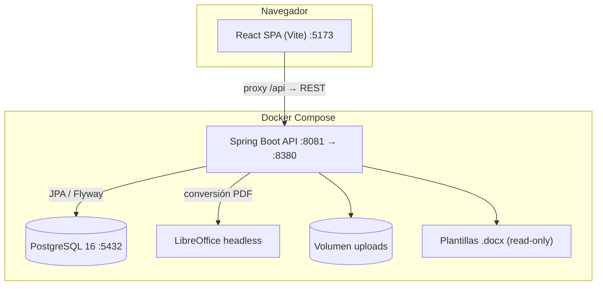
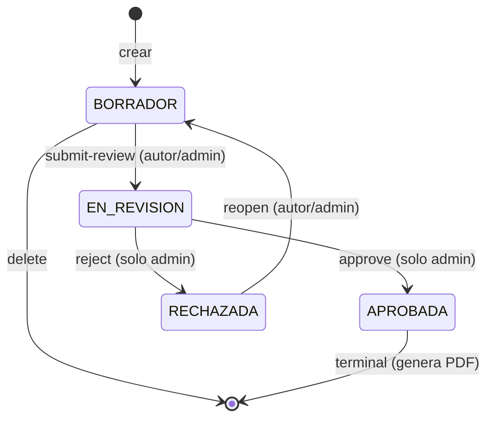

# Informe del proyecto — Plataforma de Gestión Documental "Somos Barrio"

**Repositorio:** `PRODUCTO/` (monorepo: `BACKEND/` + `FRONTEND/`)
**Cliente:** Programa Somos Barrio — Subsecretaría de Prevención del Delito (Viña del Mar)
**Fecha del informe:** Junio 2026

---

## Índice

1. [Introducción al proyecto](#1-introducción-al-proyecto)
2. [Especificaciones del Backend](#2-especificaciones-del-backend)
3. [Especificaciones del Frontend](#3-especificaciones-del-frontend)
4. [Oportunidades de mejora](#4-oportunidades-de-mejora)

---

# 1. Introducción al proyecto

## 1.1 ¿Qué es Somos Barrio?

Somos Barrio es una **plataforma web full-stack de gestión documental** diseñada para digitalizar el ciclo de vida de los documentos formales que produce un programa municipal de prevención del delito: **actas de mesa comunitaria, informes técnicos, bitácoras de terreno, oficios y memorandos**.

El problema que resuelve es concreto: hoy estos documentos se redactan manualmente en Word, se intercambian por correo y carecen de trazabilidad (quién los creó, quién los aprobó, cuándo). La plataforma centraliza ese flujo **sin perder el formato institucional**, porque genera el documento final a partir de plantillas Word (`.docx`) oficiales rellenadas automáticamente con los datos capturados en formularios web.

## 1.2 Capacidades principales

| Capacidad | Descripción |
|-----------|-------------|
| **Autenticación con roles** | JWT stateless con dos perfiles: `ADMINISTRADOR` y `COLABORADOR` |
| **Gestión de actividades** | Registro de actividades territoriales que dan contexto a los documentos |
| **Plantillas dinámicas** | Plantillas con esquema de campos JSON que generan formularios automáticamente |
| **Flujo de aprobación** | Máquina de estados: BORRADOR → EN_REVISIÓN → APROBADA / RECHAZADA |
| **Generación documental** | Merge de `.docx` con Apache POI + conversión a PDF con LibreOffice |
| **Adjuntos e imágenes** | Subida de evidencia fotográfica embebida en el documento final |
| **Repositorio y búsqueda** | Consulta filtrada de documentos |
| **Envío por correo** | Distribución del PDF aprobado a grupos de destinatarios |
| **Auditoría** | Registro inmutable de acciones críticas |
| **Reportes** | Exportación de actividades/documentos a Excel |
| **Proveedores** | Catálogo de proveedores con licitaciones y órdenes de compra |

## 1.3 Arquitectura de alto nivel



## 1.4 Stack tecnológico resumido

| Capa | Tecnologías |
|------|-------------|
| **Frontend** | React 19, Vite, TypeScript, React Router 7, TanStack Query, Zustand, Axios, Tailwind CSS 4, react-hook-form + Zod |
| **Backend** | Java 21, Spring Boot 3.5, Spring Security, Spring Data JPA, MapStruct, Apache POI, OpenPDF, Apache Tika |
| **Datos** | PostgreSQL 16, Flyway (migraciones V1–V18) |
| **Infraestructura** | Docker Compose, LibreOffice (conversión DOCX→PDF), Maven, JUnit 5 + Testcontainers + JaCoCo |

## 1.5 Estructura del monorepo

```
PRODUCTO/
├── BACKEND/somosbarrio-backend/
│   ├── docker-compose.yml          # Postgres + backend + pgAdmin
│   ├── templates/                  # Plantillas .docx (montadas read-only)
│   └── backend/                    # Proyecto Maven (cl.somosbarrio:backend)
│       ├── Dockerfile              # Build multi-stage + LibreOffice
│       └── src/main/java/cl/somosbarrio/backend/
│           ├── auth/ activities/ documents/ minutes/
│           ├── mailing/ audit/ reports/ suppliers/
│           ├── security/ common/ exception/
└── FRONTEND/somosbarrio-frontend/
    └── src/
        ├── app/      # Router, layouts, guards
        ├── store/    # authStore (Zustand)
        ├── shared/   # axios, UI base, hooks, tipos
        └── features/ # auth, documents, activities, suppliers, ...
```

---

# 2. Especificaciones del Backend

## 2.1 Visión general y filosofía de diseño

El backend es una **API REST** construida con **Spring Boot 3.5 y Java 21**, organizada según una **arquitectura por capas dividida por dominios** (vertical slicing). Cada dominio funcional es un paquete autocontenido con su propia estructura:

```
<dominio>/
  controller/   → Adaptador HTTP (endpoints REST)
  service/      → Lógica de negocio (interfaz + Impl)
  repository/   → Acceso a datos (Spring Data JPA)
  entity/       → Entidades JPA (modelo de persistencia)
  dto/          → Objetos de transferencia (request/response)
  mapper/       → Conversión Entity ↔ DTO (MapStruct)
```

El flujo de una petición siempre sigue el mismo recorrido:

```
HTTP Request → Controller → Service (interfaz) → ServiceImpl → Repository → PostgreSQL
                    ↓             ↓
              DTO (validado)   StateMachine / PdfService / AuditLog
```

Esta separación tiene una ventaja clave: **el controlador no conoce la lógica de negocio** (solo traduce HTTP), y el **servicio no conoce HTTP** (solo reglas de dominio), lo que hace el código testeable y mantenible.

## 2.2 Configuración central y arranque

El punto de entrada es `BackendApplication`. La configuración se externaliza en `application.yml`, donde destacan tres decisiones críticas:

```5:20:PRODUCTO/BACKEND/somosbarrio-backend/backend/src/main/resources/application.yml
  datasource:
    url: jdbc:postgresql://${DB_HOST:localhost}:${DB_PORT:5432}/${DB_NAME:somosbarrio_dev}
    username: ${DB_USER:somosbarrio_app}
    password: ${DB_PASSWORD:somosbarrio_app_dev}
    driver-class-name: org.postgresql.Driver
  jpa:
    hibernate:
      ddl-auto: validate
```

- **`ddl-auto: validate`**: Hibernate **nunca** modifica el esquema. La única fuente de verdad del esquema es Flyway. Esto previene cambios accidentales en producción.
- **Variables de entorno con defaults**: permite el mismo artefacto en local, Docker y cloud cambiando solo variables.
- **Multipart 20 MB**: límite de subida alineado con la restricción CHECK en base de datos.

## 2.3 Seguridad (paquete `security`)

La seguridad es **stateless basada en JWT**, sin sesiones HTTP. La configura `SecurityConfig`:

```50:69:PRODUCTO/BACKEND/somosbarrio-backend/backend/src/main/java/cl/somosbarrio/backend/security/SecurityConfig.java
    public SecurityFilterChain filterChain(HttpSecurity http) throws Exception {
        http
            .cors(cors -> cors.configurationSource(corsConfigurationSource()))
            .csrf(AbstractHttpConfigurer::disable)
            .sessionManagement(sm -> sm.sessionCreationPolicy(SessionCreationPolicy.STATELESS))
            .formLogin(AbstractHttpConfigurer::disable)
            .httpBasic(AbstractHttpConfigurer::disable)
            .authorizeHttpRequests(auth -> auth
                .requestMatchers("/api/v1/auth/login", "/api/v1/auth/refresh").permitAll()
                .requestMatchers("/actuator/health", "/actuator/info").permitAll()
                .requestMatchers("/swagger-ui/**", "/swagger-ui.html",
                                 "/v3/api-docs/**").permitAll()
                .anyRequest().authenticated()
            )
```

**Cómo trabaja la seguridad:**

1. **Superficie pública mínima**: solo `login`, `refresh`, health/info de Actuator y Swagger son accesibles sin token. Todo lo demás requiere autenticación.
2. **CSRF deshabilitado**: correcto en una API stateless con JWT (no hay cookies de sesión).
3. **`@EnableMethodSecurity`**: habilita autorización fina a nivel de método con `@PreAuthorize("hasRole('ADMINISTRADOR')")`.

El **filtro `JwtAuthenticationFilter`** se ejecuta una vez por petición e inyecta la identidad en el contexto de Spring Security:

```46:65:PRODUCTO/BACKEND/somosbarrio-backend/backend/src/main/java/cl/somosbarrio/backend/security/JwtAuthenticationFilter.java
        try {
            Claims claims = jwtService.validateToken(token);
            if (!"access".equals(claims.get("type", String.class))) {
                chain.doFilter(request, response);
                return;
            }

            String userId = claims.getSubject();
            String email = claims.get("email", String.class);

            @SuppressWarnings("unchecked")
            List<String> roles = claims.get("roles", List.class);
            List<SimpleGrantedAuthority> authorities = roles == null ? List.of() :
                    roles.stream().map(SimpleGrantedAuthority::new).toList();

            var auth = new UsernamePasswordAuthenticationToken(userId, null, authorities);
            SecurityContextHolder.getContext().setAuthentication(auth);
```

Puntos relevantes:
- El **principal es el UUID del usuario** (no el email), lo que permite a los controladores hacer `UUID.fromString((String) auth.getPrincipal())`.
- Solo acepta tokens con `type=access` (los `refresh` no autentican peticiones).
- Si el token está **expirado**, responde directamente `401 TOKEN_EXPIRED` con cuerpo JSON estructurado — ese código es el que el frontend intercepta para renovar la sesión.

## 2.4 Módulo de autenticación (paquete `auth`)

Gestiona usuarios, roles, login, refresh tokens y cambio de contraseña. Su `AuthServiceImpl` incluye **protección contra fuerza bruta**:

```54:63:PRODUCTO/BACKEND/somosbarrio-backend/backend/src/main/java/cl/somosbarrio/backend/auth/service/AuthServiceImpl.java
        if (!passwordEncoder.matches(request.getPassword(), user.getPasswordHash())) {
            user.setFailedLoginAttempts(user.getFailedLoginAttempts() + 1);
            if (user.getFailedLoginAttempts() >= MAX_FAILED_ATTEMPTS) {
                user.setLockedUntil(Instant.now().plusSeconds(LOCK_DURATION_MINUTES * 60));
                log.warn("Account locked for user {} after {} failed attempts", user.getEmail(), MAX_FAILED_ATTEMPTS);
            }
            userRepository.save(user);
            auditLogService.log(user.getId(), AuditAction.LOGIN_FAILED, "User", user.getId().toString(), null, null);
            throw new BusinessException(ErrorCode.INVALID_CREDENTIALS, "Credenciales inválidas", HttpStatus.UNAUTHORIZED);
        }
```

**Mecanismos de seguridad del módulo:**

- **Bloqueo de cuenta**: tras **5 intentos fallidos**, la cuenta se bloquea **15 minutos**.
- **Contraseñas con BCrypt**: nunca se almacenan en texto plano.
- **Refresh token rotativo**: cada `refresh` invalida el token anterior y emite uno nuevo (`validateAndRotate`), guardado como **hash SHA-256** en la tabla `refresh_tokens`.
- **Auditoría de accesos**: cada `LOGIN`, `LOGIN_FAILED` y cambios se registran.
- **Logout idempotente**: revocar un token ya revocado no produce error.
- **Validación de estado**: cuentas inactivas o bloqueadas no pueden iniciar sesión.

El `JwtService` genera tokens firmados con claims `sub` (UUID), `email`, `roles` y `type`; el access token vive ~15 minutos y el refresh ~7 días.

## 2.5 Módulo de actividades (paquete `activities`)

Modela las **actividades territoriales** que sirven de contexto opcional a los documentos. Implementa CRUD completo con:
- **Soft delete** vía `@SQLDelete` / `@SQLRestriction` (no se borra físicamente).
- **Auditoría** heredada de `AuditableEntity` (`created_at`, `updated_at`).
- **Cambio de estado** mediante `PATCH /activities/{id}/status`.

## 2.6 Módulo de documentos (paquete `documents`) — el núcleo del sistema

Es el módulo más complejo y el corazón funcional. Se subdivide en:
- `controller` / `service` / `repository` / `entity` / `dto` / `mapper`: CRUD y workflow.
- `pdf`: subsistema de generación documental (merge Word + PDF).

### 2.6.1 La entidad `DocumentEntity` y la tabla `documents`

La migración V5 define la estructura, con dos campos especialmente importantes:

```1:18:PRODUCTO/BACKEND/somosbarrio-backend/backend/src/main/resources/db/migration/V5__documents.sql
CREATE TABLE documents (
    id                  UUID         PRIMARY KEY DEFAULT gen_random_uuid(),
    code                VARCHAR(40)  UNIQUE NOT NULL,
    template_id         UUID         NOT NULL REFERENCES document_templates(id) ON DELETE RESTRICT,
    activity_id         UUID         REFERENCES activities(id) ON DELETE RESTRICT,
    title               VARCHAR(200) NOT NULL CHECK (char_length(title) >= 3),
    field_values        JSONB        NOT NULL DEFAULT '{}'::jsonb,
    generated_pdf_path  VARCHAR(500),
    status              VARCHAR(20)  NOT NULL DEFAULT 'BORRADOR'
                            CHECK (status IN ('BORRADOR','EN_REVISION','APROBADA','RECHAZADA')),
    created_by          UUID         NOT NULL REFERENCES users(id),
    approved_by         UUID         REFERENCES users(id),
    approved_at         TIMESTAMPTZ,
    rejection_reason    TEXT,
    deleted_at          TIMESTAMPTZ,
    version             INTEGER      NOT NULL DEFAULT 0,
```

- **`code`**: correlativo institucional único (p. ej. `INFORME-2026-0003`), generado atómicamente por `DocumentCodeGenerator` con la tabla `document_code_counters`.
- **`field_values` (JSONB)**: los datos del formulario como JSON flexible. Permite que **cada plantilla tenga campos distintos sin alterar el esquema relacional**.
- **`status` con CHECK**: integridad reforzada a nivel BD aunque la lógica viva en la máquina de estados.

### 2.6.2 La máquina de estados (`DocumentStateMachine`)

Centraliza **todas** las reglas de transición y quién puede ejecutarlas:

```33:62:PRODUCTO/BACKEND/somosbarrio-backend/backend/src/main/java/cl/somosbarrio/backend/documents/service/DocumentStateMachine.java
    public void validate(DocumentStatus from, DocumentStatus to,
                         UUID actorId, UUID authorId, Set<String> actorRoles) {

        if (from == DocumentStatus.APROBADA) {
            throw ConflictException.invalidStateTransition(from.name(), to.name());
        }

        switch (from) {
            case BORRADOR -> {
                if (to != DocumentStatus.EN_REVISION) {
                    throw ConflictException.invalidStateTransition(from.name(), to.name());
                }
                boolean canTransition = actorId.equals(authorId)
                        || actorRoles.contains(ROLE_ADMINISTRADOR);
                if (!canTransition) {
                    throw new BusinessException(ErrorCode.ACCESS_DENIED,
                            "Solo el autor o un ADMINISTRADOR pueden enviar el documento a revision",
                            HttpStatus.FORBIDDEN);
                }
            }
            case EN_REVISION -> {
                if (to == DocumentStatus.APROBADA || to == DocumentStatus.RECHAZADA) {
                    if (!actorRoles.contains(ROLE_ADMINISTRADOR)) {
                        throw new BusinessException(ErrorCode.ACCESS_DENIED,
                                "Solo un ADMINISTRADOR puede aprobar o rechazar documentos",
                                HttpStatus.FORBIDDEN);
                    }
```

El ciclo de vida completo:



**Por qué es relevante:** concentrar las reglas en un solo componente evita que se dispersen por controladores y servicios. Cualquier transición inválida lanza excepciones tipadas que el `GlobalExceptionHandler` traduce a HTTP 403/409 con códigos estables.

### 2.6.3 El `DocumentController` y los endpoints del workflow

El controlador expone el ciclo completo. Nótese cómo extrae roles del token para pasarlos a la máquina de estados:

```128:148:PRODUCTO/BACKEND/somosbarrio-backend/backend/src/main/java/cl/somosbarrio/backend/documents/controller/DocumentController.java
    @PatchMapping("/{id}/approve")
    @PreAuthorize("hasRole('ADMINISTRADOR')")
    @Operation(summary = "Aprobar documento (EN_REVISION → APROBADA)")
    public ResponseEntity<DocumentDto> approve(@PathVariable UUID id, Authentication auth) {
        UUID actorId = UUID.fromString((String) auth.getPrincipal());
        Set<String> roles = extractRoles(auth);
        return ResponseEntity.ok(
                documentService.changeStatus(id, DocumentStatus.APROBADA, actorId, roles));
    }
```

Hay una **doble capa de autorización**: `@PreAuthorize` a nivel HTTP **y** la validación de la máquina de estados a nivel de negocio. Es defensa en profundidad.

### 2.6.4 La aprobación dispara el PDF (`DocumentServiceImpl`)

El evento de aprobación es el que materializa el documento oficial:

```163:170:PRODUCTO/BACKEND/somosbarrio-backend/backend/src/main/java/cl/somosbarrio/backend/documents/service/DocumentServiceImpl.java
        if (newStatus == DocumentStatus.APROBADA) {
            UserEntity approver = userRepository.findById(actorId)
                    .orElseThrow(() -> new ResourceNotFoundException("Usuario", actorId));
            doc.setApprovedBy(approver);
            doc.setApprovedAt(Instant.now());
            doc.setRejectionReason(null);
            String pdfRelPath = documentPdfGenerationService.generateAndStorePdf(doc);
            doc.setGeneratedPdfPath(pdfRelPath);
```

El PDF **no** se genera en borrador: solo al aprobar, evitando que circulen documentos "oficiales" sin revisar.

### 2.6.5 Subsistema PDF (paquete `documents.pdf`)

Es el diferenciador técnico del proyecto. Tres piezas colaboran:

**a) `DocumentPdfGenerationServiceImpl` — el orquestador:**

```50:79:PRODUCTO/BACKEND/somosbarrio-backend/backend/src/main/java/cl/somosbarrio/backend/documents/pdf/DocumentPdfGenerationServiceImpl.java
    @Override
    public String generateAndStorePdf(DocumentEntity document) {
        Path templatePath = resolveTemplateFile(document);
        Map<UUID, Path> imagePaths = loadImageAttachments(document.getId());
        Map<String, String> vars = prepareMergeVars(document, imagePaths);

        String typeFolder = document.getTemplate().getDocumentType().name();
        String relativeDir = "documents/generated/" + typeFolder + "/" + document.getId();
        Path genDir = fileStorageService.resolve(relativeDir);
        try {
            Files.createDirectories(genDir);
        } catch (Exception e) {
            throw new BusinessException(ErrorCode.FILE_STORAGE_ERROR,
                    "No se pudo crear carpeta de generados", HttpStatus.INTERNAL_SERVER_ERROR);
        }

        String mergedName = GeneratedDocumentFilenames.mergedDocxFileName(document);
        String pdfName = GeneratedDocumentFilenames.pdfFileName(document);
        Path mergedDocx = genDir.resolve(mergedName);
        Path pdfOut = genDir.resolve(pdfName);

        writeMergedDocx(templatePath, vars, imagePaths, mergedDocx);

        try {
            if (libreOfficePdfConverter.isAvailable()) {
                libreOfficePdfConverter.convert(mergedDocx, pdfOut);
            } else {
                openPdfFallbackGenerator.write(document, vars, imagePaths, pdfOut);
                log.warn("PDF documento {} generado en modo resumen (sin LibreOffice).", document.getId());
            }
```

El pipeline: (1) resolver `.docx` de plantilla, (2) cargar imágenes adjuntas, (3) preparar variables, (4) merge a DOCX, (5) convertir a PDF con **LibreOffice** o, si no está disponible, el **fallback OpenPDF** (degradación elegante, nunca falla por falta de LibreOffice).

**b) `DocxPlaceholderMergeService` — el motor de reemplazo:**

Define el contrato de marcadores que deben usarse en los `.docx`:

```35:40:PRODUCTO/BACKEND/somosbarrio-backend/backend/src/main/java/cl/somosbarrio/backend/documents/pdf/DocxPlaceholderMergeService.java
    private static final Pattern IMG_UUID_LITERAL = Pattern.compile(
            "^\\$\\{IMG:([0-9a-fA-F]{8}-[0-9a-fA-F]{4}-[0-9a-fA-F]{4}-[0-9a-fA-F]{4}-[0-9a-fA-F]{12})\\}\\s*$");

    /** Solo párrafo: nombre de clave en field_values cuyo valor debe ser el UUID del adjunto. */
    private static final Pattern IMG_FIELD_REF = Pattern.compile("^\\$\\{IMG:([a-zA-Z_][a-zA-Z0-9_]*)\\}\\s*$");
```

| Sintaxis en el `.docx` | Resolución |
|------------------------|------------|
| `${numero_informe}` | Texto desde `field_values.numero_informe` |
| `${IMG:foto_informe_uuid}` | Imagen del adjunto cuyo UUID está en ese campo |
| `${IMG:<uuid-literal>}` | Imagen del adjunto con ese ID directo |

Maneja además placeholders **partidos entre varios "runs"** de Word (un problema clásico de POI) y opera sobre párrafos, tablas, cabeceras y pies.

**c) `ImageFieldValuesEnricher` — el puente UX:**

Resuelve un problema real: el usuario sube una foto pero no conoce el UUID que necesita el placeholder. Este componente asigna automáticamente los UUIDs de imágenes a campos `*_uuid` vacíos:

```23:26:PRODUCTO/BACKEND/somosbarrio-backend/backend/src/main/java/cl/somosbarrio/backend/documents/pdf/ImageFieldValuesEnricher.java
    public static void enrich(Map<String, String> vars, Map<UUID, ?> imageAttachments, String fieldsSchema,
                              ObjectMapper objectMapper) {
        if (imageAttachments == null || imageAttachments.isEmpty()) {
            return;
        }
```

### 2.6.6 Plantillas: datos en BD, archivos en disco

Una decisión arquitectónica clave es que **el `.docx` vive en disco** (`TEMPLATE_ROOT`, montado read-only en Docker) y la **BD solo guarda metadatos**: el `template_file_path` y el `fields_schema` (JSON que describe los campos del formulario). La migración V17 muestra ese esquema para el informe:

```31:42:PRODUCTO/BACKEND/somosbarrio-backend/backend/src/main/resources/db/migration/V17__update_acta_informe_fields_schema.sql
{
    "fields": [
        {"key": "numero_informe", "label": "Informe Nº / año", "type": "text", "required": true},
        {"key": "mat_asunto", "label": "MAT. (asunto)", "type": "textarea", "required": true},
        {"key": "fecha_ciudad", "label": "Ciudad y fecha", "type": "text", "required": true},
        {"key": "destinatario_a", "label": "A (destinatario)", "type": "textarea", "required": true},
        {"key": "remitente_de", "label": "DE (remitente)", "type": "textarea", "required": true},
        {"key": "cuerpo_intro", "label": "Cuerpo del informe", "type": "textarea", "required": true},
        {"key": "revisado_por", "label": "Revisado por", "type": "text", "required": false},
        {"key": "foto_informe_uuid", "label": "UUID adjunto imagen (opcional)", "type": "text", "required": false}
    ]
}
```

Gracias a esto, **registrar una nueva plantilla no requiere recompilar nada**: el frontend lee este JSON y construye el formulario dinámicamente.

## 2.7 Módulo de actas (paquete `minutes`)

Flujo paralelo al de documentos, históricamente usado para actas. Mantiene su propia entidad, máquina de estados (`MinuteStateMachine`) y adjuntos. **Sigue existiendo en el backend** pero en la Up actual el flujo se ha unificado bajo Documentos (las rutas de actas redirigen a Documentos), por lo que el módulo es candidato a deprecación.

## 2.8 Módulo de correo (paquete `mailing`)

Gestiona **grupos de destinatarios** y el **envío del PDF aprobado**. Dos servicios:
- `RecipientGroupServiceImpl`: CRUD de grupos (emails almacenados como JSONB).
- `DocumentMailServiceImpl`: envía el PDF generado por SMTP y registra cada envío en `email_logs`, lo que permite consultar el historial de correos por documento.

## 2.9 Módulo de auditoría (paquete `audit`)

`AuditLogServiceImpl` registra acciones tipadas mediante el enum `AuditAction` (`CREATE`, `UPDATE`, `DELETE`, `APPROVE`, `REJECT`, `PDF_GENERATED`, `LOGIN`, `LOGIN_FAILED`...). Cada registro guarda actor, tipo de entidad, identificador y metadatos opcionales. Es **transversal**: prácticamente todos los servicios lo invocan, dando trazabilidad institucional completa.

## 2.10 Módulo de reportes (paquete `reports`)

`ReportServiceImpl` genera **exportaciones Excel** de actividades y documentos para gestión administrativa (solo `ADMINISTRADOR`). Útil para análisis tabular fuera de la aplicación.

## 2.11 Módulo de proveedores (paquete `suppliers`)

Módulo más reciente (migración V18). Gestiona un **catálogo de proveedores** con datos de empresa, giros comerciales, IDs de licitación y órdenes de compra. Su `SupplierServiceImpl` aporta varios patrones interesantes:

**a) Búsqueda dinámica con JPA Specifications:**

```40:54:PRODUCTO/BACKEND/somosbarrio-backend/backend/src/main/java/cl/somosbarrio/backend/suppliers/service/SupplierServiceImpl.java
        Specification<SupplierEntity> spec = (root, query, cb) -> {
            List<Predicate> predicates = new ArrayList<>();
            if (status != null) {
                predicates.add(cb.equal(root.get("status"), status));
            }
            if (search != null && !search.isBlank()) {
                String term = "%" + search.toLowerCase() + "%";
                predicates.add(cb.or(
                        cb.like(cb.lower(root.get("nombreProveedor")), term),
                        cb.like(root.get("rutEmpresa"), "%" + search + "%")
                ));
            }
            return cb.and(predicates.toArray(new Predicate[0]));
        };
        return supplierRepository.findAll(spec, pageable).map(supplierMapper::toDto);
```

**b) Reglas de negocio explícitas:**
- **RUT único**: valida duplicados en creación y edición.
- **Borrado protegido**: no se puede eliminar un proveedor `SUSPENDIDO` sin cambiar antes su estado.
- **Auditoría** en cada operación.

```146:152:PRODUCTO/BACKEND/somosbarrio-backend/backend/src/main/java/cl/somosbarrio/backend/suppliers/service/SupplierServiceImpl.java
        if (supplier.getStatus() == SupplierStatus.SUSPENDIDO) {
            throw new ConflictException(ErrorCode.CONFLICT_STATE,
                    "No se puede eliminar un proveedor con estado SUSPENDIDO. Cambie el estado primero.");
        }

        supplierRepository.delete(supplier);
        auditLogService.log(null, AuditAction.DELETE, "Supplier", id.toString(), null, null);
```

La entidad usa `@ElementCollection` para las colecciones multi-valor (giros, licitaciones, órdenes), persistidas en tablas auxiliares (`supplier_giros`, etc.) con cascada de borrado.

## 2.12 Infraestructura transversal (paquete `common`)

- **`common.audit.AuditableEntity`**: superclase con `created_at` / `updated_at` y `AuditingEntityListener`.
- **`common.storage`**: `FileStorageService` (resolución de rutas bajo `UPLOAD_ROOT`) y `MimeValidator` (validación de tipo real de archivo con **Apache Tika**, no solo por extensión).
- **`common.pagination.PagedResponse`**: envoltorio uniforme de respuestas paginadas.
- **`common.logging.CorrelationIdFilter`**: propaga `X-Correlation-Id` al MDC para trazar peticiones en logs.

## 2.13 Manejo de errores (paquete `exception`)

`GlobalExceptionHandler` (`@RestControllerAdvice`) traduce excepciones de dominio (`BusinessException`, `ConflictException`, `ResourceNotFoundException`) a respuestas `ApiError` con un **código estable** (`ErrorCode`), mensaje, timestamp y path. Este contrato de error es justamente lo que el frontend interpreta (p. ej. `TOKEN_EXPIRED`).

## 2.14 Persistencia y migraciones (Flyway V1–V18)

| Versión | Contenido |
|---------|-----------|
| V1–V2 | Extensiones PostgreSQL + tablas de auth (`roles`, `users`, `user_roles`, `refresh_tokens`) |
| V3–V5 | Actividades, plantillas, documentos y adjuntos |
| V6–V8 | Mailing, auditoría, triggers `updated_at` y vistas |
| V9–V11 | Seeds (roles, datos demo, plantillas) |
| V12–V13 | Actas y contador de correlativos |
| V14–V17 | Ajustes plantillas, ruta `.docx`, plantillas municipales y esquemas de campos |
| **V18** | **Proveedores** (`suppliers` + colecciones) |

Los adjuntos tienen validación de MIME y tamaño **también en BD**, como defensa adicional:

```32:40:PRODUCTO/BACKEND/somosbarrio-backend/backend/src/main/resources/db/migration/V5__documents.sql
    content_type      VARCHAR(120) NOT NULL
                          CHECK (content_type IN (
                              'application/pdf',
                              'image/jpeg',
                              'image/png',
                              'application/vnd.openxmlformats-officedocument.wordprocessingml.document',
                              'application/vnd.openxmlformats-officedocument.spreadsheetml.sheet'
                          )),
    size_bytes        BIGINT       NOT NULL CHECK (size_bytes > 0 AND size_bytes <= 20971520),
```

## 2.15 Despliegue (Docker)

`docker-compose.yml` levanta tres servicios con réplica del entorno productivo:

```19:50:PRODUCTO/BACKEND/somosbarrio-backend/docker-compose.yml
  backend:
    build:
      context: ./backend
      dockerfile: Dockerfile
    container_name: sb_backend
    depends_on:
      db:
        condition: service_healthy
    environment:
      SPRING_PROFILES_ACTIVE: dev
      DB_HOST: db
      DB_PORT: 5432
      DB_NAME: somosbarrio
      DB_USER: somosbarrio_app
      DB_PASSWORD: ${DB_PASSWORD:-password}
      JWT_SECRET: ${JWT_SECRET:-dev-only-cambia-en-produccion-openssl-rand-base64-64}
      JWT_ACCESS_TTL_MIN: 15
      JWT_REFRESH_TTL_DAYS: 7
      APP_CORS_ORIGINS: http://localhost:5173
      UPLOAD_ROOT: /app/uploads
      MAIL_HOST: ${MAIL_HOST:-smtp.gmail.com}
      MAIL_PORT: ${MAIL_PORT:-587}
      MAIL_USERNAME: ${MAIL_USERNAME:-}
      MAIL_PASSWORD: ${MAIL_PASSWORD:-}
      TEMPLATE_ROOT: /app/templates
      LIBREOFFICE_PATH: /usr/bin/soffice
    ports:
      - "8081:8380"
    volumes:
      - uploads_data:/app/uploads
      - ./templates:/app/templates:ro
```

El `Dockerfile` es **multi-stage**: compila con JDK e instala solo JRE + LibreOffice + fuentes en la imagen final, optimizando tamaño. El healthcheck de Postgres garantiza el orden de arranque.

## 2.16 Calidad: tests

El backend cuenta con tests **unitarios** (Mockito) y **E2E** (Testcontainers con PostgreSQL real), con umbral **JaCoCo ≥ 50%**:

| Tipo | Ejemplos |
|------|----------|
| Unitarios servicio | `DocumentServiceImplTest`, `AuthServiceImplTest`, `SupplierServiceImplTest` |
| Unitarios máquina estados | `DocumentStateMachineTest`, `MinuteStateMachineTest` |
| Unitarios PDF | `DocxPlaceholderMergeServiceTest`, `ImageFieldValuesEnricherTest` |
| Seguridad | `JwtServiceTest` |
| E2E | `DocumentWordTemplatesFlowIT`, `Sprint1FlowIT` |

---

# 3. Especificaciones del Frontend

## 3.1 Visión general y filosofía

El frontend es una **Single Page Application (SPA)** construida con **React 19 + Vite + TypeScript**, organizada con arquitectura **feature-first**: el código se agrupa por funcionalidad de negocio, no por tipo técnico.

```
src/
├── app/        → Router, layouts, guards de acceso, bootstrap de sesión
├── store/      → Estado global de autenticación (Zustand)
├── shared/     → Cliente HTTP, componentes UI base, hooks, constantes, tipos
└── features/   → Un directorio por dominio funcional
    ├── auth/ documents/ activities/ suppliers/ users/
    ├── mailing/ reports/ repository/ audit/ document-templates/
    ├── minutes/ worker-menu/ worker-logbook/ worker-minutes/ home/
```

Cada feature replica un patrón consistente: `pages/` (vistas), `components/` (UI específica), `api/` (llamadas REST), `hooks/` (lógica reutilizable con TanStack Query), `types.ts`.

## 3.2 Gestión de estado: dos sistemas complementarios

| Sistema | Responsabilidad |
|---------|-----------------|
| **Zustand** (`authStore`) | Estado de cliente: sesión, tokens, usuario, roles |
| **TanStack Query** | Estado de servidor: caché, queries, mutaciones, invalidación |

Esta separación es una buena práctica: los datos del servidor (documentos, actividades) los gestiona React Query con caché automática; el estado de sesión lo gestiona Zustand con persistencia.

## 3.3 Autenticación en el cliente (`store/authStore.ts`)

El `authStore` gestiona el ciclo completo de sesión y **normaliza los roles** que vienen del backend (quita el prefijo `ROLE_`):

```32:44:PRODUCTO/FRONTEND/somosbarrio-frontend/src/store/authStore.ts
      login: async (email, password) => {
        const data = await loginRequest(email, password)
        
        const sanitizedRoles = data.user?.roles.map(role => 
          role.startsWith('ROLE_') ? role.replace('ROLE_', '') : role
        ) as Role[]

        set({
          user: data.user ? { ...data.user, roles: sanitizedRoles } : null,
          accessToken: data.accessToken,
          refreshToken: data.refreshToken,
        })
      },
```

Detalles relevantes del diseño:
- **Persistencia selectiva**: solo se guardan en `localStorage` el `refreshToken` y el `user` (no el access token, que vive en memoria por seguridad).

```103:110:PRODUCTO/FRONTEND/somosbarrio-frontend/src/store/authStore.ts
    {
      name: 'sb-auth',
      storage: createJSONStorage(() => localStorage),
      partialize: (s) => ({
        refreshToken: s.refreshToken,
        user: s.user,
      }),
    },
```

- **`hasRole(...)`**: helper central para el control de acceso en la UI.
- **`syncUser()`**: re-sincroniza el perfil contra `GET /auth/me`.
- **Logout idempotente** que limpia `localStorage`.

## 3.4 Cliente HTTP e interceptores (`shared/lib/axios.ts`)

Toda comunicación con el backend pasa por una instancia de Axios con dos interceptores clave.

**Request**: inyecta automáticamente el Bearer token y un ID de correlación:

```12:30:PRODUCTO/FRONTEND/somosbarrio-frontend/src/shared/lib/axios.ts
api.interceptors.request.use((config) => {
  const token = useAuthStore.getState().accessToken
  
  if (token) {
    if (config.headers.set) {
      config.headers.set('Authorization', `Bearer ${token}`)
    } else {
      config.headers['Authorization'] = `Bearer ${token}`
    }
  }
  
  if (config.headers.set) {
    config.headers.set('X-Correlation-Id', crypto.randomUUID())
  } else {
    config.headers['X-Correlation-Id'] = crypto.randomUUID()
  }

  return config
})
```

**Response**: detecta el `401 TOKEN_EXPIRED` del backend y **renueva la sesión de forma transparente**, reintentando la petición original:

```43:72:PRODUCTO/FRONTEND/somosbarrio-frontend/src/shared/lib/axios.ts
    if (
      axios.isAxiosError(error) &&
      error.response?.status === 401 &&
      (serverCode === 'TOKEN_EXPIRED' || 
       serverCode === 'TOKEN_INVALID' || 
       serverMessage === 'TOKEN_EXPIRED' ||
       serverCode === 'AUTH_TOKEN_EXPIRED') &&
      original &&
      !original._retry
    ) {
      original._retry = true
      
      // Control de concurrencia seguro para peticiones en paralelo
      refreshing ??= useAuthStore.getState().refresh()
      const newToken = await refreshing
      refreshing = null
      
      if (newToken) {
        ...
        return api(original) // Reintenta la petición original con el nuevo token
      }
      
      // Si falla la renovación del refresh token, se cierra la sesión limpiamente
      useAuthStore.getState().logout()
      window.location.href = '/login'
    }
```

El detalle del `refreshing ??=` evita una **estampida de renovaciones** cuando varias peticiones fallan a la vez: solo se ejecuta un `refresh` y todas esperan el mismo resultado.

## 3.5 Enrutamiento y control de acceso (`app/router.tsx`)

El router usa `createBrowserRouter` con **tres zonas** protegidas por guards distintos:

```45:80:PRODUCTO/FRONTEND/somosbarrio-frontend/src/app/router.tsx
  {
    path: '/',
    element: (
      <ProtectedRoute>
        <AppLayout />
      </ProtectedRoute>
    ),
    children: [
      { index: true, element: <HomePage /> },
      { path: 'activities', element: <ActivitiesListPage /> },
      { path: 'documents', element: <DocumentsListPage /> },
      { path: 'documents/new', element: <CreateDocumentPage /> },
      { path: 'documents/:id', element: <DocumentDetailPage /> },
      ...
      {
        element: <AdminRoute />,
        children: [
          { path: 'reports', element: <AdminReportsPage /> },
          { path: 'document-templates', element: <DocumentTemplatesPage /> },
          { path: 'recipient-groups', element: <RecipientGroupsPage /> },
          { path: 'audit-logs', element: <AuditLogsPage /> },
          { path: 'users', element: <UsersListPage /> },
          { path: 'suppliers', element: <SuppliersListPage /> },
        ],
      },
    ],
  },
```

| Guard | Protege | Redirige si falla |
|-------|---------|-------------------|
| `ProtectedRoute` | Portal institucional | `/login` |
| `AdminRoute` | Plantillas, usuarios, auditoría, reportes, destinatarios, proveedores | `/` |
| `WorkerRoute` | Portal de terreno `/trabajador/*` | `/trabajador/login` |

Hay **dos portales** con layouts distintos: el institucional (`AppLayout` con barra lateral completa) y el de trabajador de terreno (`WorkerLayout`, simplificado). Las rutas legacy (`/minutes`, `/mis-actas`, `/mis-reportes`, `/trabajador/actas`) **redirigen** al flujo unificado de documentos.

## 3.6 Navegación adaptativa por rol (`SideNavBar.tsx`)

La barra lateral muestra/oculta opciones según el rol, usando `hasRole`:

```110:116:PRODUCTO/FRONTEND/somosbarrio-frontend/src/shared/components/layout/SideNavBar.tsx
                {/* 11. Gestión Proveedores (Solo Admin) */}
                {isAdmin && (
                    <Link to="/suppliers" className={`flex items-center gap-3 px-3 py-2 transition-colors duration-200 rounded-lg ${isActivePrefix('/suppliers') ? 'bg-secondary-container text-on-secondary-container font-bold' : 'text-on-surface-variant hover:bg-surface-container-high'}`}>
                        <span className="material-symbols-outlined">business</span>
                        <span className="text-sm font-semibold">Proveedores</span>
                    </Link>
                )}
```

Opciones **siempre visibles**: Panel, Actividades, Documentos, Nueva Solicitud. Opciones **solo admin**: Plantillas, Destinatarios, Repositorio, Auditoría, Reportes, Usuarios, Proveedores.

## 3.7 Feature de documentos (la más rica)

### 3.7.1 Creación con formulario dinámico (`CreateDocumentPage.tsx`)

La página construye el formulario **a partir del esquema JSON de la plantilla** seleccionada:

```33:51:PRODUCTO/FRONTEND/somosbarrio-frontend/src/features/documents/pages/CreateDocumentPage.tsx
  const selectedTemplate = templatesQuery.data?.find((t) => t.id === templateId)
  const templateFields = useMemo(
    () => parseTemplateFields(selectedTemplate?.fieldsSchema),
    [selectedTemplate?.fieldsSchema],
  )
  const imageFieldKeys = useMemo(() => listImageUuidFieldKeys(templateFields), [templateFields])

  const createMutation = useMutation({
    mutationFn: () =>
      createDocumentWithAttachments(
        {
          templateId,
          activityId: activityId || undefined,
          title: title.trim(),
          fieldValues: buildFieldValuesJson(fieldValues),
        },
        pendingFiles,
        imageFieldKeys,
      ),
```

El componente `TemplateFieldsForm` renderiza cada campo según su `type` (`text`, `textarea`, `date`) y **oculta** los campos `*_uuid` (que se rellenan solos al subir imágenes).

### 3.7.2 Vinculación automática de imágenes (`documents.api.ts`)

La función orquesta crear documento + subir adjuntos + vincular imágenes a sus campos:

```145:172:PRODUCTO/FRONTEND/somosbarrio-frontend/src/features/documents/api/documents.api.ts
export async function createDocumentWithAttachments(
  payload: CreateDocumentPayload,
  files: File[],
  imageFieldKeys: string[] = [],
): Promise<DocumentDto> {
  let document = await createDocument(payload)
  let fieldValues = parseFieldValuesJson(payload.fieldValues ?? document.fieldValues)
  let fieldValuesChanged = false

  for (const file of files) {
    const attachment = await uploadDocumentAttachment(document.id, file)
    if (isImageFile(file) && imageFieldKeys.length > 0) {
      const linked = assignImageAttachmentToFields(fieldValues, attachment.id, imageFieldKeys)
      if (linked !== fieldValues) {
        fieldValues = linked
        fieldValuesChanged = true
      }
    }
  }

  if (fieldValuesChanged) {
    document = await updateDocument(document.id, {
      title: document.title,
      fieldValues: buildFieldValuesJson(fieldValues),
    })
  }

  return document
}
```

Este flujo es el que cierra el puente con el backend: el UUID del adjunto queda en `field_values`, de modo que el placeholder `${IMG:foto_informe_uuid}` resuelve al generar el documento.

### 3.7.3 Descargas binarias (preview DOCX y PDF)

Las descargas usan `responseType: 'blob'` y extraen el nombre del header `Content-Disposition`:

```132:143:PRODUCTO/FRONTEND/somosbarrio-frontend/src/features/documents/api/documents.api.ts
export async function downloadDocumentPreviewDocx(documentId: string): Promise<void> {
  const response = await api.post<Blob>(
    `/documents/${documentId}/preview-docx`,
    null,
    { responseType: 'blob' },
  )
  const filename = filenameFromContentDisposition(
    response.headers['content-disposition'] as string | undefined,
    `vista_previa_${documentId}.docx`,
  )
  downloadBlob(response.data, filename)
}
```

### 3.7.4 Detalle del documento (`DocumentDetailPage.tsx`)

Centraliza todo el ciclo según estado: edición (BORRADOR/RECHAZADA), panel de adjuntos, panel de correo (en APROBADA), botones de workflow (enviar a revisión, aprobar, rechazar, reabrir, eliminar) y descargas de preview/PDF.

## 3.8 Feature de proveedores (`features/suppliers`)

Espejo limpio del backend. El cliente API expone el CRUD completo con tipado fuerte:

```55:84:PRODUCTO/FRONTEND/somosbarrio-frontend/src/features/suppliers/api/suppliers.api.ts
export const suppliersApi = {
  getAll: async (params?: SuppliersQueryParams): Promise<PagedResponse<Supplier>> => {
    const response = await api.get<PagedResponse<Supplier>>('/suppliers', { params })
    return response.data
  },

  getById: async (id: string): Promise<Supplier> => {
    const response = await api.get<Supplier>(`/suppliers/${id}`)
    return response.data
  },

  create: async (data: CreateSupplierRequest): Promise<Supplier> => {
    const response = await api.post<Supplier>('/suppliers', data)
    return response.data
  },

  update: async (id: string, data: UpdateSupplierRequest): Promise<Supplier> => {
    const response = await api.put<Supplier>(`/suppliers/${id}`, data)
    return response.data
  },

  changeStatus: async (id: string, status: SupplierStatus): Promise<Supplier> => {
    const body: ChangeSupplierStatusRequest = { status }
    const response = await api.patch<Supplier>(`/suppliers/${id}/status`, body)
    return response.data
  },

  delete: async (id: string): Promise<void> => {
    await api.delete(`/suppliers/${id}`)
  },
}
```

Incluye `SuppliersListPage` (listado con filtros y paginación), `SupplierForm` (alta/edición) y `SupplierStatusBadge` (indicador visual de estado), más el hook `useSuppliers` con TanStack Query.

## 3.9 Otras features

| Feature | Función |
|---------|---------|
| `auth` | Login institucional y de trabajador, página de cuenta, cambio de contraseña |
| `activities` | Listado, alta y edición de actividades |
| `users` | Gestión de usuarios (admin), con asignación de roles vía `RoleCheckboxes` |
| `document-templates` | CRUD de plantillas (admin) |
| `mailing` | Grupos de destinatarios + panel de envío de correo |
| `repository` | Búsqueda documental |
| `audit` | Visualización de logs de auditoría |
| `reports` | Exportaciones Excel (admin) |
| `worker-menu` / `worker-logbook` | Portal de terreno: home, bitácora, notas locales, ayuda |
| `minutes` / `worker-minutes` | Código legacy de actas (rutas redirigidas a Documentos) |

## 3.10 Capa compartida (`shared/`)

- **`lib/axios.ts`**: cliente HTTP con interceptores.
- **`lib/download.ts`**: utilidades para descargar blobs y parsear `Content-Disposition`.
- **`lib/formatters.ts`**: formateo de fechas y textos.
- **`components/ui/`**: botones, inputs de fecha, estados vacíos, headers de página.
- **`hooks/`**: `useUserOptions`, `useActivityOptions` para selects reutilizables.
- **`types/`**: tipos de API y enums (`ROLES`).

## 3.11 Integración y herramientas

- **Proxy de desarrollo**: Vite reenvía `/api` al backend (`:8081`), evitando CORS en local.
- **Build**: `tsc -b && vite build` (chequeo de tipos + bundle).
- **Estilos**: Tailwind CSS 4 con tokens de diseño (colores `surface`, `primary`, etc.) e iconos Material Symbols.
- **Validación de formularios**: react-hook-form + Zod en formularios críticos.

---

# 4. Oportunidades de mejora

Esta sección recoge hallazgos sobre el funcionamiento interno, deuda técnica y propuestas de nuevos módulos.

## 4.1 Calidad y testing

### 4.1.1 Ausencia total de tests en el frontend
**Hallazgo:** el frontend no tiene ninguna suite de pruebas (no hay Vitest, Jest, Testing Library ni Playwright). Toda la validación es manual.
**Riesgo:** alto. Cualquier refactor puede romper flujos críticos (login, creación de documentos, refresh de token) sin que nadie lo note.
**Propuesta:**
- Incorporar **Vitest + React Testing Library** para componentes y hooks.
- Tests prioritarios: el interceptor de refresh de Axios, el `authStore`, `createDocumentWithAttachments` y los guards de ruta.
- **Playwright/Cypress** para un E2E del flujo completo: login → crear documento con imagen → enviar a revisión → aprobar → descargar PDF.

### 4.1.2 Elevar la cobertura del backend
**Hallazgo:** el umbral JaCoCo es 50%, aceptable pero mejorable para un sistema con lógica documental compleja.
**Propuesta:** subir progresivamente a 70–75% y añadir tests de los controladores que aún no tienen slice tests (`DocumentController`, `SupplierController`).

## 4.2 Seguridad y configuración

### 4.2.1 Secretos con valores por defecto en `application.yml`
**Hallazgo:** `application.yml` contiene credenciales de correo y un `JWT_SECRET` por defecto embebidos en el archivo. Si se despliega sin sobrescribir variables, quedan expuestos.
**Riesgo:** crítico si llega a producción.
**Propuesta:**
- Crear un **perfil `prod`** que **no** tenga defaults sensibles y falle el arranque si faltan variables obligatorias.
- Mover los secretos a un gestor (variables de entorno de la plataforma cloud, Docker secrets, o Vault).
- Rotar las credenciales SMTP que están actualmente en el repositorio.

### 4.2.2 `logout` borra todo el `localStorage`
**Hallazgo:** `localStorage.clear()` en el logout elimina también notas y borradores locales del trabajador.
**Propuesta:** borrar solo las claves con prefijo `sb-*` en lugar de limpiar todo el almacenamiento.

### 4.2.3 Rate limiting a nivel de API
**Hallazgo:** existe bloqueo de cuenta por intentos fallidos, pero no hay límite de tasa global por IP.
**Propuesta:** añadir rate limiting (p. ej. Bucket4j o un filtro) en `/auth/login` y endpoints sensibles para mitigar abuso distribuido.

## 4.3 Coherencia funcional y deuda técnica

### 4.3.1 Módulo `minutes` (actas) en estado zombi
**Hallazgo:** el módulo de actas existe completo en backend y frontend, pero la UI redirige todas sus rutas a Documentos. Es código muerto que aumenta el mantenimiento.
**Propuesta:** decidir entre (a) **deprecar y eliminar** el módulo, o (b) migrar formalmente sus datos al modelo de Documentos y retirar el código duplicado. Mantenerlo "por si acaso" genera confusión.

### 4.3.2 Validación de plantillas `.docx` desconectada del código
**Hallazgo:** un placeholder mal escrito en un `.docx` (p. ej. `${IMG:<uuid-del-adjunto>}` como texto literal) falla **silenciosamente** en el merge: la imagen simplemente no aparece, sin error visible. Ya ocurrió en la práctica.
**Propuesta:** crear un **validador en CI** que abra cada `.docx` de `templates/`, extraiga sus placeholders y verifique que todas las claves existen en el `fields_schema` de la plantilla correspondiente. Esto convierte un fallo silencioso en un fallo de build temprano.

### 4.3.3 Funcionalidad backend sin UI
**Hallazgo:** `PATCH /activities/{id}/status` está implementado y consumible, pero no hay pantalla que lo use.
**Propuesta:** añadir el control de cambio de estado de actividades en la UI de administración, o documentarlo como API-only.

### 4.3.4 Las plantillas `.docx` no se gestionan por la aplicación
**Hallazgo:** subir o actualizar una plantilla Word requiere copiar el archivo manualmente al servidor (`TEMPLATE_ROOT`). Es un paso operativo frágil.
**Propuesta:** crear un endpoint admin de **subida de `.docx`** que guarde el archivo y registre la plantilla en una sola operación, eliminando el paso manual.

## 4.4 Rendimiento y escalabilidad

### 4.4.1 Generación de PDF síncrona y bloqueante
**Hallazgo:** la conversión a PDF con LibreOffice ocurre **dentro** de la transacción de aprobación. Para documentos grandes o concurrencia alta, esto puede bloquear hilos y degradar la respuesta.
**Propuesta:** mover la generación a un **proceso asíncrono** (cola de trabajos con `@Async` o un broker ligero), marcando el documento como "PDF en proceso" y notificando cuando esté listo. Mejora la latencia percibida y la resiliencia.

### 4.4.2 Almacenamiento local de archivos
**Hallazgo:** los archivos viven en un volumen local (`UPLOAD_ROOT`). Esto impide escalar horizontalmente el backend (varias instancias no comparten disco).
**Propuesta:** abstraer `FileStorageService` para soportar **almacenamiento de objetos** (S3, MinIO, Azure Blob). El interfaz ya existe; solo faltaría una implementación alternativa.

### 4.4.3 `@ElementCollection` EAGER en proveedores
**Hallazgo:** `SupplierEntity` carga giros, licitaciones y órdenes con `FetchType.EAGER`. En listados grandes esto puede provocar el problema N+1 o cargas innecesarias.
**Propuesta:** evaluar LAZY + proyecciones específicas para el listado, cargando colecciones solo en el detalle.

## 4.5 Experiencia de usuario

### 4.5.1 Feedback de estado del PDF
**Propuesta:** mostrar en la UI el progreso de generación del PDF tras aprobar (especialmente si se adopta generación asíncrona) y un estado claro de "documento listo / con error".

### 4.5.2 Previsualización embebida
**Hallazgo:** hoy el preview se descarga como `.docx`.
**Propuesta:** ofrecer una **vista previa del PDF embebida** en el navegador antes de aprobar, evitando descargar y abrir Word.

### 4.5.3 Internacionalización y accesibilidad
**Propuesta:** aunque el sistema es en español, extraer textos a un sistema i18n facilitaría mantenimiento y auditorías de accesibilidad (etiquetas ARIA, navegación por teclado en formularios dinámicos).

## 4.6 Nuevos módulos propuestos

| Módulo propuesto | Valor que aporta |
|------------------|------------------|
| **Notificaciones** | Avisar a los administradores cuando hay documentos EN_REVISIÓN, y a los autores cuando se aprueban/rechazan. Hoy el flujo depende de que el usuario revise manualmente. Podría ser in-app + email. |
| **Firma electrónica** | Para documentos oficiales, integrar firma digital (FirmaGob u otro) daría validez legal plena al PDF aprobado. |
| **Dashboard analítico** | Panel con KPIs: documentos por estado, tiempos medios de aprobación, productividad por colaborador, actividades por sector. Aprovecharía datos ya existentes. |
| **Versionado de documentos** | Historial de cambios de `field_values` entre revisiones, para ver qué se modificó tras un rechazo. |
| **Vinculación proveedores ↔ documentos** | Conectar el nuevo módulo de proveedores con informes/órdenes de compra, cerrando el ciclo de contratación. |
| **Gestión de evidencia georreferenciada** | Para bitácoras de terreno, capturar ubicación GPS de las fotos adjuntas, útil en prevención del delito. |
| **Exportación masiva / API pública** | Permitir a otras dependencias municipales consumir documentos aprobados vía API con tokens de servicio. |

## 4.7 Observabilidad y operación

### 4.7.1 Métricas y trazas
**Hallazgo:** existe `CorrelationIdFilter` y Actuator con métricas básicas.
**Propuesta:** integrar **Micrometer + Prometheus/Grafana** para métricas de negocio (documentos generados, tiempos de PDF) y trazabilidad distribuida.

### 4.7.2 Estrategia de backups documentada y automatizada
**Hallazgo:** el procedimiento de respaldo de BD y archivos es manual.
**Propuesta:** automatizar `pg_dump` programado + sincronización del volumen de uploads a almacenamiento externo, con pruebas periódicas de restauración.

---

## Conclusión

Somos Barrio es un sistema **funcional, bien estructurado y técnicamente sólido**. Su mayor fortaleza es el **motor de generación documental** (Word + JSONB + imágenes + PDF), que resuelve con elegancia el requisito de mantener el formato institucional automatizando su llenado. La arquitectura por capas y por dominios, la seguridad JWT con bloqueo de cuentas, la auditoría transversal y el despliegue reproducible con Docker son señales de madurez.

Las principales áreas de inversión recomendadas son, en orden de prioridad: **(1)** asegurar los secretos antes de cualquier despliegue productivo, **(2)** incorporar tests automatizados en el frontend, **(3)** validar las plantillas `.docx` en CI para eliminar fallos silenciosos, y **(4)** preparar la generación de PDF y el almacenamiento de archivos para escalar. Con esas mejoras, el sistema estaría en condiciones de operar de forma robusta en producción a escala municipal.
