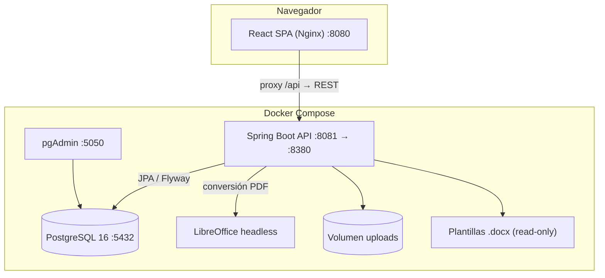
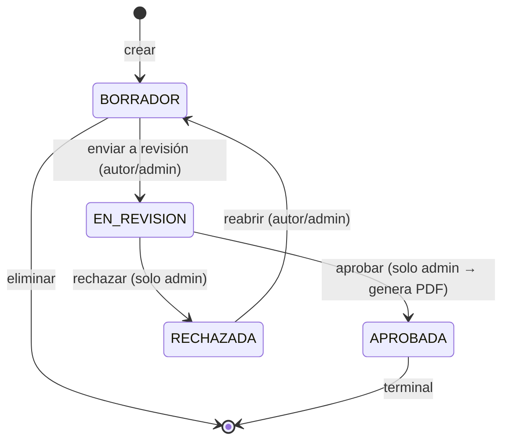

# Somos Barrio — Plataforma de Gestión Documental

Plataforma web **full-stack** para digitalizar el ciclo de vida de los documentos
formales (actas, informes, bitácoras, oficios y memorandos) de un programa municipal
de prevención del delito, **manteniendo el formato institucional** mediante plantillas
Word (`.docx`) rellenadas automáticamente y convertidas a PDF.

> **Cliente / contexto:** Programa *Somos Barrio* — Subsecretaría de Prevención del Delito (Viña del Mar).
> Proyecto desarrollado como trabajo final transversal.

---

## ¿Qué problema resuelve?

Hoy estos documentos se redactan a mano en Word, se intercambian por correo y no tienen
trazabilidad (quién los creó, quién los aprobó, cuándo). Somos Barrio centraliza ese flujo:

1. El **colaborador** registra actividades y crea documentos a partir de plantillas oficiales,
   llenando un formulario web generado dinámicamente desde un esquema JSON.
2. El **administrador** revisa, aprueba o rechaza. Al aprobar, el sistema **genera el PDF oficial**
   (merge del `.docx` + imágenes adjuntas) y permite **enviarlo por correo** a grupos de destinatarios.
3. Todo queda **auditado** y disponible en un repositorio consultable, con **reportes en Excel**.

---

## Características principales

| Capacidad | Descripción |
|-----------|-------------|
| **Autenticación con roles** | JWT stateless con dos perfiles: `ADMINISTRADOR` y `COLABORADOR` |
| **Gestión de actividades** | Actividades territoriales que dan contexto a los documentos |
| **Plantillas dinámicas** | Esquema de campos en JSON que genera el formulario web automáticamente |
| **Flujo de aprobación** | Máquina de estados: BORRADOR → EN_REVISIÓN → APROBADA / RECHAZADA |
| **Generación documental** | Merge de `.docx` (Apache POI) + conversión a PDF con LibreOffice (con fallback OpenPDF) |
| **Adjuntos e imágenes** | Subida de evidencia fotográfica embebida en el documento final |
| **Envío por correo** | Distribución del PDF aprobado a grupos de destinatarios (SMTP) |
| **Auditoría** | Registro inmutable de acciones críticas |
| **Reportes** | Exportación de actividades/documentos a Excel |
| **Proveedores** | Catálogo de proveedores con licitaciones y órdenes de compra |

---

## Arquitectura



El frontend se sirve con **Nginx**, que hace de *reverse proxy* de `/api` hacia el backend
dentro de la red de Docker (mismo origen, sin CORS en el navegador).

### Stack tecnológico

| Capa | Tecnologías |
|------|-------------|
| **Frontend** | React 19, Vite, TypeScript, React Router 7, TanStack Query, Zustand, Axios, Tailwind CSS 4, react-hook-form + Zod |
| **Backend** | Java 21, Spring Boot 3.5, Spring Security, Spring Data JPA, MapStruct, Apache POI, OpenPDF, Apache Tika |
| **Datos** | PostgreSQL 16, Flyway (migraciones versionadas) |
| **Infraestructura** | Docker Compose, Nginx, LibreOffice (DOCX→PDF), Maven, JUnit 5 + Testcontainers + JaCoCo |

---

## Estructura del repositorio

```
gestion-documental-somosbarrio/
├── README.md                  ← este archivo
├── DOCUMENTACION/             # Material de apoyo (incluye VIDEO/)
├── GESTION/                   # Gestión del proyecto (Carta Gantt, planificación)
│   └── PLAN_CARTA_GANTT.md
└── PRODUCTO/                  # El sistema (código fuente + orquestación)
    ├── docker-compose.yml     # Levanta TODO: db + backend + frontend + pgAdmin
    ├── .env.example           # Plantilla de variables de entorno
    ├── BACKEND/somosbarrio-backend/   # API REST (Spring Boot / Maven)
    └── FRONTEND/somosbarrio-frontend/ # SPA (React + Vite)
```

> La documentación técnica detallada vive junto al código:
> [`PRODUCTO/BACKEND/.../README.md`](PRODUCTO/BACKEND/somosbarrio-backend/README.md) y
> [`PRODUCTO/FRONTEND/.../README.md`](PRODUCTO/FRONTEND/somosbarrio-frontend/README.md).

---

## Puesta en marcha (Docker — recomendado)

Requisitos: **Docker** y **Docker Compose**.

```bash
# 1. Ubícate en la carpeta del producto
cd PRODUCTO

# 2. (Opcional) Copia la plantilla de variables y ajústala
cp .env.example .env

# 3. Levanta todo el sistema con un solo comando
docker compose up --build
```

Una vez arriba:

| Servicio | URL |
|----------|-----|
| **Frontend (SPA)** | http://localhost:8080 |
| **Backend (API REST)** | http://localhost:8081/api/v1 |
| **Swagger UI** | http://localhost:8081/swagger-ui.html |
| **pgAdmin** | http://localhost:5050 |

### Credenciales de demo (datos *seed*)

> Solo para entorno de desarrollo. Cámbialas antes de cualquier despliegue real.

| Rol | Email | Contraseña |
|-----|-------|------------|
| Administrador | `admin@somosbarrio.cl` | `Admin123!` |
| Colaborador | `colaborador1@somosbarrio.cl` | `Admin123!` |
| Colaborador | `colaborador2@somosbarrio.cl` | `Admin123!` |

---

## Variables de entorno

Definidas en `PRODUCTO/.env.example` (cópialo a `.env`). Las principales:

| Variable | Descripción | Default (dev) |
|----------|-------------|---------------|
| `DB_PASSWORD` | Contraseña de PostgreSQL | `password` |
| `JWT_SECRET` | Secreto de firma JWT (mínimo 32 caracteres) | placeholder de dev |
| `APP_CORS_ORIGINS` | Origen permitido del frontend | `http://localhost:8080` |
| `MAIL_HOST` / `MAIL_PORT` | Servidor SMTP | `smtp.gmail.com` / `587` |
| `MAIL_USERNAME` / `MAIL_PASSWORD` | Credenciales SMTP (vacías = correo desactivado) | — |

> Genera un secreto JWT seguro con: `openssl rand -base64 64`.

---

## Roles y flujo de aprobación



- **Colaborador:** crea actividades y documentos, los edita en BORRADOR y los envía a revisión.
- **Administrador:** además aprueba/rechaza, gestiona plantillas, usuarios, destinatarios,
  proveedores, auditoría y reportes.
- La autorización es **defensa en profundidad**: `@PreAuthorize` a nivel HTTP **y** validación
  de la máquina de estados a nivel de negocio.

---

## Calidad y pruebas

- **Backend:** tests unitarios (Mockito) y E2E (Testcontainers con PostgreSQL real), umbral JaCoCo ≥ 50%.
  ```bash
  cd PRODUCTO/BACKEND/somosbarrio-backend/backend
  ./mvnw test
  ```
- **Seguridad:** JWT con expiración corta + refresh token rotativo (hash SHA-256), bloqueo de
  cuenta tras 5 intentos fallidos, contraseñas con BCrypt, auditoría de accesos.

---

## Documentación adicional

| Documento | Ubicación |
|-----------|-----------|
| Planificación / Carta Gantt | [`GESTION/PLAN_CARTA_GANTT.md`](GESTION/PLAN_CARTA_GANTT.md) |
| README del Backend | [`PRODUCTO/BACKEND/somosbarrio-backend/README.md`](PRODUCTO/BACKEND/somosbarrio-backend/README.md) |
| README del Frontend | [`PRODUCTO/FRONTEND/somosbarrio-frontend/README.md`](PRODUCTO/FRONTEND/somosbarrio-frontend/README.md) |
| Esquema de base de datos | [`PRODUCTO/BACKEND/somosbarrio-backend/docs/database_schema.md`](PRODUCTO/BACKEND/somosbarrio-backend/docs/database_schema.md) |

---

## Licencia y propósito

Proyecto académico desarrollado para el programa *Somos Barrio*. Stack 100% software libre,
pensado para ejecutarse en cualquier proveedor cloud mediante contenedores.
